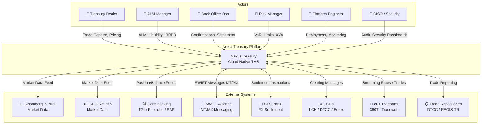
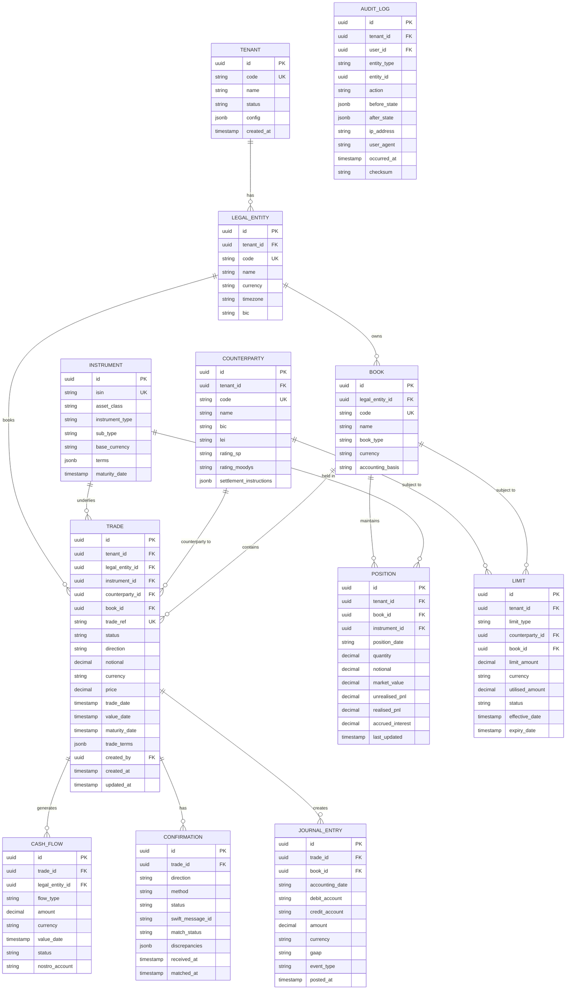
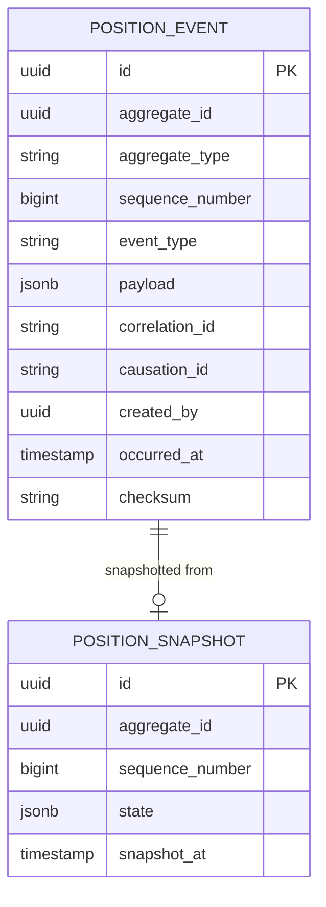
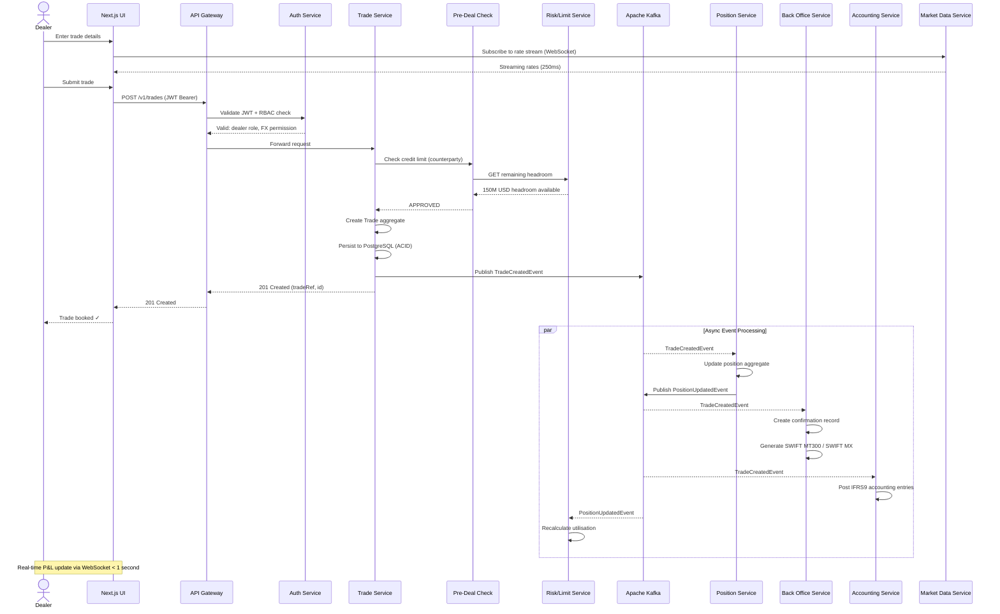
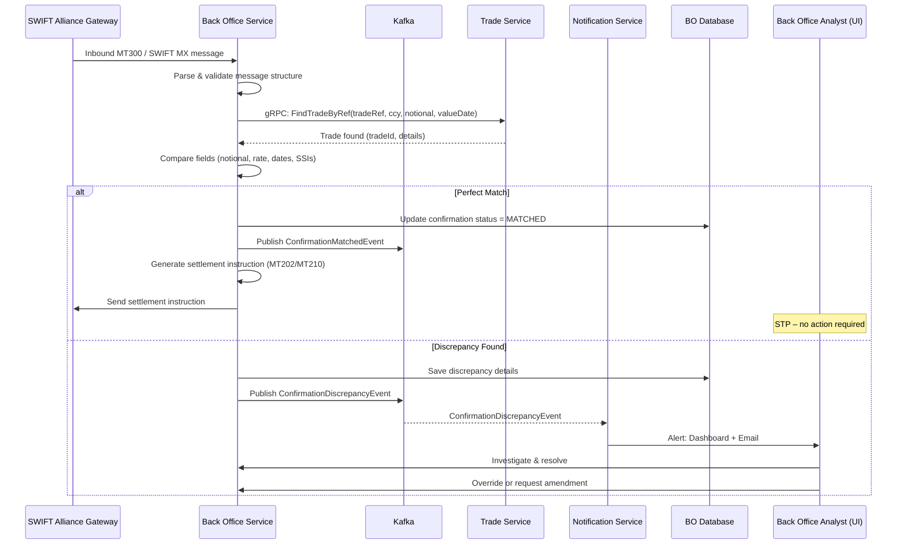
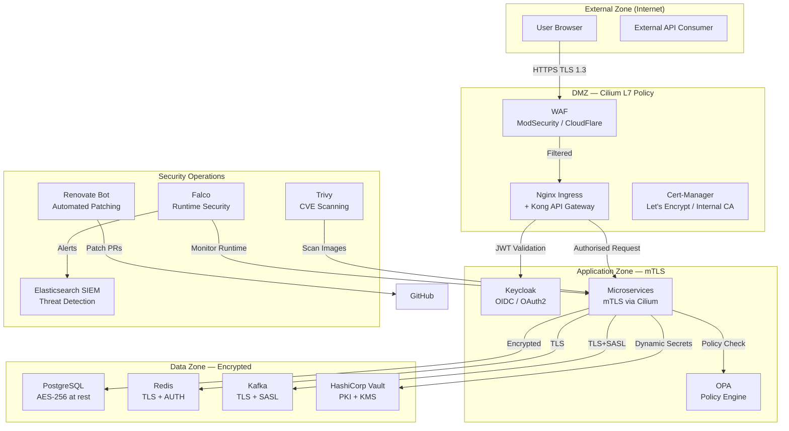
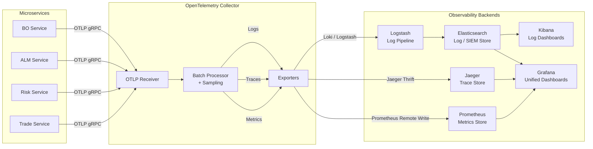
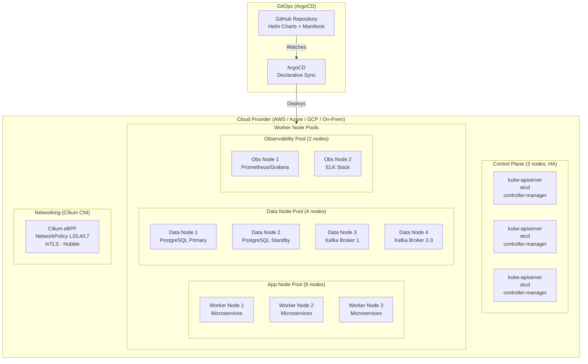

# NexusTreasury — Solution Design Document

**Version**: 1.0.0 | **Status**: Approved
**Architect**: Chief Solutions Architect
**Review Board**: CTO, CISO, Head of Engineering, Platform Lead
**Date**: 2026-04-07

---

## Change Log

| Version | Date | Change |
|---------|------|--------|
| 0.1 | 2026-03-01 | Initial architecture draft |
| 0.5 | 2026-03-20 | Added event-driven design; Kafka topology |
| 1.0 | 2026-04-07 | Final review approved |

---

## 1. Executive Summary

NexusTreasury is architected as a **cloud-native, event-driven microservices platform** built on a domain-driven design (DDD) foundation. The system is deployed on Kubernetes with Cilium networking, uses Apache Kafka as the central nervous system for real-time event propagation, PostgreSQL for transactional persistence, and a Next.js/React frontend served via edge-optimised CDN.

The architecture enforces **Zero Trust security**, **SOC 2 Type II** controls, **automated security patching**, and **full observability** via Grafana, ELK, and OpenTelemetry distributed tracing. Every component is designed for horizontal scalability, resilience under failure, and zero-downtime deployment.

---

## 2. Business Context & Drivers

| Driver | Architectural Response |
|--------|----------------------|
| Real-time P&L and risk | Event-sourced position engine; Kafka streams for sub-second propagation |
| Regulatory compliance | Dedicated compliance microservices; FRTB/IRRBB calculation engines |
| Zero Trust security | mTLS between all services; Cilium NetworkPolicy; OPA policy engine |
| SOC 2 Type II | Immutable audit log service; Vault secrets; automated evidence collection |
| Cloud portability | Kubernetes-native; Helm charts; cloud-agnostic storage abstractions |
| Developer velocity | Domain-isolated bounded contexts; GitOps; 2-week release cadence |
| Automated security patching | Renovate Bot + GitHub Actions + Trivy CVE scanning + automated PR merge |

---

## 3. Architecture Decision Records (ADRs)

### ADR-001: Event-Driven Architecture with Apache Kafka

- **Context**: Treasury operations require real-time propagation of trades, positions, and risk events across Front Office, Middle Office, Back Office, and Risk modules.
- **Decision**: Apache Kafka as the central event bus, with event sourcing for position management.
- **Rationale**: Kafka provides durable, ordered, replayable event logs; enables temporal decoupling; supports exactly-once semantics for financial transactions.
- **Alternatives Considered**: RabbitMQ (insufficient throughput/replay); AWS EventBridge (cloud-lock); Redis Streams (no durable replication).
- **Consequences**: All services become event-driven consumers/producers; requires schema registry (Confluent); adds operational complexity managed by Platform team.

### ADR-002: Domain-Driven Design with Bounded Contexts

- **Context**: Treasury TMS covers diverse domains (trading, risk, back office, accounting) that are tightly coupled in legacy systems causing change paralysis.
- **Decision**: Decompose into 8 bounded contexts (see Section 4.3), each owning its domain model, database, and API.
- **Rationale**: Enables independent deployment; reduces blast radius of changes; aligns with Conway's Law.
- **Consequences**: Cross-context communication via domain events on Kafka; eventual consistency between contexts requires careful saga design.

### ADR-003: PostgreSQL as Primary Data Store

- **Context**: Need ACID transactions for financial data with complex queries for risk calculations.
- **Decision**: PostgreSQL 16+ with Patroni HA (3-node primary/standby) and read replicas per bounded context.
- **Rationale**: Battle-tested for financial systems; JSONB support for flexible instrument data; TimescaleDB extension for time-series (P&L, market data history); excellent Prisma/TypeORM tooling.
- **Alternatives Considered**: Oracle (licence cost; closed source); MongoDB (insufficient ACID for financial); CockroachDB (distributed complexity).

### ADR-004: Next.js 14 with React for Frontend

- **Context**: Dealing room UI requires real-time data (WebSocket), SSR for SEO/initial load, and mobile-responsive dashboards.
- **Decision**: Next.js 14 (App Router) with React 18, TypeScript, Tailwind CSS.
- **Rationale**: Server-side rendering for initial page load performance; React Server Components reduce client bundle size; TypeScript enforces type safety across FE/BE boundary.
- **Alternatives Considered**: Angular (heavier; worse ecosystem for financial charting); Vue.js (smaller ecosystem); Remix (less mature for large-scale apps).

### ADR-005: Cilium for Kubernetes Networking and Security

- **Context**: Zero Trust requires layer-7 network policy enforcement between services, not just IP-based rules.
- **Decision**: Cilium CNI with eBPF-based network policies; Hubble for network observability.
- **Rationale**: Cilium enforces mutual TLS (mTLS) + L7 HTTP/gRPC policies; eBPF-based performance; native Kubernetes NetworkPolicy compliance; built-in Hubble UI for network flow visibility.
- **Alternatives Considered**: Calico (no L7 policies); Istio (high memory overhead; complexity); Flannel (no security features).

### ADR-006: TypeScript Throughout

- **Context**: Large-scale financial software requires strict typing to prevent runtime errors in calculations.
- **Decision**: TypeScript 5.x for all backend services (Node.js) and frontend (React/Next.js).
- **Rationale**: Compile-time type safety; shared type definitions between FE/BE via npm workspace monorepo; excellent IDE support; aligns with DDD value objects as branded types.

### ADR-007: GitOps with GitHub Actions and ArgoCD

- **Context**: Need declarative, auditable, and automated deployment pipeline.
- **Decision**: GitHub Actions for CI; ArgoCD for GitOps continuous deployment to Kubernetes.
- **Rationale**: Git as the single source of truth for infrastructure state; automated drift detection; PR-based change approval; complete audit trail in Git history.

---

## 4. System Architecture (C4 Model)

### 4.1 Level 1: System Context Diagram



### 4.2 Level 2: Container Diagram

```mermaid
graph TB
    subgraph Frontend["Frontend Layer"]
        WebApp["🖥️ Next.js Web App<br/>React 18 · TypeScript<br/>Tailwind CSS · WebSocket"]
    end

    subgraph APIGateway["API Gateway Layer"]
        GW["🔀 API Gateway<br/>Kong / Nginx Ingress<br/>OAuth2 · Rate Limiting · WAF"]
    end

    subgraph Microservices["Microservices — Bounded Contexts"]
        TradeService["📈 Trade Service<br/>Node.js · TypeScript<br/>REST + gRPC"]
        PositionService["📊 Position Service<br/>Node.js · TypeScript<br/>Event Sourced"]
        RiskService["⚠️ Risk Service<br/>Node.js · TypeScript<br/>VaR · Limits · XVA"]
        ALMService["🏦 ALM Service<br/>Node.js · TypeScript<br/>LCR · NSFR · IRRBB"]
        BOService["📋 Back Office Service<br/>Node.js · TypeScript<br/>SWIFT · Settlement"]
        AccountingService["📒 Accounting Service<br/>Node.js · TypeScript<br/>IFRS9 · Sub-Ledger"]
        MarketDataService["📡 Market Data Service<br/>Node.js · TypeScript<br/>Bloomberg · LSEG"]
        NotificationService["🔔 Notification Service<br/>Node.js · TypeScript<br/>Email · Webhook · WS"]
        AuditService["🔐 Audit Service<br/>Node.js · TypeScript<br/>Immutable Log"]
        AuthService["🔑 Auth Service<br/>Keycloak OIDC<br/>OAuth2 · MFA"]
        PlatformMgmt["⚙️ Platform Mgmt Plane<br/>Node.js · TypeScript<br/>Tenant · Config · RBAC"]
    end

    subgraph EventBus["Event Bus"]
        Kafka["📨 Apache Kafka<br/>Confluent Schema Registry<br/>Kafka Streams"]
    end

    subgraph DataStores["Data Stores"]
        PostgresDB["🗄️ PostgreSQL 16<br/>Patroni HA<br/>TimescaleDB"]
        RedisCache["⚡ Redis Cluster<br/>Cache · Sessions<br/>Rate Limiting"]
        ElasticSearch["🔍 Elasticsearch<br/>Log Index<br/>Search"]
        S3Store["🪣 Object Storage<br/>S3-compatible<br/>Reports · Attachments"]
    end

    subgraph Observability["Observability Stack"]
        Prometheus["📊 Prometheus<br/>Metrics"]
        Grafana["📈 Grafana<br/>Dashboards"]
        ELK["📋 ELK Stack<br/>Logstash · Kibana"]
        Jaeger["🔍 Jaeger<br/>Distributed Tracing"]
        OTel["🔭 OpenTelemetry<br/>Collector"]
    end

    subgraph Security["Security Infrastructure"]
        Vault["🔐 HashiCorp Vault<br/>Secrets · PKI · KMS"]
        OPA["🛡️ OPA<br/>Policy Engine"]
        Trivy["🔬 Trivy<br/>CVE Scanning"]
    end

    WebApp -->|HTTPS / WS| GW
    GW -->|JWT Auth| AuthService
    GW -->|Route| TradeService
    GW -->|Route| PositionService
    GW -->|Route| RiskService
    GW -->|Route| ALMService
    GW -->|Route| BOService
    GW -->|Route| AccountingService
    GW -->|Route| PlatformMgmt

    TradeService -->|Publish Events| Kafka
    PositionService -->|Subscribe · Publish| Kafka
    RiskService -->|Subscribe| Kafka
    ALMService -->|Subscribe| Kafka
    BOService -->|Subscribe · Publish| Kafka
    AccountingService -->|Subscribe| Kafka
    MarketDataService -->|Publish Rates| Kafka
    NotificationService -->|Subscribe Alerts| Kafka
    AuditService -->|Subscribe All| Kafka

    TradeService -->|CRUD| PostgresDB
    PositionService -->|Event Store| PostgresDB
    RiskService -->|Read Positions| PostgresDB
    ALMService -->|ALM Data| PostgresDB
    BOService -->|BO Data| PostgresDB
    AccountingService -->|Accounting Entries| PostgresDB

    TradeService -->|Cache Rates| RedisCache
    GW -->|Rate Limit State| RedisCache
    AuthService -->|Sessions| RedisCache

    AuditService -->|Structured Logs| ElasticSearch

    All services -->|Logs| ELK
    All services -->|Metrics| Prometheus
    All services -->|Traces| OTel
    Prometheus -->|Query| Grafana
    OTel -->|Export| Jaeger
    OTel -->|Export| ELK
```

### 4.3 Level 3: Bounded Contexts and Domain Decomposition

```mermaid
graph LR
    subgraph TradingContext["Trading Bounded Context"]
        TC_Trade[Trade Aggregate]
        TC_Instrument[Instrument Catalogue]
        TC_Pricing[Pricing Engine]
        TC_PreDeal[Pre-Deal Check]
    end

    subgraph PositionContext["Position Bounded Context"]
        PC_Position[Position Aggregate]
        PC_PnL[P&L Calculator]
        PC_EventStore[Event Store]
    end

    subgraph RiskContext["Risk Bounded Context"]
        RC_Limit[Limit Aggregate]
        RC_VaR[VaR Calculator]
        RC_XVA[XVA Engine]
        RC_Counterparty[Counterparty Exposure]
    end

    subgraph ALMContext["ALM Bounded Context"]
        AC_CashLadder[Cash Ladder]
        AC_GapReport[Gap Report]
        AC_IRRBB[IRRBB Engine]
        AC_Ratios[LCR/NSFR Calculator]
        AC_Stress[Stress Engine]
        AC_FTP[FTP Engine]
    end

    subgraph BoContext["Back Office Bounded Context"]
        BC_Confirmation[Confirmation]
        BC_Settlement[Settlement]
        BC_Reconciliation[Reconciliation]
        BC_Collateral[Collateral]
        BC_Corporate[Corporate Actions]
    end

    subgraph AccountingContext["Accounting Bounded Context"]
        AccountCtx_Entry[Journal Entry]
        AccountCtx_IFRS9[IFRS9 Classifier]
        AccountCtx_Hedge[Hedge Accounting]
        AccountCtx_GL[GL Feed]
    end

    subgraph MarketDataContext["Market Data Bounded Context"]
        MD_Rate[Rate Publisher]
        MD_Curve[Yield Curve Builder]
        MD_Vol[Volatility Surface]
    end

    subgraph PlatformContext["Platform Context"]
        Plat_Tenant[Tenant Manager]
        Plat_RBAC[RBAC Engine]
        Plat_Config[Config Service]
        Plat_Audit[Audit Logger]
    end

    %% Domain Events flow
    TradingContext -->|TradeBooked event| PositionContext
    TradingContext -->|TradeBooked event| RiskContext
    TradingContext -->|TradeBooked event| BoContext
    TradingContext -->|TradeBooked event| AccountingContext
    PositionContext -->|PositionUpdated event| RiskContext
    PositionContext -->|PositionUpdated event| ALMContext
    MarketDataContext -->|RateUpdated event| TradingContext
    MarketDataContext -->|RateUpdated event| RiskContext
    MarketDataContext -->|RateUpdated event| ALMContext
```



---

## 5. Data Architecture

### 5.1 Core Entity Relationship Diagram



### 5.2 Event Store Schema (Position Event Sourcing)



### 5.3 Kafka Topic Topology

| Topic | Partitions | Replication | Retention | Schema |
|-------|-----------|-------------|-----------|--------|
| `nexus.trading.trades.created` | 24 | 3 | 30 days | TradeCreatedEvent |
| `nexus.trading.trades.amended` | 24 | 3 | 30 days | TradeAmendedEvent |
| `nexus.trading.trades.cancelled` | 12 | 3 | 30 days | TradeCancelledEvent |
| `nexus.positions.updated` | 24 | 3 | 7 days | PositionUpdatedEvent |
| `nexus.risk.limit-breach` | 6 | 3 | 30 days | LimitBreachEvent |
| `nexus.risk.var-calculated` | 12 | 3 | 7 days | VaRResultEvent |
| `nexus.marketdata.rates` | 48 | 3 | 1 day | RateTickEvent |
| `nexus.marketdata.curves` | 12 | 3 | 7 days | YieldCurveEvent |
| `nexus.bo.confirmation-received` | 12 | 3 | 30 days | ConfirmationEvent |
| `nexus.bo.settlement-instruction` | 12 | 3 | 30 days | SettlementEvent |
| `nexus.accounting.journal-entries` | 24 | 3 | 365 days | JournalEntryEvent |
| `nexus.alm.cashflow-updated` | 12 | 3 | 7 days | CashFlowEvent |
| `nexus.platform.audit-log` | 48 | 3 | 3650 days | AuditLogEvent |

---

## 6. API Design

### 6.1 REST API Conventions

- **Base URL**: `https://api.nexustreasury.com/v1`
- **Authentication**: Bearer token (JWT) via OAuth2/OIDC
- **Content-Type**: `application/json`
- **Versioning**: URL path versioning (`/v1/`, `/v2/`)
- **Pagination**: Cursor-based (`cursor`, `limit`)
- **Error Format**: RFC 7807 Problem Details

### 6.2 Core API Endpoints

```yaml
openapi: 3.0.3
info:
  title: NexusTreasury API
  version: 1.0.0
  description: Enterprise Treasury Management System API
  contact:
    name: NexusTreasury Engineering
    email: api-support@nexustreasury.com
  license:
    name: Proprietary

servers:
  - url: https://api.nexustreasury.com/v1
    description: Production
  - url: https://api-staging.nexustreasury.com/v1
    description: Staging

security:
  - BearerAuth: []
  - OAuth2: [trade:read, trade:write, risk:read, alm:read]

tags:
  - name: Trades
    description: Trade capture and lifecycle management
  - name: Positions
    description: Real-time position management
  - name: Risk
    description: Risk calculations and limit management
  - name: ALM
    description: Asset-Liability Management
  - name: BackOffice
    description: Confirmation, settlement, and reconciliation
  - name: MarketData
    description: Market data feeds

paths:
  /trades:
    post:
      operationId: createTrade
      tags: [Trades]
      summary: Book a new trade
      description: |
        Captures a new trade with pre-deal limit checks. 
        Publishes TradeCreatedEvent to Kafka on success.
      requestBody:
        required: true
        content:
          application/json:
            schema:
              $ref: '#/components/schemas/CreateTradeRequest'
            example:
              instrumentId: "550e8400-e29b-41d4-a716-446655440000"
              counterpartyId: "550e8400-e29b-41d4-a716-446655440001"
              bookId: "fx-trading-01"
              direction: "BUY"
              notional: 10000000
              currency: "USD"
              settlementCurrency: "EUR"
              price: 1.0845
              tradeDate: "2026-04-07"
              valueDate: "2026-04-09"
      responses:
        '201':
          description: Trade booked successfully
          content:
            application/json:
              schema:
                $ref: '#/components/schemas/TradeResponse'
        '400':
          $ref: '#/components/responses/ValidationError'
        '409':
          description: Pre-deal limit breach
          content:
            application/json:
              schema:
                $ref: '#/components/schemas/LimitBreachError'
        '401':
          $ref: '#/components/responses/Unauthorized'
        '403':
          $ref: '#/components/responses/Forbidden'
        '500':
          $ref: '#/components/responses/InternalError'

    get:
      operationId: listTrades
      tags: [Trades]
      summary: List trades with filtering
      parameters:
        - name: bookId
          in: query
          schema: { type: string }
        - name: status
          in: query
          schema:
            type: string
            enum: [DRAFT, CONFIRMED, AMENDED, CANCELLED]
        - name: assetClass
          in: query
          schema: { type: string }
        - name: fromDate
          in: query
          schema: { type: string, format: date }
        - name: toDate
          in: query
          schema: { type: string, format: date }
        - name: cursor
          in: query
          schema: { type: string }
        - name: limit
          in: query
          schema: { type: integer, default: 50, maximum: 500 }
      responses:
        '200':
          description: Paginated trade list
          content:
            application/json:
              schema:
                $ref: '#/components/schemas/TradeListResponse'

  /trades/{tradeId}:
    get:
      operationId: getTrade
      tags: [Trades]
      parameters:
        - name: tradeId
          in: path
          required: true
          schema: { type: string, format: uuid }
      responses:
        '200':
          content:
            application/json:
              schema:
                $ref: '#/components/schemas/TradeResponse'
        '404':
          $ref: '#/components/responses/NotFound'

  /positions:
    get:
      operationId: listPositions
      tags: [Positions]
      summary: Get real-time positions
      parameters:
        - name: bookId
          in: query
          schema: { type: string }
        - name: assetClass
          in: query
          schema: { type: string }
        - name: positionDate
          in: query
          schema: { type: string, format: date }
      responses:
        '200':
          content:
            application/json:
              schema:
                $ref: '#/components/schemas/PositionListResponse'

  /risk/var:
    get:
      operationId: calculateVaR
      tags: [Risk]
      summary: Get current VaR calculation
      parameters:
        - name: bookId
          in: query
          schema: { type: string }
        - name: confidenceLevel
          in: query
          schema: { type: number, default: 0.99 }
        - name: holdingPeriod
          in: query
          schema: { type: integer, default: 1, enum: [1, 10] }
      responses:
        '200':
          content:
            application/json:
              schema:
                $ref: '#/components/schemas/VaRResult'

  /alm/liquidity-gap:
    get:
      operationId: getLiquidityGap
      tags: [ALM]
      summary: Get liquidity gap report
      parameters:
        - name: legalEntityId
          in: query
          required: true
          schema: { type: string, format: uuid }
        - name: scenario
          in: query
          schema:
            type: string
            enum: [CONTRACTUAL, BEHAVIOURAL, STRESSED]
            default: CONTRACTUAL
        - name: currency
          in: query
          schema: { type: string }
      responses:
        '200':
          content:
            application/json:
              schema:
                $ref: '#/components/schemas/LiquidityGapReport'

  /alm/lcr:
    get:
      operationId: getLCR
      tags: [ALM]
      summary: Get current LCR ratio
      parameters:
        - name: legalEntityId
          in: query
          required: true
          schema: { type: string, format: uuid }
        - name: asOf
          in: query
          schema: { type: string, format: date-time }
      responses:
        '200':
          content:
            application/json:
              schema:
                $ref: '#/components/schemas/LCRReport'

components:
  securitySchemes:
    BearerAuth:
      type: http
      scheme: bearer
      bearerFormat: JWT
    OAuth2:
      type: oauth2
      flows:
        authorizationCode:
          authorizationUrl: https://auth.nexustreasury.com/oauth2/authorize
          tokenUrl: https://auth.nexustreasury.com/oauth2/token
          scopes:
            trade:read: Read trade data
            trade:write: Create and amend trades
            risk:read: Read risk data
            alm:read: Read ALM data

  schemas:
    CreateTradeRequest:
      type: object
      required: [instrumentId, counterpartyId, bookId, direction, notional, currency, tradeDate, valueDate]
      properties:
        instrumentId: { type: string, format: uuid }
        counterpartyId: { type: string, format: uuid }
        bookId: { type: string }
        direction:
          type: string
          enum: [BUY, SELL, LEND, BORROW, PAY, RECEIVE]
        notional: { type: number, minimum: 0 }
        currency: { type: string, pattern: '^[A-Z]{3}$' }
        price: { type: number }
        tradeDate: { type: string, format: date }
        valueDate: { type: string, format: date }
        maturityDate: { type: string, format: date }
        tradeTerms: { type: object }

    TradeResponse:
      type: object
      properties:
        id: { type: string, format: uuid }
        tradeRef: { type: string }
        status: { type: string }
        instrumentId: { type: string, format: uuid }
        counterpartyId: { type: string, format: uuid }
        bookId: { type: string }
        direction: { type: string }
        notional: { type: number }
        currency: { type: string }
        price: { type: number }
        tradeDate: { type: string, format: date }
        valueDate: { type: string, format: date }
        createdAt: { type: string, format: date-time }

    LimitBreachError:
      type: object
      properties:
        type: { type: string }
        title: { type: string }
        limitId: { type: string }
        limitType: { type: string }
        limitAmount: { type: number }
        utilisedAmount: { type: number }
        requestedAmount: { type: number }
        headroom: { type: number }
        overrideAllowed: { type: boolean }

    VaRResult:
      type: object
      properties:
        calculatedAt: { type: string, format: date-time }
        bookId: { type: string }
        confidenceLevel: { type: number }
        holdingPeriod: { type: integer }
        varAmount: { type: number }
        currency: { type: string }
        methodology: { type: string, enum: [HISTORICAL, PARAMETRIC, MONTE_CARLO] }
        stressedVar: { type: number }
        componentVar: { type: object }

    LiquidityGapReport:
      type: object
      properties:
        legalEntityId: { type: string, format: uuid }
        reportDate: { type: string, format: date }
        scenario: { type: string }
        currency: { type: string }
        timeBuckets:
          type: array
          items:
            type: object
            properties:
              bucket: { type: string }
              inflows: { type: number }
              outflows: { type: number }
              netFlow: { type: number }
              cumulativeGap: { type: number }
        totalInflows: { type: number }
        totalOutflows: { type: number }
        netLiquidityPosition: { type: number }

    LCRReport:
      type: object
      properties:
        legalEntityId: { type: string, format: uuid }
        asOf: { type: string, format: date-time }
        lcrRatio: { type: number }
        hqlaBuffer: { type: number }
        netCashOutflows30Day: { type: number }
        minimumRequired: { type: number, default: 1.0 }
        breachIndicator: { type: boolean }

  responses:
    ValidationError:
      description: Validation error
      content:
        application/problem+json:
          schema:
            type: object
            properties:
              type: { type: string }
              title: { type: string }
              status: { type: integer }
              errors: { type: array, items: { type: object } }
    Unauthorized:
      description: Authentication required
    Forbidden:
      description: Insufficient permissions
    NotFound:
      description: Resource not found
    InternalError:
      description: Internal server error
```

---

## 7. Integration Architecture

### 7.1 Trade Lifecycle Sequence Diagram



### 7.2 SWIFT Confirmation Matching Sequence



---

## 8. Non-Functional Design

### 8.1 Performance & Scalability

```
Trade Service:         Target P99 < 100ms → Horizontal scaling via Kubernetes HPA
                       PgBouncer connection pool: 100 connections per pod
                       Redis caching: Pre-deal static data (instruments, limits)

Position Service:      Event-sourced snapshots every 1000 events
                       Read model materialized from Kafka Streams
                       Redis write-through cache for real-time positions

Risk Service:          VaR calculation: vectorized NumericJS/custom engine
                       Incremental calculation on PositionUpdatedEvent
                       Pre-computed risk factor sensitivities cached in Redis

Market Data:           Rate ticks ingested at 48 partitions in Kafka
                       TimescaleDB for historical rate storage
                       Redis SORTED SET for current rate snapshots
```

### 8.2 Security Architecture



**Zero Trust Controls:**
- All service-to-service communication uses mTLS enforced by Cilium
- JWT tokens expire in 15 minutes; refresh tokens rotated every 24 hours
- HashiCorp Vault for dynamic database credentials (lease: 1 hour)
- OPA Gatekeeper policies enforce admission control in Kubernetes
- Falco rules detect container escape, privilege escalation, suspicious syscalls
- All secrets stored in Vault; never in environment variables or ConfigMaps

### 8.3 Resilience Patterns

| Pattern | Implementation | Service |
|---------|---------------|---------|
| Circuit Breaker | `opossum` npm library, threshold: 50% error rate | All outbound HTTP calls |
| Retry with Backoff | Exponential backoff: 100ms, 200ms, 400ms, max 3 retries | Kafka producers, DB connections |
| Bulkhead | Separate thread pools per downstream dependency | Risk calculations |
| Idempotency | Idempotency key on trade creation; Kafka exactly-once semantics | Trade Service, BO Service |
| Dead Letter Queue | `nexus.*.dlq` topics for failed event processing | All Kafka consumers |
| Saga Pattern | Choreography-based sagas via events for cross-context operations | Trade booking workflow |
| Health Checks | `/health/live` and `/health/ready` endpoints on all services | Kubernetes probes |
| Rate Limiting | Redis-based sliding window rate limiter at API Gateway | All APIs |

### 8.4 Observability Architecture



**Key Grafana Dashboards:**
1. **Trading Operations**: Live trade count, booking latency, STP rate, SWIFT message status
2. **Risk Overview**: VaR by book, limit utilisation, breach count
3. **ALM Dashboard**: LCR/NSFR real-time, liquidity gap waterfall, IRRBB NII
4. **Platform Health**: Pod status, CPU/memory, Kafka consumer lag, DB connection pool
5. **Security Dashboard**: Failed auth attempts, CVE scan results, audit event volume

---

## 9. Deployment Architecture

### 9.1 Kubernetes Architecture



### 9.2 Namespace Strategy

| Namespace | Contents | Network Policy |
|-----------|----------|---------------|
| `nexus-prod` | All application microservices | Deny all, allow explicit |
| `nexus-data` | PostgreSQL, Redis, Kafka | Allow from nexus-prod only |
| `nexus-platform` | Vault, Keycloak, OPA | Allow from nexus-prod only |
| `nexus-observability` | Prometheus, Grafana, ELK, Jaeger | Allow scrape from all |
| `nexus-security` | Trivy, Falco | Privileged; allow cluster-wide |
| `nexus-ingress` | Nginx Ingress Controller | Allow inbound 443 |
| `argocd` | ArgoCD controllers | Allow from CI/CD only |

### 9.3 Environment Strategy

| Environment | Purpose | Deployment Trigger | Data |
|------------|---------|-------------------|------|
| `dev` | Feature development | Auto on PR merge to `develop` | Synthetic |
| `staging` | Integration & UAT | Auto on merge to `main` | Anonymised prod clone |
| `prod-blue` | Production (active) | Manual approval + automated | Live |
| `prod-green` | Production (standby) | Blue-green swap | Live |

---

## 10. Technology Stack

| Layer | Technology | Version | Rationale |
|-------|-----------|---------|-----------|
| Frontend Framework | Next.js | 14.x | SSR, App Router, TypeScript, performance |
| UI Library | React | 18.x | Component model, concurrent rendering |
| Frontend Language | TypeScript | 5.x | Type safety, shared types FE/BE |
| Styling | Tailwind CSS | 3.x | Utility-first, consistent design system |
| UI Components | Radix UI + Shadcn | Latest | Accessible, unstyled, customisable |
| Charts | Recharts + D3.js | Latest | Financial time series, custom visuals |
| State Management | Zustand + React Query | Latest | Server state + client state separation |
| WebSocket Client | Socket.io-client | 4.x | Real-time rates, P&L, alerts |
| Backend Language | TypeScript | 5.x | Type safety, DDD value objects |
| Backend Runtime | Node.js | 22 LTS | Performance, npm ecosystem, TypeScript |
| Backend Framework | Fastify | 4.x | Performance > Express; TypeScript native |
| ORM | Prisma | 5.x | Type-safe DB client, migrations |
| Primary Database | PostgreSQL | 16.x | ACID, JSONB, extensible |
| Time-Series Extension | TimescaleDB | 2.x | Market data, P&L history |
| HA Database | Patroni | 3.x | PostgreSQL HA, automatic failover |
| Caching | Redis Cluster | 7.x | Sub-ms latency, pub/sub |
| Event Bus | Apache Kafka | 3.7.x | Durable events, stream processing |
| Schema Registry | Confluent Schema Registry | 7.x | Avro schema enforcement |
| Stream Processing | Kafka Streams (via kafkajs) | 3.x | Real-time position aggregation |
| Container Runtime | Docker | 26.x | OCI image standard |
| Orchestration | Kubernetes | 1.30 | Production-grade container orchestration |
| CNI / Security | Cilium | 1.15 | eBPF networking, L7 policy, mTLS |
| Service Mesh | Cilium (with Envoy) | 1.15 | Avoids Istio overhead |
| API Gateway | Kong | 3.x | Rate limiting, plugin ecosystem |
| Identity Provider | Keycloak | 24.x | OAuth2/OIDC, MFA, RBAC |
| Secrets Management | HashiCorp Vault | 1.17 | Dynamic secrets, PKI, KMS |
| Policy Engine | OPA (Open Policy Agent) | 0.65 | Declarative RBAC and admission control |
| GitOps CD | ArgoCD | 2.11 | Declarative K8s deployment |
| CI Pipeline | GitHub Actions | N/A | Automation, security scanning |
| Helm | Helm | 3.x | Kubernetes package management |
| Monitoring | Prometheus | 2.x | Metrics collection, alerting |
| Dashboards | Grafana | 11.x | Unified observability UI |
| Log Pipeline | Logstash + Filebeat | 8.x | Log aggregation and enrichment |
| Log Storage | Elasticsearch | 8.x | Full-text search, SIEM |
| Log Visualisation | Kibana | 8.x | Log dashboards, security analytics |
| Distributed Tracing | Jaeger | 1.57 | Trace storage and UI |
| Telemetry SDK | OpenTelemetry | 1.x | Vendor-neutral instrumentation |
| CVE Scanning | Trivy | Latest | Container image vulnerability scanner |
| Runtime Security | Falco | 0.38 | eBPF-based syscall monitoring |
| Dependency Updates | Renovate Bot | Latest | Automated patch PRs |
| Testing (Unit) | Jest + Vitest | Latest | Fast TypeScript testing |
| Testing (Integration) | Supertest + TestContainers | Latest | API integration tests |
| Testing (E2E) | Playwright | Latest | Browser automation |
| Testing (Load) | k6 | Latest | Performance testing |
| Code Quality | ESLint + Prettier + SonarQube | Latest | Code quality gates |
| SAST | CodeQL | Latest | Static application security testing |
| Monorepo | Turborepo + pnpm | Latest | Efficient monorepo builds |

---

## 11. Open Issues & Technical Debt Log

| ID | Issue | Severity | Target Resolution |
|----|-------|----------|------------------|
| TD-001 | SWIFT MX (ISO 20022) full implementation (MT legacy supported in v1.0) | Medium | v1.1 |
| TD-002 | FRTB Internal Models Approach (IMA) — SA only in v1.0 | High | v1.2 |
| TD-003 | Kafka exactly-once semantics validation across all saga paths | High | v1.0 RC1 |
| TD-004 | Kubernetes HPA tuning based on real-world load patterns | Low | Post-GA |
| TD-005 | Bloomberg BLPAPI Node.js bindings — evaluate performance vs native Java | Medium | v1.0 |

---

*End of Solution Design Document — NexusTreasury v1.0.0*

---

## 12. Sprint 9–12 Architecture Additions (v1.1.0 → v1.6.0)

### 12.1 New Bounded Contexts

#### planning-service (Port 4012) — Sprint 11–12
Owns the Financial Planning & Analysis bounded context.

```
planning-service/
  src/application/
    budget-engine.ts          BudgetEngine: 3-year scenario planning, FTP allocation, variance
    financial-planning.ts     FPAEngine: multi-year projection with capital adequacy constraints
  src/infrastructure/
    postgres/
      budget.repository.ts    PostgresBudgetRepository (idempotent upsert, row-level security)
  src/routes/
    planning.routes.ts        6 REST endpoints: /budgets, /scenarios, /projections, /ftp-rates
```

#### reporting-service (Port 4011) — Sprint 10–12
Owns Regulatory Reporting + AI Analytics + Report Builder bounded contexts.

```
reporting-service/
  src/application/
    corep-engine.ts           COREPEngine: CRR III Credit SA, FRTB SA, OpRisk SMA, buffers
    finrep-engine.ts          FINREPEngine: balance sheet, P&L, NPL, ROE, EBA taxonomy v3.3
    raroc-engine.ts           RARoCEngine: RAROC, RARORAC, EVA, economic capital
    regulatory-submission.ts  RegulatorySubmissionEngine: lifecycle tracking per regulator
    report-builder.ts         ReportBuilder: 8 templates × 7 dimensions, scheduling
    treasury-ai-assistant.ts  TreasuryAIAssistant: Claude claude-sonnet-4-20250514 RAG pipeline
  src/infrastructure/
    postgres/
      report.repository.ts    PostgresReportDefinitionRepository + PostgresReportRunRepository
```

#### audit-service (Port 4008) — Sprint 12
Owns Platform Operations bounded context (DR, secrets, FinOps, SOC2).

```
audit-service/
  src/application/
    disaster-recovery.ts      DisasterRecoveryOrchestrator: 3-probe failover, RTO ≤ 15min
    secret-rotation.ts        SecretRotationManager: JWT dual-validation (30min window)
    finops-cost-tracker.ts    FinOpsCostTracker: per-tenant AWS cost model, monthly CSV
    soc2-evidence.ts          SOC2EvidenceCollector: CC1/CC6/CC7/CC8/CC9, Drata/Vanta
```

### 12.2 New Domain Events (Sprint 9–12 Additions)

| Topic | Partitions | Producer | Consumer(s) |
|---|---|---|---|
| `nexus.market.trading-halt` | 3 | market-data-service | trade-service, risk-service |
| `nexus.regulatory.submissions` | 3 | reporting-service | audit-service, notification-service |
| `nexus.audit.events` | 6 | All services | audit-service |
| `nexus.chaos.experiment-results` | 3 | chaos-runner | audit-service |

### 12.3 XGBoost PD Model Architecture

The `XGBoostPDModelAdapter` in `accounting-service` implements Basel II Through-the-Cycle (TTC) PD recalibration using a 3-stage architecture:

```
Stage 1 — TTC Logit baseline
  Input: internal rating (AAA–D)
  Output: uncalibrated TTC logit score

Stage 2 — XGBoost 4-factor adjustment
  Features: DPD (days past due), watchlist flag, notch delta, GDP growth
  Output: adjusted PD

Stage 3 — Platt scaling isotonic calibration
  Ensures all 9 ratings are within 2% of S&P Global TTC benchmarks
  AAA=0.010%, BB=1.06%, CCC=19.79%, D=99.99%
```

### 12.4 AI Treasury Assistant Architecture

```
User query
  → PII redaction (_redactPII: IBAN/BIC patterns)
  → Query classification (8 categories via regex cascade)
  → Context injection (TreasuryDataContext: LCR, CET1, NII, positions)
  → Claude API call (claude-sonnet-4-20250514, max_tokens=1024)
  → Response parsing (_parseResponse: citedMetrics, confidence, followUps)
  → Fallback path (rule-based responses when API unavailable)
```

Classifier note: The IRRBB regex uses `\beve\b` word boundary to prevent false match on "revenue" (Sprint 12 bug fix, commit `bad1214`).

### 12.5 Site Resilience Design Reference

See `docs/sre/SITE-RESILIENCE-DESIGN.md` for the full 17-section SRE reference covering:
- Per-service SLOs and error budgets (trade booking 99.9%, audit 99.99%)
- Multi-region active-active topology with WAL streaming (RPO ≤ 5min, RTO ≤ 15min)
- Circuit breaker state machines for Bloomberg B-PIPE, Anthropic API, TorchServe
- PgBouncer connection pool configuration (25 server connections, 1000 client limit)
- TimescaleDB hypertable partitioning (7-day chunks, 30-day compression, 2-year retention)
- Kafka `min.insync.replicas=2`, `unclean.leader.election.enable=false`
- Istio retry/timeout policy per service

### 12.6 Chaos Engineering Architecture

See `docs/sre/CHAOS-MONKEY.md` for the full chaos programme. Key design points:

**Primary tool:** Chaos Mesh (CNCF) installed in `chaos-mesh` namespace.

**Experiment registry:** `infra/chaos/EXPERIMENT-REGISTRY.yaml` — 18 experiments across 6 categories (pod-lifecycle, network, resource-stress, external-dependency, time-chaos, cascading-failure).

**Critical experiment — EXP-017 (DB failover during peak trading):** The highest-stakes experiment. Validates RTO ≤ 15 minutes under sustained trade booking load. Requires engineering director approval. Run quarterly.

**Safety contract:** The `risk-service` pre-deal check treats an unavailable response as a rejection, never an approval. EXP-003 validates this invariant under real failure conditions.

### 12.7 DevContainer (`.devcontainer/`)

The platform ships a 10-phase `setup.sh` bootstrapper that brings up the full environment in under 5 minutes:

```
Phase 1  Prerequisites        (Node 22, pnpm@9, turbo, prisma, tsx, k6)
Phase 2  Infrastructure boot  (14 Docker Compose infra containers)
Phase 3  Health gates         (TCP + HTTP polling: PG, Redis, Kafka, Keycloak, Vault)
Phase 4  Database bootstrap   (Prisma generate + migrate, 15 Kafka topics + 15 DLTs, tenant seed)
Phase 5  Keycloak bootstrap   (realm, client, 4 dev users: trader/risk/admin/auditor)
Phase 6  Vault bootstrap      (kv/nexustreasury/dev with all 14-service secrets)
Phase 7  Build                (pnpm build, turbo cached, 14 packages)
Phase 8  Smoke tests          (invariants, core unit suite, E2E, pnpm audit)
Phase 9  .env.local           (all ports, secrets, feature flags auto-generated)
Phase 10 Service map          (coloured printout: 13 app URLs + 8 infra UIs)
```

---
*SDD version updated: v1.6.0 — April 2026*
