# NexusTreasury — Complete Architecture Overview

> **Status**: Sprint 6 Complete | **Date**: 2026-04-09
> **Services**: 13 microservices | **Test Files**: 34 | **Tests**: 411 | **Failures**: 0

---

## Service Registry

| Service                | Port | Package                               | Sprint | Status                                         |
| ---------------------- | ---- | ------------------------------------- | ------ | ---------------------------------------------- |
| `domain`               | —    | `@nexustreasury/domain`               | 1      | ✅ Pricing Engine, Greeks, all aggregates      |
| `trade-service`        | 4001 | `@nexustreasury/trade-service`        | 1      | ✅ Trade booking, sanctions screening          |
| `position-service`     | 4002 | `@nexustreasury/position-service`     | 1      | ✅ Kafka consumer, real-time MTM               |
| `risk-service`         | 4003 | `@nexustreasury/risk-service`         | 1+4    | ✅ PreDeal, Greeks, VaR, Stressed VaR, FRTB SA |
| `alm-service`          | 4004 | `@nexustreasury/alm-service`          | 1+6    | ✅ LCR, NSFR, NMD Modelling                    |
| `bo-service`           | 4005 | `@nexustreasury/bo-service`           | 1+3+5  | ✅ SWIFT, Settlement, SSI, Recon, Corp Actions |
| `market-data-service`  | 4006 | `@nexustreasury/market-data-service`  | 1      | ✅ Rate adapter, WebSocket streaming           |
| `accounting-service`   | 4007 | `@nexustreasury/accounting-service`   | 2      | ✅ IFRS9, ECL, Hedge accounting, JE generation |
| `audit-service`        | 4008 | `@nexustreasury/audit-service`        | 5      | ✅ HMAC tamper-evident, SOC 2                  |
| `notification-service` | 4009 | `@nexustreasury/notification-service` | 5      | ✅ Email/WS/Webhook, AI/ML personaliser        |
| `collateral-service`   | 4010 | `@nexustreasury/collateral-service`   | 6      | ✅ ISDA CSA, GMRA, margin calls, CTD           |
| `reporting-service`    | 4011 | `@nexustreasury/reporting-service`    | 6      | ✅ LCR, NSFR, IRRBB outlier test               |
| `web`                  | 3000 | `@nexustreasury/web`                  | 1+5    | ✅ Trading blotter, FX eDealing, ALM, Risk UI  |

---

## Full System Context Diagram

```mermaid
flowchart TB
  subgraph BANK["Bank / Financial Institution"]
    subgraph FO["Front Office"]
      DEAL["Treasury Dealer\n(FX eDealing Portal)"]
      BLOT["Trading Blotter\n(Real-time WebSocket)"]
    end
    subgraph MO["Middle Office"]
      RISK["Risk Manager\n(VaR, Greeks, FRTB)"]
      ALM_M["ALM Manager\n(LCR, NSFR, IRRBB)"]
    end
    subgraph BO_U["Back Office"]
      BO_OPS["BO Analyst\n(SWIFT, Settlement,\nNostro Recon)"]
      CTRLLR["Financial Controller\n(IFRS9 Accounting)"]
    end
    subgraph MGMT["Management"]
      CISO["CISO\n(Audit Trail, SOC 2)"]
      COMP["Compliance Officer\n(Sanctions, Regulatory\nReporting)"]
    end
  end

  subgraph NEXUS["NexusTreasury Platform"]
    subgraph CORE["Core Services"]
      TS["trade-service :4001"]
      PS["position-service :4002"]
      RS["risk-service :4003"]
      ALMS["alm-service :4004"]
      BOS["bo-service :4005"]
      MDS["market-data-service :4006"]
    end
    subgraph SUPPORT["Support Services"]
      ACCS["accounting-service :4007"]
      AUDS["audit-service :4008"]
      NS["notification-service :4009"]
      COLS["collateral-service :4010"]
      RPTS["reporting-service :4011"]
    end
    subgraph UI["Web Application :3000"]
      WEB["Next.js 15\nFX eDealing | Blotter\nALM Dashboard | Risk Panel"]
    end
    subgraph INFRA["Infrastructure"]
      K["Apache Kafka\n13 topics\nreplication=3"]
      PG["PostgreSQL 16\nCitus HA\nRLS multi-tenancy"]
      REDIS["Redis\nRate cache\nIdempotency store"]
      VAULT["HashiCorp Vault\nSecrets + HMAC keys"]
    end
  end

  subgraph EXT["External Systems"]
    BBERG["Bloomberg BLPAPI\nB-PIPE rates"]
    LSEG["LSEG Refinitiv\nRDP rates"]
    SWIFT_N["SWIFT Network\nMT/MX messages"]
    CLS_B["CLS Bank\nFX settlement"]
    CORE_B["Core Banking\nT24 / Flexcube"]
    REGUL["Central Bank\nLCR/NSFR/IRRBB\nreturns"]
  end

  DEAL & BLOT --> WEB
  RISK & ALM_M --> WEB
  BO_OPS & CTRLLR --> WEB
  CISO --> AUDS
  COMP --> RPTS

  WEB --> TS & RS & ALMS & BOS
  TS --> K
  K --> PS & ACCS & AUDS & NS
  RS --> K
  BOS --> SWIFT_N & CLS_B
  MDS --> BBERG & LSEG
  MDS --> K
  ACCS --> PG
  COLS --> PG
  AUDS --> VAULT
  RPTS --> REGUL
  TS --> CORE_B

  classDef user fill:#1a4a2a,stroke:#4a9d5a,color:#e8ffe8
  classDef svc  fill:#1a3a5c,stroke:#4a90d9,color:#e8f4ff
  classDef ext  fill:#3a1a5c,stroke:#7a4ad9,color:#f0e8ff
  classDef infra fill:#4a2a1a,stroke:#9d5a2a,color:#ffe8e0

  class DEAL,BLOT,RISK,ALM_M,BO_OPS,CTRLLR,CISO,COMP user
  class TS,PS,RS,ALMS,BOS,MDS,ACCS,AUDS,NS,COLS,RPTS,WEB svc
  class BBERG,LSEG,SWIFT_N,CLS_B,CORE_B,REGUL ext
  class K,PG,REDIS,VAULT infra
```

---

## Kafka Topic Map (all 13 topics)

| Topic                              | Producer            | Consumers                                 | Sprint |
| ---------------------------------- | ------------------- | ----------------------------------------- | ------ |
| `nexus.trading.trades.booked`      | trade-service       | position, accounting, audit, notification | 1      |
| `nexus.trading.trades.amended`     | trade-service       | position, accounting, audit               | 1      |
| `nexus.trading.trades.cancelled`   | trade-service       | position, accounting, audit               | 1      |
| `nexus.position.updated`           | position-service    | risk, audit                               | 1      |
| `nexus.market.rates-updated`       | market-data-service | position, risk                            | 1      |
| `nexus.risk.limit-breach`          | risk-service        | notification, audit                       | 1      |
| `nexus.risk.greeks-calculated`     | risk-service        | audit                                     | 4      |
| `nexus.risk.var-result`            | risk-service        | audit, reporting                          | 4      |
| `nexus.accounting.journal-entries` | accounting-service  | audit                                     | 2      |
| `nexus.bo.settlement-instructions` | bo-service          | audit, notification                       | 3      |
| `nexus.bo.reconciliation-break`    | bo-service          | audit, notification                       | 3      |
| `nexus.alm.lcr-calculated`         | alm-service         | audit, notification                       | 1      |
| `nexus.security.login-failed`      | trade-service/auth  | audit, notification                       | 5      |

---

## AI/ML Configuration Points — Complete Register

| Sprint | Service              | Hook Interface                 | Default             | Production Example             |
| ------ | -------------------- | ------------------------------ | ------------------- | ------------------------------ |
| 1      | domain/pricing       | `VolPredictor`                 | flat vol input      | SABR smile for EM options      |
| 1      | domain/pricing       | `BasisPredictor`               | CIP formula         | ML CIP deviation for NGN/GHS   |
| 1      | risk-service         | `ScenarioOverride`             | standard Greeks     | Stressed Greeks for limits     |
| 2      | accounting-service   | `InstrumentTextClassifier`     | rule-based SPPI     | Fine-tuned LLM on term sheets  |
| 2      | accounting-service   | `PDModelAdapter`               | rating lookup table | XGBoost + macro overlays       |
| 2      | accounting-service   | `HedgeEffectivenessMLModel`    | dollar-offset       | Regime-aware effectiveness     |
| 2      | accounting-service   | `AccountingNarrativeGenerator` | none                | LLM audit narrative            |
| 3      | bo-service           | `SSIAnomalyDetector`           | none (all active)   | Fraud detection on BIC change  |
| 3      | bo-service           | `CutoffTimeOptimiser`          | none                | RTGS cut-off prediction        |
| 3      | bo-service           | `BreakClassifierModel`         | none                | Break cause prediction         |
| 4      | risk-service         | `ScenarioAugmenter`            | none                | GAN/GARCH tail scenarios       |
| 4      | risk-service         | `SensitivityPredictor`         | none                | EM instrument sensitivities    |
| 5      | audit-service        | `AnomalyScorer`                | none                | Off-hours access detection     |
| 5      | notification-service | `MessagePersonaliser`          | template            | Context-aware LLM alerts       |
| 5      | bo-service           | `MaturityPredictor`            | none                | Early exercise prediction      |
| 6      | collateral-service   | `CTDOptimiser`                 | greedy first-fit    | Yield-minimising CTD           |
| 6      | alm-service          | `BehaviouralCalibrationModel`  | Basel III defaults  | Historical balance calibration |
| 6      | reporting-service    | `ReportNarrativeGenerator`     | none                | Regulatory LLM narrative       |

---

## Security Architecture Summary

| Control             | Implementation                                     | Standard           |
| ------------------- | -------------------------------------------------- | ------------------ |
| AuthN               | OAuth2/OIDC + JWT (Keycloak)                       | SOC 2 CC6.1        |
| AuthZ               | RBAC with 9+ roles, 4-eyes principle               | SOC 2 CC6.3        |
| Secrets             | HashiCorp Vault, no env vars for sensitive secrets | SOC 2 CC6.1        |
| Audit trail         | HMAC-SHA256 tamper-evident, append-only            | SOC 2 CC7.2, CC7.4 |
| Transport           | TLS 1.3 everywhere                                 | ISO 27001 A.10.1   |
| At-rest             | AES-256 (PostgreSQL TDE + Vault)                   | ISO 27001 A.10.1   |
| CVE patching        | Renovate Bot + Trivy, automated < 24h              | NFR-013            |
| Container security  | Distroless images, non-root, read-only FS          | CIS K8s            |
| Network policy      | Cilium eBPF Zero Trust, deny-all default           | NIST CSF           |
| Sanctions screening | OFAC SDN + HM Treasury + UN, pre-deal gate         | OFAC regulations   |

---

## Performance SLA Baseline

| Metric                            | Target          | Method                |
| --------------------------------- | --------------- | --------------------- |
| Trade booking P99                 | < 100ms         | APM trace end-to-end  |
| Pre-deal check P99                | < 5ms           | In-memory limit cache |
| FX rate streaming                 | < 250ms refresh | WebSocket push        |
| VaR recalculation (full book)     | < 5s P99        | Benchmarks            |
| ECL calculation (100 instruments) | < 1s            | Unit benchmarks       |
| LCR report generation             | < 30s           | End-to-end test       |
| Audit record write                | < 100ms         | Kafka + Elasticsearch |
| Settlement instruction generation | < 1s per trade  | Unit benchmarks       |
| Dashboard load P95                | < 2s            | Lighthouse CI         |
