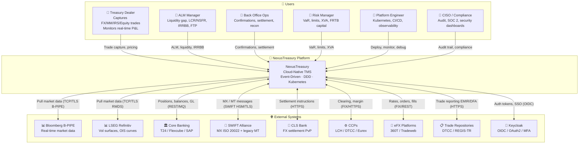

# C4 Level 1 — System Context Diagram

**NexusTreasury** in relation to its users and external systems.

## Diagram

## Key Relationships

| Relationship       | Direction      | Protocol      | Frequency                   |
| ------------------ | -------------- | ------------- | --------------------------- |
| Bloomberg B-PIPE   | Inbound        | TCP/TLS       | Tick-by-tick (sub-ms)       |
| SWIFT MX/MT        | Bi-directional | SWIFT HSM/TLS | On-event                    |
| Core Banking       | Bi-directional | REST/MQ       | Batch (EOD) + events        |
| CLS Bank           | Bi-directional | HTTPS         | Settlement windows          |
| eFX Platforms      | Bi-directional | FIX/REST      | Real-time streaming         |
| Trade Repositories | Outbound       | HTTPS         | T+1 / near-real-time        |
| Keycloak           | Bi-directional | OIDC          | Per session / token refresh |

## Users and Roles

| User              | Primary Module   | Permissions                                 |
| ----------------- | ---------------- | ------------------------------------------- |
| Treasury Dealer   | Trading, Blotter | trade:write, position:read, marketdata:read |
| ALM Manager       | ALM, Liquidity   | alm:read, alm:write, position:read          |
| Back Office Ops   | Back Office      | bo:read, bo:write, settlement:approve       |
| Risk Manager      | Risk, Limits     | risk:read, limit:write, var:read            |
| Platform Engineer | Ops, Monitoring  | platform:admin, audit:read                  |
| CISO              | Audit, Security  | audit:read, compliance:read                 |
