# C4 Level 2 — Container Diagram

All deployable units within the NexusTreasury platform boundary.

## Diagram

```mermaid
flowchart TB
  subgraph actors["👥 Actors"]
    dealer["Treasury Dealer"]
    boOps["Back Office Ops"]
    riskMgr["Risk Manager"]
  end

  subgraph ext["🌐 External"]
    bloomberg["Bloomberg B-PIPE"]
    swift["SWIFT Alliance"]
    coreBanking["Core Banking"]
  end

  subgraph fe["Frontend Layer"]
    webApp["🖥️ Next.js Web App\nReact 18 · TypeScript · Tailwind\nWebSocket blotter · Port 3000"]
  end

  subgraph gateway["API Gateway Layer"]
    apiGW["🔀 API Gateway\nKong / Nginx Ingress\nOAuth2 · Rate Limiting · WAF · Port 443"]
  end

  subgraph services["Microservices — Bounded Contexts"]
    tradeSvc["📈 Trade Service\nNode.js 24 / TypeScript / Fastify\nFX/MM/IRS/Equity booking · Port 4001"]
    posSvc["📊 Position Service\nNode.js 24 / TypeScript / Fastify\nEvent-sourced P&L engine · Port 4002"]
    riskSvc["⚠️ Risk Service\nNode.js 24 / TypeScript / Fastify\nVaR · FRTB · XVA · Limits · Port 4003"]
    almSvc["🏦 ALM Service\nNode.js 24 / TypeScript / Fastify\nLCR · NSFR · IRRBB · FTP · Port 4004"]
    boSvc["📋 Back Office Service\nNode.js 24 / TypeScript / Fastify\nSWIFT MX/MT · Settlement · Port 4005"]
    mdSvc["📡 Market Data Service\nNode.js 24 / TypeScript / Fastify\nBloomberg · LSEG · Curves · Port 4006"]
    authSvc["🔑 Auth Service\nKeycloak 24 · OIDC · OAuth2\nMFA · JWT RS256 · Port 8080"]
    auditSvc["🔐 Audit Service\nNode.js 24 · Immutable log\nHMAC checksum · SOC 2"]
    notifSvc["🔔 Notification Service\nNode.js 24\nAlerts · Email · Webhook · WS"]
    accountingSvc["📒 Accounting Service\nNode.js 24\nIFRS9 · Journal entries · GL feed"]
    platformMgmt["⚙️ Platform Management\nNode.js 24\nMulti-tenant · RBAC · Config"]
  end

  subgraph eventbus["Event Bus"]
    kafka["📨 Apache Kafka\nKafka 3.7 · Confluent Schema Registry\n13 topics · 3× replication · EOS"]
  end

  subgraph datastores["Data Stores"]
    postgres[("🗄️ PostgreSQL 16\nPatroni HA 3-node\nTimescaleDB")]
    redis[("⚡ Redis Cluster\n6-node · Cache\nSessions · Rate Limiting")]
    elastic[("🔍 Elasticsearch\nAudit log index\nFull-text search")]
    s3[("🪣 Object Storage\nS3-compatible\nReports · SWIFT archive")]
  end

  subgraph obs["Observability"]
    prometheus["📊 Prometheus\n+ Alertmanager"]
    grafana["📈 Grafana\nDashboards · SLOs"]
    jaeger["🔍 Jaeger\nDistributed tracing"]
    otel["🔭 OTel Collector\nDaemonSet"]
  end

  subgraph sec["Security Infrastructure"]
    vault["🔐 HashiCorp Vault\nDynamic secrets · PKI · KMS"]
    opa["🛡️ OPA Gatekeeper\nPolicy-as-code · RBAC"]
    trivy["🔬 Trivy Operator\nCVE scanning · Runtime"]
  end

  dealer  -->|"HTTPS/WSS 443"| webApp
  boOps   -->|"HTTPS"| webApp
  riskMgr -->|"HTTPS"| webApp
  webApp  -->|"HTTPS/WSS"| apiGW
  apiGW   -->|"JWT verify"| authSvc
  apiGW   -->|"HTTP/2"| tradeSvc
  apiGW   -->|"HTTP/2"| posSvc
  apiGW   -->|"HTTP/2"| riskSvc
  apiGW   -->|"HTTP/2"| almSvc
  apiGW   -->|"HTTP/2"| boSvc
  apiGW   -->|"HTTP/2"| platformMgmt

  tradeSvc      -->|"Publish trades"| kafka
  posSvc        <-->|"Subscribe + Publish"| kafka
  riskSvc       -->|"Subscribe"| kafka
  almSvc        -->|"Subscribe"| kafka
  boSvc         <-->|"Subscribe + Publish"| kafka
  mdSvc         -->|"Publish rates"| kafka
  accountingSvc -->|"Subscribe + Publish"| kafka
  auditSvc      -->|"Subscribe ALL"| kafka
  notifSvc      -->|"Subscribe alerts"| kafka

  tradeSvc      -->|"pg-wire/TLS"| postgres
  posSvc        -->|"pg-wire/TLS"| postgres
  riskSvc       -->|"pg-wire/TLS"| postgres
  almSvc        -->|"pg-wire/TLS"| postgres
  boSvc         -->|"pg-wire/TLS"| postgres
  accountingSvc -->|"pg-wire/TLS"| postgres
  authSvc       -->|"pg-wire/TLS"| postgres

  tradeSvc -->|"Rate cache"| redis
  apiGW    -->|"Rate limit"| redis
  authSvc  -->|"Sessions"| redis

  auditSvc -->|"HTTP REST"| elastic
  boSvc    -->|"S3 API"| s3

  bloomberg -->|"TCP/TLS B-PIPE"| mdSvc
  swift     -->|"SWIFT HSM/TLS"| boSvc
  coreBanking <-->|"REST/MQ"| tradeSvc

  tradeSvc  -->|"OTel traces"| otel
  posSvc    -->|"OTel traces"| otel
  riskSvc   -->|"OTel traces"| otel
  otel      -->|"Export"| prometheus
  otel      -->|"Export"| jaeger
  prometheus -->|"Query"| grafana

  tradeSvc -->|"Dynamic creds"| vault
  boSvc    -->|"Dynamic creds"| vault
```

## Container Inventory

| Container               | Port      | Language   | Key Dependencies                 |
| ----------------------- | --------- | ---------- | -------------------------------- |
| Next.js Web App         | 3000      | TypeScript | domain, React, Tailwind          |
| Trade Service           | 4001      | TypeScript | domain, Kafka, PostgreSQL, Redis |
| Position Service        | 4002      | TypeScript | domain, Kafka, PostgreSQL        |
| Risk Service            | 4003      | TypeScript | domain, Kafka, PostgreSQL        |
| ALM Service             | 4004      | TypeScript | domain, Kafka, PostgreSQL        |
| Back Office Service     | 4005      | TypeScript | domain, Kafka, PostgreSQL, S3    |
| Market Data Service     | 4006      | TypeScript | domain, Kafka, Bloomberg/LSEG    |
| Auth Service (Keycloak) | 8080      | Java       | PostgreSQL, Redis                |
| Apache Kafka            | 9092/9093 | JVM        | KRaft mode (no ZooKeeper)        |
| PostgreSQL              | 5432      | C          | Patroni HA (3-node)              |
| Redis                   | 6379      | C          | Cluster (6-node)                 |
| Elasticsearch           | 9200      | JVM        | —                                |
