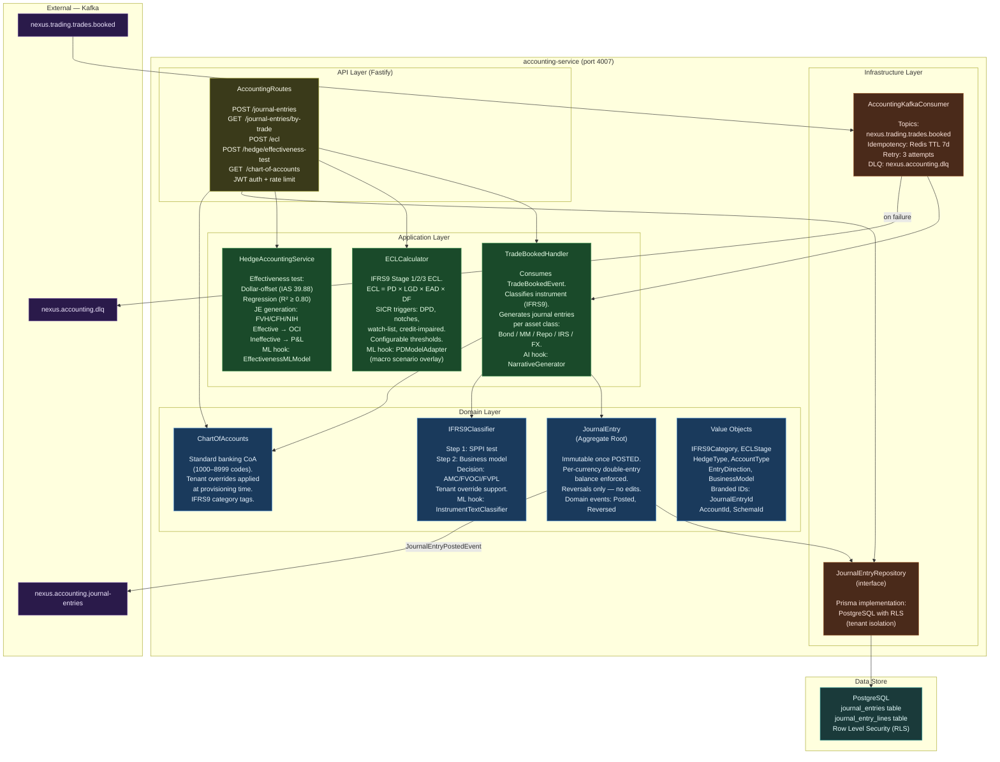
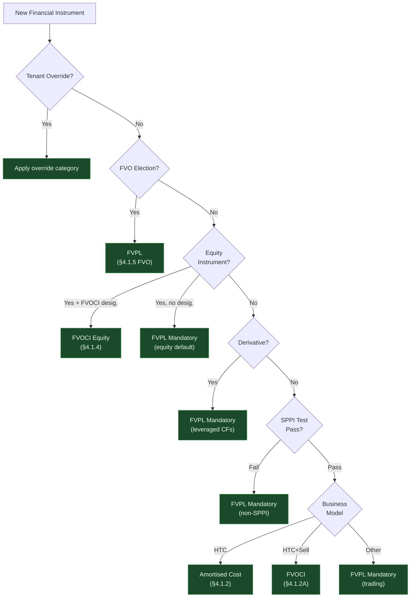
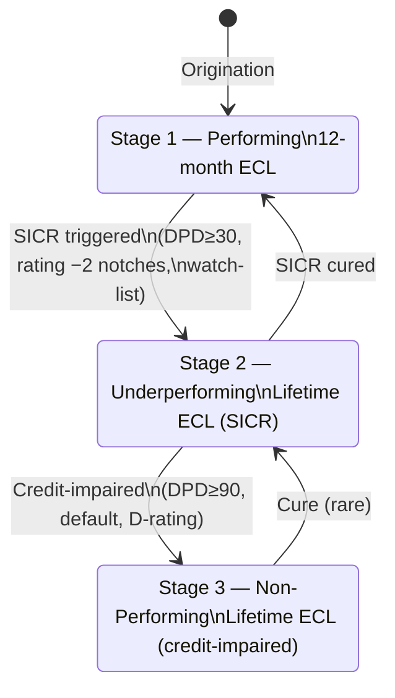

# C4 Level 3 — Accounting Bounded Context Component Diagram

> **Sprint**: Sprint 2 (P1 — Accounting Service)
> **Last Updated**: 2026-04-09

---

## Component Overview

---

## IFRS9 Classification Decision Tree

---

## Journal Entry Generation — Asset Class Matrix

| Asset Class      | Direction     | DR Account                | CR Account         | IFRS9          |
| ---------------- | ------------- | ------------------------- | ------------------ | -------------- |
| Fixed Income     | BUY           | 1300/1310/1320 (category) | 8100 (clearing)    | AMC/FVOCI/FVPL |
| Fixed Income     | SELL          | 8100 (clearing)           | 1300/1310/1320     | AMC/FVOCI/FVPL |
| Money Market     | Placement     | 1500 (MM asset)           | 1100 (nostro)      | AMC            |
| Money Market     | Borrowing     | 1100 (nostro)             | 2300 (MM liab)     | AMC            |
| Repo             | SELL (repo)   | 1100 (cash in)            | 2900 (liability)   | AMC            |
| Repo             | BUY (reverse) | 1600 (securities)         | 1100 (cash out)    | AMC            |
| FX Spot          | BUY base      | 1100 (base nostro)        | 8100 (base clear)  | FVPL           |
| FX Spot          | BUY base      | 8100 (term clear)         | 1100 (term nostro) | FVPL           |
| IRS at-market    | —             | _no entry (NPV=0)_        |                    | FVPL           |
| IRS with premium | Payer         | 1400 (IRS asset)          | 1100 (nostro)      | FVPL           |

---

## ECL Staging (IFRS 9 §5.5)

---

## AI/ML Configuration Points

| Hook                | Interface                      | Default             | Production Example                       |
| ------------------- | ------------------------------ | ------------------- | ---------------------------------------- |
| IFRS9 classifier    | `InstrumentTextClassifier`     | Rule-based          | Fine-tuned LLM on term sheets            |
| ECL PD model        | `PDModelAdapter`               | Rating lookup table | XGBoost with macro overlays              |
| Hedge effectiveness | `HedgeEffectivenessMLModel`    | Dollar-offset       | Regression + volatility regime detection |
| JE narrative        | `AccountingNarrativeGenerator` | None                | LLM audit narrative (IFRS 9 disclosures) |

---

## Test Coverage

| Module                     | Tests  | Coverage Areas                                |
| -------------------------- | ------ | --------------------------------------------- |
| `JournalEntry` (aggregate) | 19     | Double-entry, state machine, reversal, events |
| `IFRS9Classifier`          | 13     | All 5 categories, FVO, override, Islamic      |
| `ECLCalculator`            | 15     | Stage 1/2/3, ECL formula, configurable SICR   |
| `TradeBookedHandler`       | 11     | Bond BUY/SELL, MM, IRS at-par, FX Spot, Repo  |
| `HedgeAccountingService`   | 6      | Dollar-offset, regression, FVH/CFH JEs        |
| **Total**                  | **64** |                                               |
