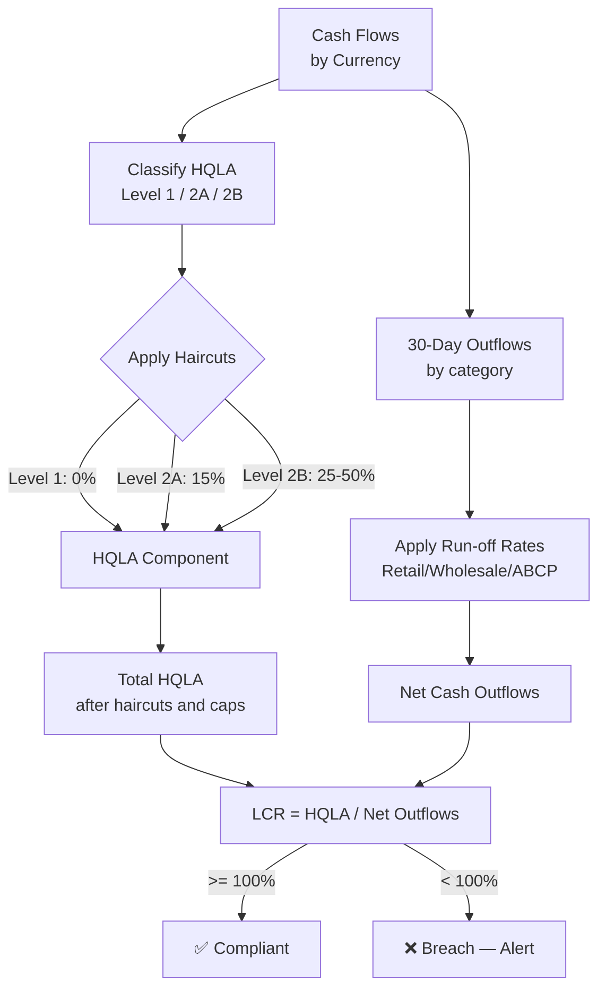

# C4 Level 3 — ALM Service Components

Internal architecture of the **ALM Service** (`packages/alm-service`).
Covers liquidity gap, LCR/NSFR (Basel III), IRRBB (BCBS 368), and FTP.

## Diagram

```mermaid
C4Component
  title ALM Service — Component Diagram

  Container_Boundary(almSvc, "ALM Service  :4004") {

    Component(routes,       "ALM Routes",           "Fastify / OpenAPI 3",
      "GET /alm/liquidity-gap, GET /alm/lcr, GET /alm/nsfr, GET /alm/irrbb, GET /alm/ftp")
    Component(gapCalc,      "LiquidityGapCalculator","Domain Service",
      "Builds contractual and behavioural cash flow ladder by time bucket (O/N to 5Y+).")
    Component(lcrCalc,      "LCRCalculator",        "Regulatory Domain Service",
      "LCR = HQLA / Net 30-day Outflows. Level 1/2A/2B HQLA haircuts (BCBS 238).")
    Component(nsfrCalc,     "NSFRCalculator",       "Regulatory Domain Service",
      "NSFR = ASF / RSF. Required Stable Funding by asset/liability category (BCBS 295).")
    Component(irrbbEngine,  "IRRBBEngine",          "Regulatory Domain Service",
      "EVE and NII sensitivity under 6 BCBS 368 shock scenarios (+/-200bp, twist, steepen).")
    Component(ftpEngine,    "FTPEngine",            "Domain Service",
      "Funds Transfer Pricing. Assigns internal funding cost to each trade by tenor/currency.")
    Component(stressEngine, "StressEngine",         "Domain Service",
      "Bank-specific and market-wide stress scenarios. Survival period calculation.")
    Component(gapAgg,       "LiquidityGapAggregate","DDD Aggregate Root",
      "LiquidityGapReport aggregate. Immutable once generated. Stores by legalEntityId + date.")
    Component(gapRepo,      "GapReportRepository",  "Repository (Prisma)",
      "Persists liquidity gap reports and LCR/NSFR results.")
    Component(posConsumer,  "PositionEventConsumer","Kafka Consumer",
      "Consumes nexus.positions.updated. Triggers gap report refresh.")
    Component(cfConsumer,   "CashFlowConsumer",     "Kafka Consumer",
      "Consumes nexus.alm.cashflow-updated from Trade Service.")
    Component(rateConsumer, "RateEventConsumer",    "Kafka Consumer",
      "Consumes nexus.marketdata.curves. Updates yield curves for IRRBB.")
    Component(otelTrace,    "OTel Tracer",          "Observability",
      "Traces LCR run time, stress scenario duration, FTP calculation performance.")
  }

  Container(kafka,   "Apache Kafka",  "", "Event bus")
  ContainerDb(pg,    "PostgreSQL",    "", "gap_reports, lcr_results, nsfr_results tables")
  Container(webApp,  "Web App",       "", "ALM dashboard, gap chart")

  Rel(kafka,       posConsumer,   "nexus.positions.updated",       "SASL")
  Rel(kafka,       cfConsumer,    "nexus.alm.cashflow-updated",    "SASL")
  Rel(kafka,       rateConsumer,  "nexus.marketdata.curves",       "SASL")
  Rel(posConsumer, gapCalc,       "refreshGap(legalEntityId)",     "in-process")
  Rel(cfConsumer,  gapCalc,       "updateCashFlow(flow)",          "in-process")
  Rel(rateConsumer,irrbbEngine,   "updateCurves(curves)",          "in-process")
  Rel(gapCalc,     lcrCalc,       "computeLCR(hqla, outflows)",    "in-process")
  Rel(gapCalc,     nsfrCalc,      "computeNSFR(asf, rsf)",        "in-process")
  Rel(gapCalc,     stressEngine,  "runStress(scenario)",           "in-process")
  Rel(gapCalc,     gapAgg,        "buildReport()",                 "in-process")
  Rel(gapAgg,      gapRepo,       "save(report)",                  "in-process")
  Rel(gapRepo,     pg,            "INSERT gap_reports",            "pg-wire")
  Rel(routes,      gapCalc,       "GET /alm/liquidity-gap",        "in-process")
  Rel(routes,      lcrCalc,       "GET /alm/lcr",                  "in-process")
  Rel(routes,      nsfrCalc,      "GET /alm/nsfr",                 "in-process")
  Rel(routes,      irrbbEngine,   "GET /alm/irrbb",                "in-process")
  Rel(routes,      ftpEngine,     "GET /alm/ftp",                  "in-process")
```

## LCR Calculation Flow



## Regulatory References

| Metric          | Regulation              | Minimum             | Calculation Frequency    |
| --------------- | ----------------------- | ------------------- | ------------------------ |
| LCR             | BCBS 238 / CRR2 Art 412 | ≥ 100%              | Daily                    |
| NSFR            | BCBS 295 / CRR2 Art 428 | ≥ 100%              | Monthly (Daily internal) |
| IRRBB EVE       | BCBS 368                | Outlier < 15% CET1  | Quarterly                |
| IRRBB NII       | BCBS 368                | Outlier < 5% Tier 1 | Quarterly                |
| Survival Period | Internal / ILAAP        | ≥ 30 days           | Daily                    |
