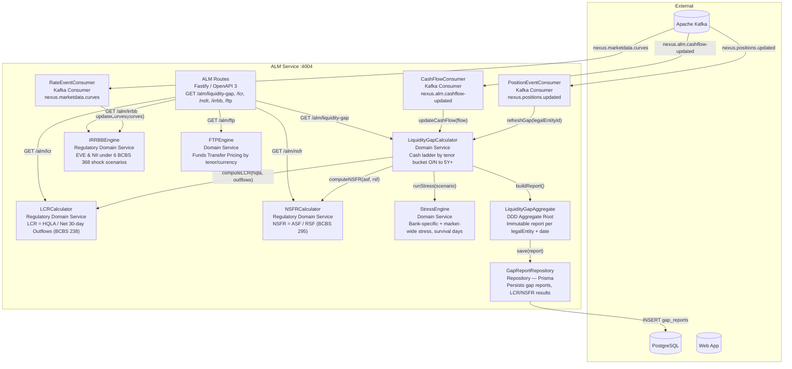
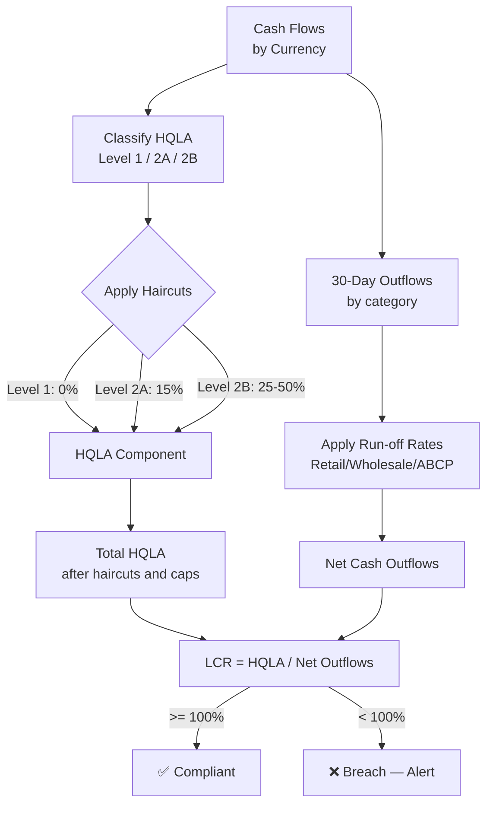

# C4 Level 3 — ALM Service Components

Internal architecture of the **ALM Service** (`packages/alm-service`).
Covers liquidity gap, LCR/NSFR (Basel III), IRRBB (BCBS 368), and FTP.

## Diagram

## LCR Calculation Flow

## Regulatory References

| Metric          | Regulation              | Minimum             | Calculation Frequency    |
| --------------- | ----------------------- | ------------------- | ------------------------ |
| LCR             | BCBS 238 / CRR2 Art 412 | ≥ 100%              | Daily                    |
| NSFR            | BCBS 295 / CRR2 Art 428 | ≥ 100%              | Monthly (Daily internal) |
| IRRBB EVE       | BCBS 368                | Outlier < 15% CET1  | Quarterly                |
| IRRBB NII       | BCBS 368                | Outlier < 5% Tier 1 | Quarterly                |
| Survival Period | Internal / ILAAP        | ≥ 30 days           | Daily                    |
