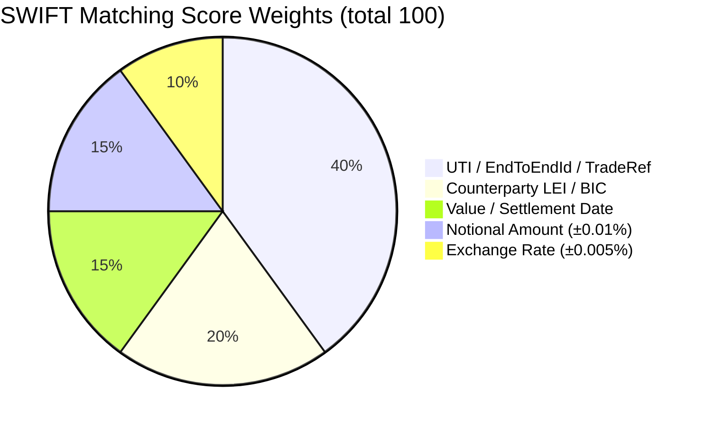

# C4 Level 3 — Back Office Service Components

Internal architecture of the **Back Office Service** (`packages/bo-service`).
Handles SWIFT MX/MT message processing, confirmation matching, and settlement.

## Diagram

```mermaid
C4Component
  title Back Office Service — Component Diagram

  Container_Boundary(boSvc, "Back Office Service  :4005") {

    Component(routes,       "BO Routes",             "Fastify / OpenAPI 3",
      "POST /bo/swift/inbound, GET /bo/exceptions, GET /bo/settlement-ladder, GET /health")
    Component(mxParser,     "ISO20022Parser",        "Application Service — MX",
      "Parses ISO 20022 XML (fxtr.008/014, pacs.002/008/009/028, camt.053/054/056). Extracts UTI, LEI, BIC.")
    Component(matcher,      "SWIFTMatcher",          "Application Service",
      "Field-level matching engine. Weighted scoring: UTI/LEI(40%), BIC(20%), date(15%), amount(15%), rate(10%).")
    Component(mtParser,     "MT FIN Parser",         "Application Service — Legacy",
      "Parses legacy MT FIN messages (MT300, MT320, MT360, MT940). Colon-tagged field extraction.")
    Component(confirmSvc,   "ConfirmationService",   "Domain Service",
      "Auto-matches SWIFT confirmations to booked trades. STP target ≥ 95% within 15 minutes.")
    Component(settleSvc,    "SettlementService",     "Domain Service",
      "Generates CLS settlement instructions. Nostro account management. PvP coordination.")
    Component(reconSvc,     "ReconciliationService", "Domain Service",
      "Daily nostro reconciliation. Breaks identification and exception management.")
    Component(tradeConsumer,"TradeEventConsumer",    "Kafka Consumer",
      "Consumes nexus.trading.trades.created. Creates pending confirmation record.")
    Component(confPub,      "ConfirmationPublisher", "Kafka Producer",
      "Publishes ConfirmationMatchedEvent to nexus.bo.confirmation-received.")
    Component(settlePub,    "SettlementPublisher",   "Kafka Producer",
      "Publishes SettlementInstructionEvent to nexus.bo.settlement-instruction.")
    Component(s3Client,     "S3ArchiveClient",       "Infrastructure",
      "Archives SWIFT MX/MT messages to S3 for regulatory retention (7 years).")
    Component(otelTrace,    "OTel Tracer",           "Observability",
      "Traces SWIFT parse latency, matching score, settlement instruction processing time.")
  }

  Container(kafka,  "Apache Kafka", "", "Event bus")
  ContainerDb(pg,   "PostgreSQL",   "", "confirmations, settlements, reconciliations")
  ContainerDb(s3,   "Object Storage","","SWIFT message archive")
  System_Ext(swift, "SWIFT Alliance","","MX/MT messages inbound")
  System_Ext(cls,   "CLS Bank",     "", "FX settlement PvP")

  Rel(swift,        routes,       "POST /bo/swift/inbound (MX XML / MT FIN)", "HTTPS/mTLS")
  Rel(routes,       mxParser,     "parse(xmlContent, messageType)",             "in-process")
  Rel(routes,       mtParser,     "parseMT(finContent, messageType)",           "in-process")
  Rel(mxParser,     matcher,      "match(parsedFields, tradeRef)",              "in-process")
  Rel(mtParser,     matcher,      "match(parsedFields, tradeRef)",              "in-process")
  Rel(matcher,      confirmSvc,   "onMatchResult(result)",                      "in-process")
  Rel(confirmSvc,   confPub,      "publish(ConfirmationMatchedEvent)",           "in-process")
  Rel(confirmSvc,   s3Client,     "archive(swiftMessage)",                      "in-process")
  Rel(kafka,        tradeConsumer,"nexus.trading.trades.created",               "SASL")
  Rel(tradeConsumer,confirmSvc,   "createPendingConfirmation(trade)",            "in-process")
  Rel(routes,       settleSvc,    "GET /bo/settlement-ladder",                  "in-process")
  Rel(settleSvc,    settlePub,    "publish(SettlementInstructionEvent)",         "in-process")
  Rel(settlePub,    kafka,        "nexus.bo.settlement-instruction",            "SASL")
  Rel(confPub,      kafka,        "nexus.bo.confirmation-received",             "SASL")
  Rel(settleSvc,    cls,          "FX settlement instruction",                  "HTTPS/mTLS")
  Rel(confirmSvc,   pg,           "INSERT/UPDATE confirmations",                "pg-wire")
  Rel(settleSvc,    pg,           "INSERT settlements, cash_flows",             "pg-wire")
  Rel(s3Client,     s3,           "PUT swift/{year}/{msgId}.xml",               "S3 API")
```

## SWIFT MX Message Support Matrix

| MX Message | Replaces (MT) | Purpose                            | Parser Method    |
| ---------- | ------------- | ---------------------------------- | ---------------- |
| `fxtr.008` | MT300         | FX Trade Confirmation              | `parseFxtr()`    |
| `fxtr.014` | MT300         | FX Trade Status Advice             | `parseFxtr()`    |
| `pacs.008` | MT103         | Customer Credit Transfer           | `parsePacs008()` |
| `pacs.009` | MT202         | FI Credit Transfer (FX settlement) | `parsePacs009()` |
| `pacs.002` | MT199         | Payment Status Report              | `parsePacs002()` |
| `pacs.028` | MT192         | FI Payment Status Request          | `parsePacs028()` |
| `camt.053` | MT940         | Bank Statement (Nostro recon)      | `parseCamt053()` |
| `camt.054` | MT942         | Debit/Credit Notification          | `parseCamt054()` |
| `camt.056` | MT192/MT292   | Payment Cancellation Request       | `parseCamt056()` |

## Matching Score Breakdown



| Score          | Status    | Action                   |
| -------------- | --------- | ------------------------ |
| ≥ 80           | MATCHED   | Auto-confirmed; STP path |
| 50–79          | PENDING   | Back office review       |
| < 50           | UNMATCHED | Exception queue          |
| Field mismatch | EXCEPTION | Immediate alert          |
