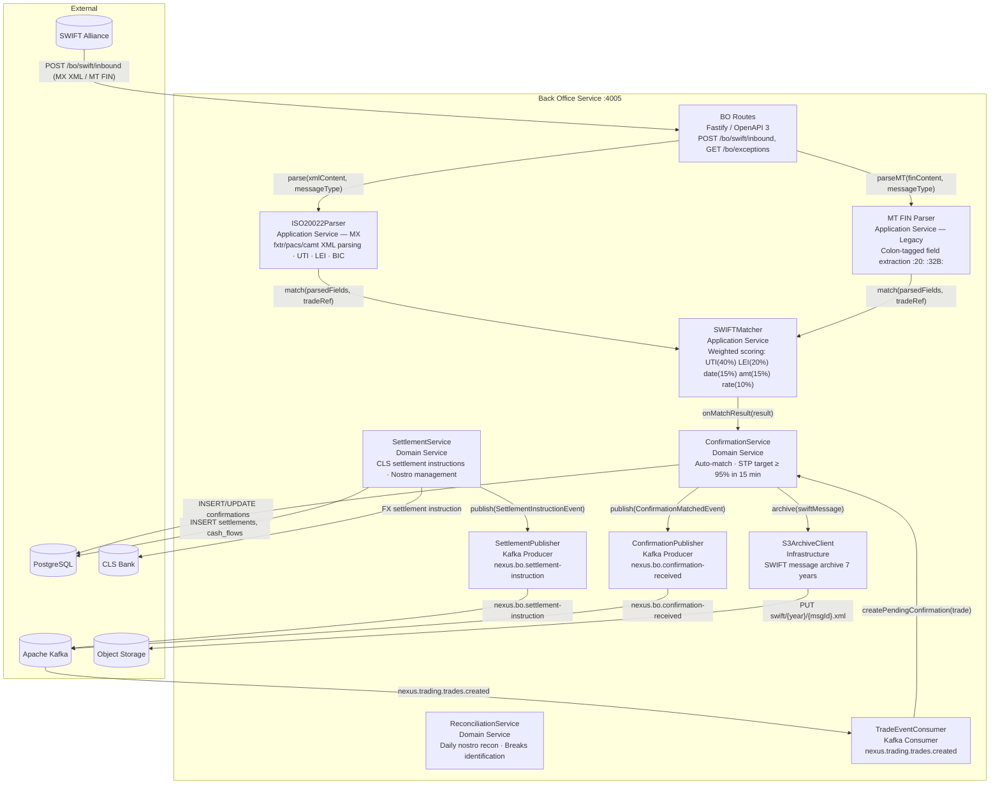
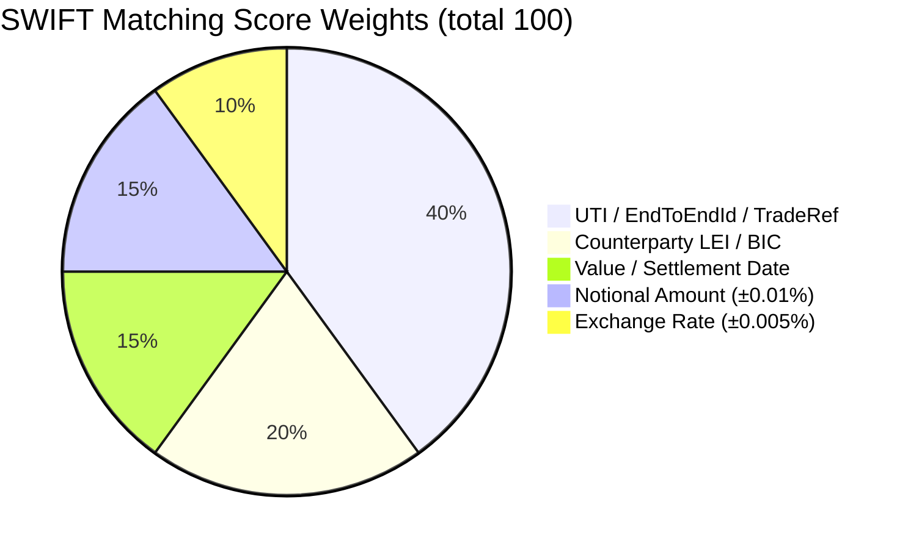

# C4 Level 3 — Back Office Service Components

Internal architecture of the **Back Office Service** (`packages/bo-service`).
Handles SWIFT MX/MT message processing, confirmation matching, and settlement.

## Diagram

## SWIFT MX Message Support Matrix

| MX Message | Replaces (MT) | Purpose                            | Parser Method    |
| ---------- | ------------- | ---------------------------------- | ---------------- |
| `fxtr.008` | MT300         | FX Trade Confirmation              | `parseFxtr()`    |
| `fxtr.014` | MT300         | FX Trade Status Advice             | `parseFxtr()`    |
| `pacs.008` | MT103         | Customer Credit Transfer           | `parsePacs008()` |
| `pacs.009` | MT202         | FI Credit Transfer (FX settlement) | `parsePacs009()` |
| `pacs.002` | MT199         | Payment Status Report              | `parsePacs002()` |
| `pacs.028` | MT192         | FI Payment Status Request          | `parsePacs028()` |
| `camt.053` | MT940         | Bank Statement (Nostro recon)      | `parseCamt053()` |
| `camt.054` | MT942         | Debit/Credit Notification          | `parseCamt054()` |
| `camt.056` | MT192/MT292   | Payment Cancellation Request       | `parseCamt056()` |

## Matching Score Breakdown

| Score          | Status    | Action                   |
| -------------- | --------- | ------------------------ |
| ≥ 80           | MATCHED   | Auto-confirmed; STP path |
| 50–79          | PENDING   | Back office review       |
| < 50           | UNMATCHED | Exception queue          |
| Field mismatch | EXCEPTION | Immediate alert          |
