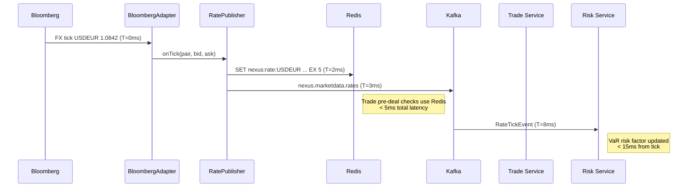

# C4 Level 3 — Market Data Service Components

Internal architecture of the **Market Data Service** (`packages/market-data-service`).

## Diagram

```mermaid
C4Component
  title Market Data Service — Component Diagram

  Container_Boundary(mdSvc, "Market Data Service  :4006") {

    Component(routes,       "Market Data Routes",   "Fastify / OpenAPI 3",
      "GET /marketdata/rates, GET /marketdata/curves, GET /marketdata/vol-surface")
    Component(rateAdapter,  "MockRateAdapter",      "Infrastructure Adapter",
      "In CI/test: generates synthetic FX/MM rates. Production: replaced by BloombergAdapter or LSEGAdapter.")
    Component(bloombergAdp, "BloombergAdapter",     "Infrastructure Adapter (Prod)",
      "Connects to Bloomberg B-PIPE. Subscribes to FX spots, deposit rates, bond yields.")
    Component(lsegAdp,      "LSEGAdapter",          "Infrastructure Adapter (Prod)",
      "Connects to LSEG Refinitiv RMDS. Volatility surfaces and OIS curves.")
    Component(curveBuilder, "YieldCurveBuilder",    "Domain Service",
      "Bootstraps OIS and IBOR curves from deposit/swap rates. Nelson-Siegel-Svensson parameterisation.")
    Component(volSurface,   "VolatilitySurface",    "Domain Service",
      "Builds FX implied vol surface (SABR model). Calculates smile/skew for option pricing.")
    Component(ratePub,      "RatePublisher",        "Kafka Producer",
      "Publishes RateTickEvent to nexus.marketdata.rates on every tick (target < 10ms latency).")
    Component(curvePub,     "CurvePublisher",       "Kafka Producer",
      "Publishes YieldCurveEvent to nexus.marketdata.curves on curve rebuild (every 5 minutes).")
    Component(rateCache,    "RateCache",            "Infrastructure — Redis",
      "Caches latest rate per currency pair. TTL 5 seconds. Used by Trade Service pre-deal checks.")
    Component(otelTrace,    "OTel Tracer",          "Observability",
      "Traces feed latency, curve build time, cache hit/miss ratio.")
  }

  Container(kafka,     "Apache Kafka",    "", "Event bus")
  ContainerDb(redis,   "Redis Cluster",   "", "Rate cache: nexus:rate:{pair}")
  System_Ext(bloomberg,"Bloomberg B-PIPE","", "Real-time market data")
  System_Ext(lseg,     "LSEG Refinitiv", "", "Volatility surfaces, OIS curves")
  Container(tradeSvc,  "Trade Service",   "", "Reads rates via Redis cache")
  Container(riskSvc,   "Risk Service",    "", "Consumes rate events for VaR")
  Container(almSvc,    "ALM Service",     "", "Consumes curve events for IRRBB")

  Rel(bloomberg,   bloombergAdp, "B-PIPE subscription feed",            "TCP/TLS")
  Rel(lseg,        lsegAdp,      "RMDS subscription feed",              "TCP/TLS")
  Rel(bloombergAdp,curveBuilder, "raw rates",                           "in-process")
  Rel(lsegAdp,     volSurface,   "vol quotes",                         "in-process")
  Rel(bloombergAdp,ratePub,      "tick data",                           "in-process")
  Rel(rateAdapter, ratePub,      "synthetic tick (CI/dev)",             "in-process")
  Rel(ratePub,     kafka,        "nexus.marketdata.rates",              "SASL")
  Rel(ratePub,     rateCache,    "SET nexus:rate:{pair} EX 5",          "Redis")
  Rel(curveBuilder,curvePub,     "rebuilt curve",                       "in-process")
  Rel(curvePub,    kafka,        "nexus.marketdata.curves",             "SASL")
  Rel(rateCache,   redis,        "GET/SET",                             "Redis protocol")
  Rel(tradeSvc,    rateCache,    "GET nexus:rate:{pair}",               "Redis protocol")
  Rel(kafka,       riskSvc,      "nexus.marketdata.rates (VaR RF)",     "SASL")
  Rel(kafka,       almSvc,       "nexus.marketdata.curves (IRRBB)",     "SASL")
  Rel(routes,      rateAdapter,  "GET /marketdata/rates",               "in-process")
  Rel(routes,      curveBuilder, "GET /marketdata/curves",              "in-process")
  Rel(routes,      volSurface,   "GET /marketdata/vol-surface",         "in-process")
```

## Rate Cache Strategy

| Key Pattern           | Value                                                 | TTL  | Consumer      |
| --------------------- | ----------------------------------------------------- | ---- | ------------- |
| `nexus:rate:USDEUR`   | `{"bid":1.0840,"ask":1.0845,"mid":1.0842,"ts":"..."}` | 5s   | Trade Service |
| `nexus:rate:USDGHS`   | `{"bid":14.80,"ask":14.82,"mid":14.81,"ts":"..."}`    | 5s   | Trade Service |
| `nexus:curve:USD-OIS` | `{"pillars":[0.25,0.5,1,2,5,10],"rates":[...]}`       | 300s | Risk/ALM      |
| `nexus:vol:EURUSD`    | `{"surface":[[delta,tenor,vol],...]}`                 | 300s | Risk (XVA)    |

## Data Flow Timing


