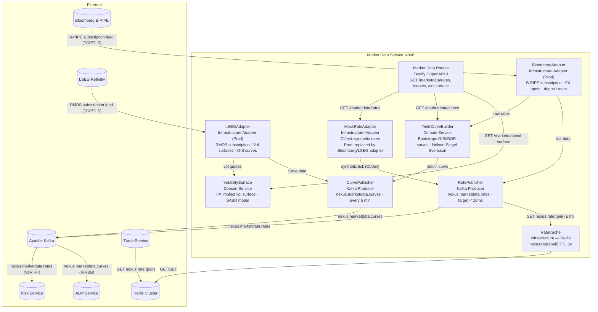
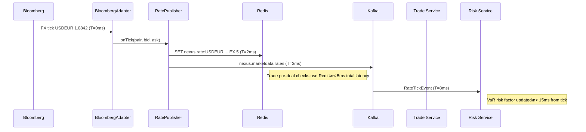

# C4 Level 3 — Market Data Service Components

Internal architecture of the **Market Data Service** (`packages/market-data-service`).

## Diagram

## Rate Cache Strategy

| Key Pattern           | Value                                                 | TTL  | Consumer      |
| --------------------- | ----------------------------------------------------- | ---- | ------------- |
| `nexus:rate:USDEUR`   | `{"bid":1.0840,"ask":1.0845,"mid":1.0842,"ts":"..."}` | 5s   | Trade Service |
| `nexus:rate:USDGHS`   | `{"bid":14.80,"ask":14.82,"mid":14.81,"ts":"..."}`    | 5s   | Trade Service |
| `nexus:curve:USD-OIS` | `{"pillars":[0.25,0.5,1,2,5,10],"rates":[...]}`       | 300s | Risk/ALM      |
| `nexus:vol:EURUSD`    | `{"surface":[[delta,tenor,vol],...]}`                 | 300s | Risk (XVA)    |

## Data Flow Timing

