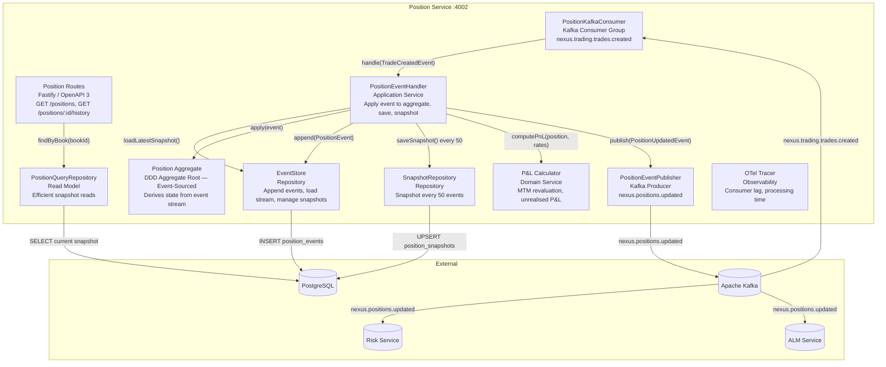
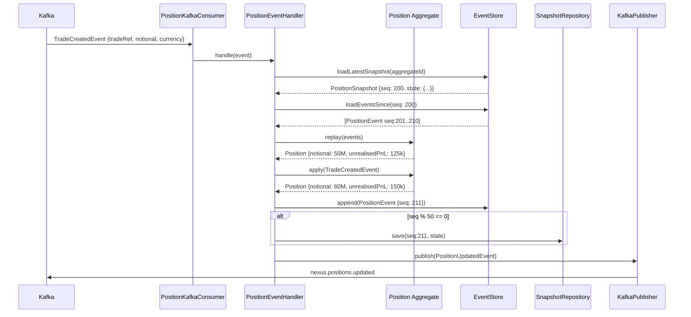

# C4 Level 3 — Position Service Components

Internal architecture of the **Position Service** (`packages/position-service`).
Implements **event sourcing** — position state is derived entirely from an append-only event store.

## Diagram

## Event Sourcing Design

## Event Types

| Event Type          | Trigger                          | Fields                                   |
| ------------------- | -------------------------------- | ---------------------------------------- |
| `PositionOpened`    | First trade in a book/instrument | bookId, instrumentId, notional, currency |
| `PositionIncreased` | Buy trade                        | delta, newNotional, unrealisedPnL        |
| `PositionDecreased` | Sell trade                       | delta, newNotional, realisedPnL          |
| `PositionClosed`    | Net zero position                | realisedPnL, closedAt                    |
| `PositionRevalued`  | MTM revaluation                  | marketValue, unrealisedPnL, rate         |
| `PositionAmended`   | Trade amendment                  | oldState, newState                       |
