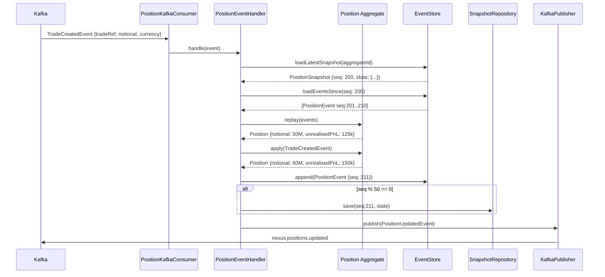

# C4 Level 3 — Position Service Components

Internal architecture of the **Position Service** (`packages/position-service`).
Implements **event sourcing** — position state is derived entirely from an append-only event store.

## Diagram

```mermaid
C4Component
  title Position Service — Component Diagram (Event-Sourced)

  Container_Boundary(posSvc, "Position Service  :4002") {

    Component(routes,       "Position Routes",        "Fastify / OpenAPI 3",
      "GET /positions, GET /positions/:id, GET /positions/:id/history")
    Component(kafkaConsumer,"PositionKafkaConsumer",  "Kafka Consumer Group",
      "Consumes nexus.trading.trades.created. Rebuilds position aggregate on each event.")
    Component(posHandler,   "PositionEventHandler",   "Application Service",
      "Applies TradeCreatedEvent to Position aggregate. Saves event + updated snapshot.")
    Component(posAgg,       "Position Aggregate",     "DDD Aggregate Root (Event-Sourced)",
      "Derives current state from event stream. Supports point-in-time replay. Raises PositionUpdatedEvent.")
    Component(eventStore,   "EventStore",             "Repository",
      "Appends PositionEvent records. Loads event stream for replay. Manages snapshot cadence (every 50 events).")
    Component(snapshotRepo, "SnapshotRepository",     "Repository",
      "Stores position snapshots for performance. Reduces event replay from full history to last 50.")
    Component(pnlCalc,      "P&L Calculator",         "Domain Service",
      "Computes unrealised P&L using current market rates. MTM revaluation engine.")
    Component(kafkaPub,     "PositionEventPublisher", "Kafka Producer",
      "Publishes PositionUpdatedEvent to nexus.positions.updated after each position change.")
    Component(queryRepo,    "PositionQueryRepository","Read Model",
      "Efficient query-side reads. Returns current position snapshot without event replay.")
    Component(otelTrace,    "OTel Tracer",            "Observability",
      "Traces Kafka consumer lag, event processing time, P&L calculation duration.")
  }

  Container(kafka,   "Apache Kafka",   "", "Event bus")
  ContainerDb(pg,    "PostgreSQL",     "", "position_events, position_snapshots tables")
  Container(riskSvc, "Risk Service",   "", "Consumes PositionUpdatedEvent")
  Container(almSvc,  "ALM Service",    "", "Consumes PositionUpdatedEvent")

  Rel(kafka,        kafkaConsumer, "nexus.trading.trades.created",       "SASL")
  Rel(kafkaConsumer,posHandler,   "handle(TradeCreatedEvent)",           "in-process")
  Rel(posHandler,   posAgg,       "apply(event)",                        "in-process")
  Rel(posHandler,   eventStore,   "append(PositionEvent)",               "in-process")
  Rel(posHandler,   snapshotRepo, "saveSnapshot() every 50 events",      "in-process")
  Rel(posHandler,   pnlCalc,      "computePnL(position, rates)",         "in-process")
  Rel(posHandler,   kafkaPub,     "publish(PositionUpdatedEvent)",        "in-process")
  Rel(routes,       queryRepo,    "findByBook(bookId, tenantId)",         "in-process")
  Rel(eventStore,   pg,           "INSERT position_events",              "pg-wire/TLS")
  Rel(snapshotRepo, pg,           "UPSERT position_snapshots",           "pg-wire/TLS")
  Rel(queryRepo,    pg,           "SELECT current snapshot",             "pg-wire/TLS")
  Rel(kafkaPub,     kafka,        "nexus.positions.updated",             "SASL")
  Rel(kafka,        riskSvc,      "nexus.positions.updated",             "SASL")
  Rel(kafka,        almSvc,       "nexus.positions.updated",             "SASL")
```

## Event Sourcing Design



## Event Types

| Event Type          | Trigger                          | Fields                                   |
| ------------------- | -------------------------------- | ---------------------------------------- |
| `PositionOpened`    | First trade in a book/instrument | bookId, instrumentId, notional, currency |
| `PositionIncreased` | Buy trade                        | delta, newNotional, unrealisedPnL        |
| `PositionDecreased` | Sell trade                       | delta, newNotional, realisedPnL          |
| `PositionClosed`    | Net zero position                | realisedPnL, closedAt                    |
| `PositionRevalued`  | MTM revaluation                  | marketValue, unrealisedPnL, rate         |
| `PositionAmended`   | Trade amendment                  | oldState, newState                       |
