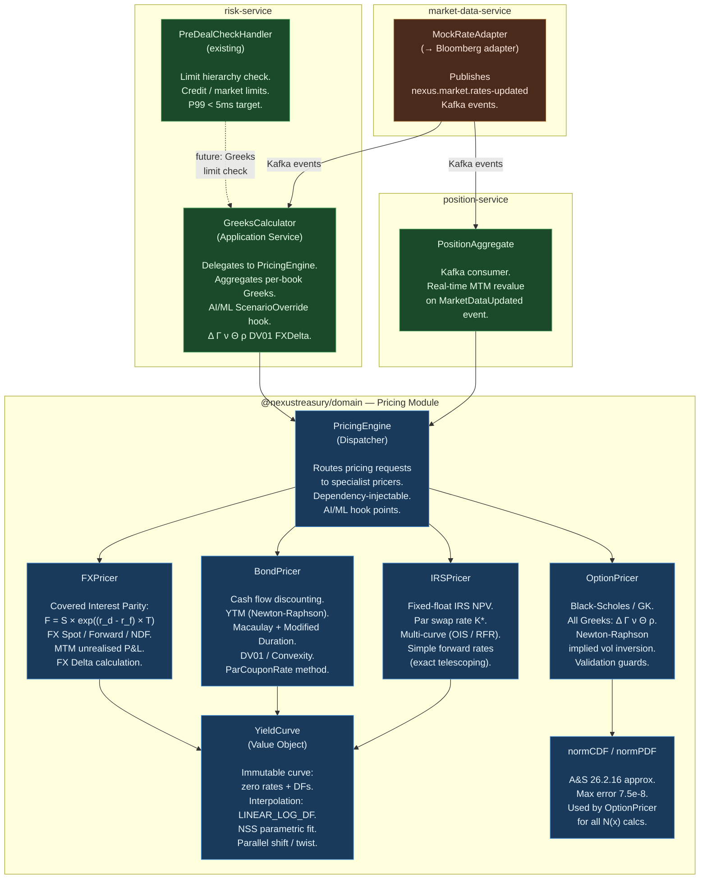
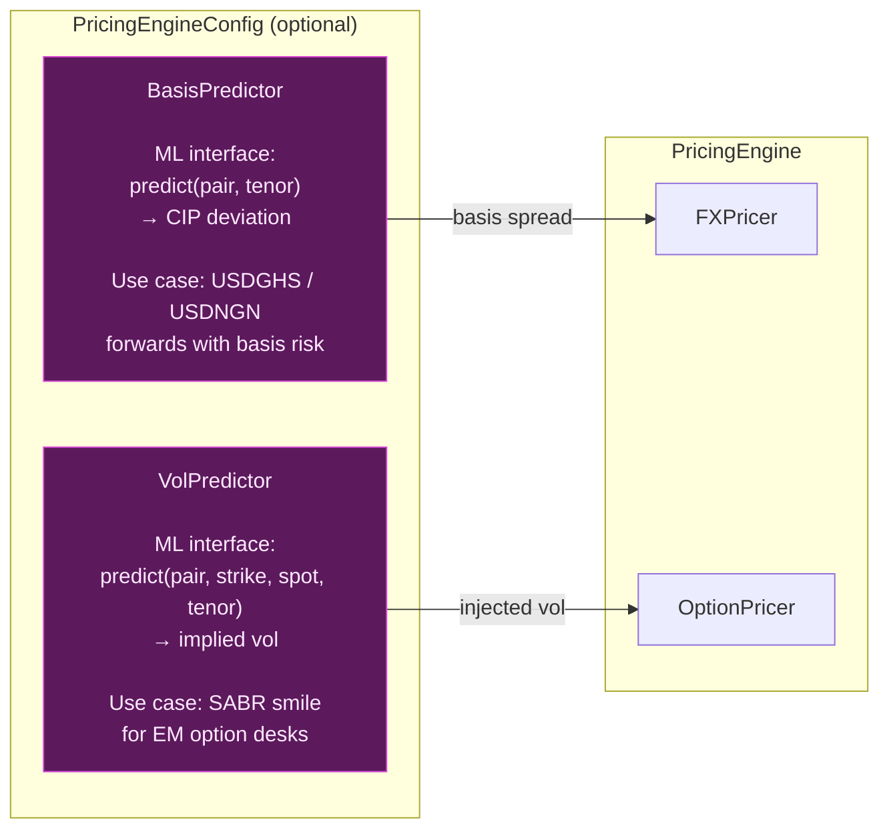
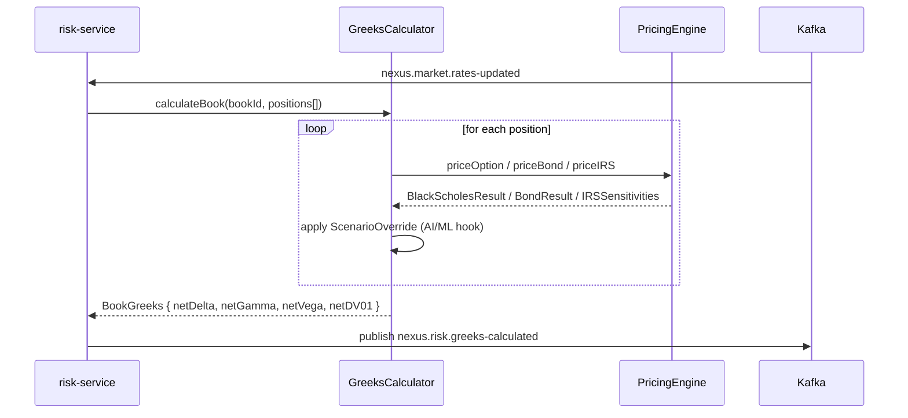
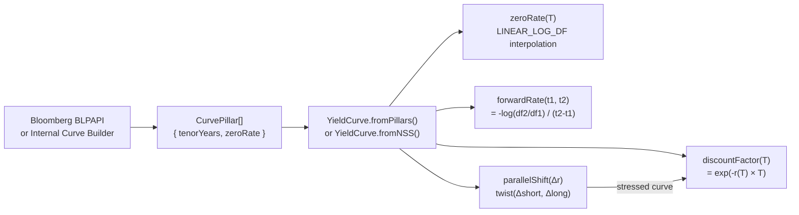

# C4 Level 3 — Pricing Bounded Context Component Diagram

> **Document**: NexusTreasury Architecture — Pricing Engine Components
> **Sprint**: Sprint 1 (P1 — Pricing Engine + Greeks)
> **Last Updated**: 2026-04-09

---

## Component Overview

The Pricing Engine is a pure domain module (`@nexustreasury/domain/pricing`) with
no infrastructure dependencies. It is used by:

- `risk-service` — pre-deal Greek limit checks, VaR, FRTB
- `position-service` — real-time MTM revaluation on market data events
- `alm-service` — HQLA yield calculations, EVE shocks
- `trade-service` — indicative pricing at trade capture

---

## AI/ML Hook Points

The pricing engine has two configurable AI/ML injection points:

---

## Greeks Calculator Book-Level Flow

---

## Data Flow: Yield Curve Construction

---

## Interpolation Method Comparison

| Method          | Description                     | Pros                                                           | Cons                               |
| --------------- | ------------------------------- | -------------------------------------------------------------- | ---------------------------------- |
| `LINEAR_ZERO`   | Linear on zero rates            | Simple                                                         | Can produce negative forward rates |
| `LINEAR_LOG_DF` | Linear on log(df) ← **default** | Guarantees positive forwards; piecewise-constant forward rates | Slightly less smooth               |
| `CUBIC_SPLINE`  | Cubic spline on zero rates      | Smooth forward curve                                           | Potential oscillation at edges     |

---

## Test Coverage Matrix

| Component          | Test File                   | Tests  | Key Fixtures                              |
| ------------------ | --------------------------- | ------ | ----------------------------------------- |
| `YieldCurve`       | `yield-curve.test.ts`       | 14     | Flat 5%, SOFR (upward-sloping), NSS       |
| `OptionPricer`     | `option-pricer.test.ts`     | 19     | Haug §1.1 (S=42, K=40), EURUSD ATM        |
| `FXPricer`         | `fx-pricer.test.ts`         | 5      | EURUSD, USDGHS EM forward, NDF            |
| `BondPricer`       | `bond-pricer.test.ts`       | 11     | 5% 5Y bond, zero-coupon, par bond         |
| `IRSPricer`        | `irs-pricer.test.ts`        | 8      | 5Y SOFR swap, upward-sloping curve        |
| `GreeksCalculator` | `greeks-calculator.test.ts` | 8      | ATM FX call, FX forward, book aggregation |
| **Total**          |                             | **65** | Bloomberg / Haug / BIS reference values   |
