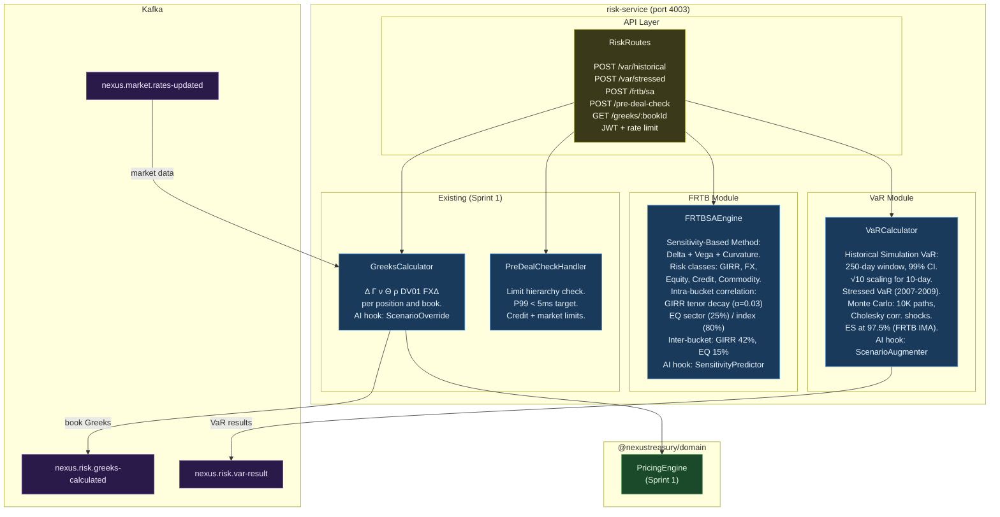
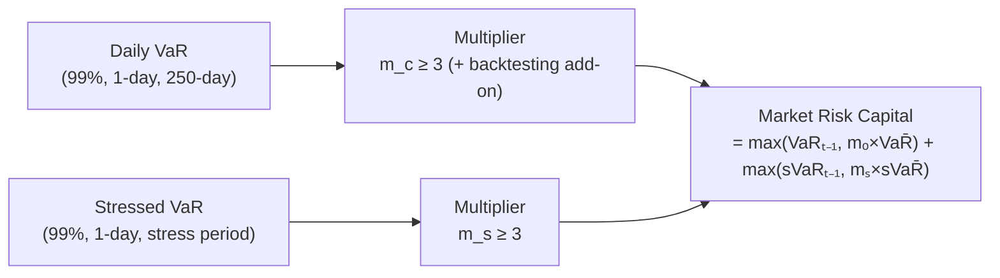
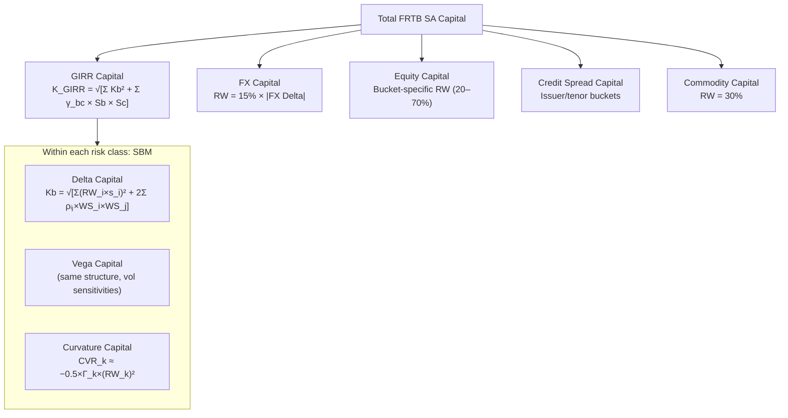

# C4 Level 3 — Market Risk Engine Component Diagram

> **Sprint**: Sprint 4 (P1 — VaR + Stressed VaR + FRTB SA Capital)
> **Last Updated**: 2026-04-09

---

## Component Overview



---

## VaR Method Comparison

| Method                    | Inputs                                | Pros                           | Cons                            | Used for                       |
| ------------------------- | ------------------------------------- | ------------------------------ | ------------------------------- | ------------------------------ |
| **Historical Simulation** | 250-day P&L history                   | Captures fat tails, real-world | Needs history; backward-looking | Basel III VaR, daily reporting |
| **Stressed VaR**          | P&L during 2007–2008                  | Captures crisis tail risk      | Fixed stress period             | Basel III additional capital   |
| **Monte Carlo**           | Position sensitivities, RF covariance | Handles options/non-linearity  | Computationally intensive       | FRTB IMA, complex books        |
| **Expected Shortfall**    | Same as HS or MC                      | Coherent risk measure          | More volatile than VaR          | FRTB IMA (replaces VaR)        |

---

## Basel III Capital Calculation



---

## FRTB SA Capital Structure (BCBS 457)



---

## GIRR Intra-Bucket Tenor Correlations

```
ρ(T_i, T_j) = exp(−0.03 × |T_i − T_j| / min(T_i, T_j))

Examples (BCBS 457 prescribed):
  0.25Y ↔ 0.5Y:  ρ ≈ exp(-0.03 × 0.25/0.25) = 0.970
  1Y    ↔ 5Y:    ρ ≈ exp(-0.03 × 4/1)        = 0.887
  1Y    ↔ 30Y:   ρ ≈ exp(-0.03 × 29/1)       = 0.419
```

---

## AI/ML Integration Points — Sprint 4

| Hook                   | Interface              | Activation                   | Use Case                                               |
| ---------------------- | ---------------------- | ---------------------------- | ------------------------------------------------------ |
| `ScenarioAugmenter`    | `augment(history[])`   | VaRCalculator constructor    | Add COVID/GFC synthetic scenarios to HS-VaR            |
| `SensitivityPredictor` | `predict(position)`    | FRTBSAEngine constructor     | Predict FRTB sensitivities for illiquid EM instruments |
| `ScenarioOverride`     | `apply(greeks, input)` | GreeksCalculator constructor | Stressed Greeks for limit checking                     |

---

## Test Coverage — Sprint 4

| Module                       | Tests    | Key Scenarios                                     |
| ---------------------------- | -------- | ------------------------------------------------- |
| `VaRCalculator` (HS)         | 8        | correct quantile, √10 scaling, window=250, ES≥VaR |
| `VaRCalculator` (MC)         | 5        | positive, method tag, path count, ES≥VaR          |
| `VaRCalculator` (sVaR)       | 4        | method, period filter, fallback                   |
| `VaRCalculator` (AI/ML)      | 1        | augmented VaR > base VaR                          |
| `FRTBSAEngine` (delta)       | 6        | RW application, diversification, GIRR/FX/EQ       |
| `FRTBSAEngine` (total)       | 5        | sum correctness, non-negative, risk class count   |
| `FRTBSAEngine` (correlation) | 1        | tenor correlation structure                       |
| **Sprint 4 Total**           | **30**   |                                                   |
| **Cumulative**               | **300+** | All packages                                      |
