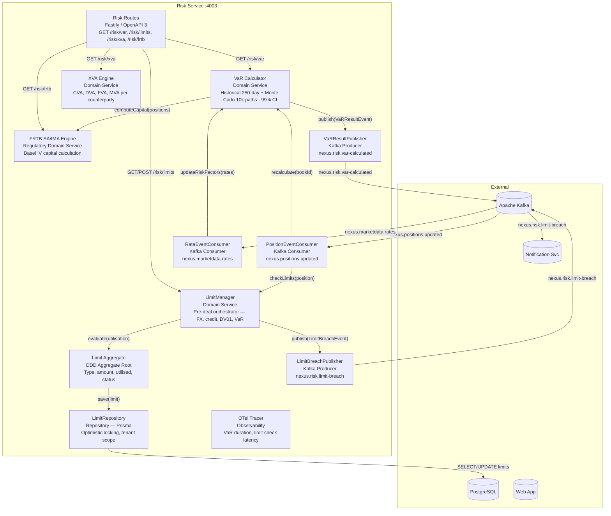
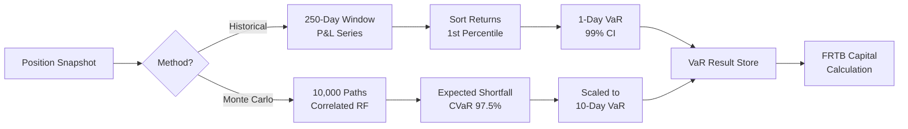

# C4 Level 3 — Risk Service Components

Internal architecture of the **Risk Service** (`packages/risk-service`).
Covers VaR, FRTB SA/IMA, XVA, and counterparty limit management.

## Diagram

## Limit Types Supported

| Limit Type           | Scope               | Unit             | Basel Reference         |
| -------------------- | ------------------- | ---------------- | ----------------------- |
| FX Net Open Position | Book                | Notional (CCY)   | Basel II Pillar 1       |
| Counterparty Credit  | Counterparty        | Notional (CCY)   | EMIR/CRR2               |
| DV01 (Interest Rate) | Book                | USD per bp       | FRTB SB-DRC             |
| VaR                  | Book / Portfolio    | USD (99%, 1-day) | Basel III / FRTB IMA    |
| CVA                  | Counterparty        | USD              | Basel III CVA framework |
| FRTB SA Capital      | Desk / Legal Entity | USD              | Basel IV FRTB SA        |

## VaR Calculation Methods

