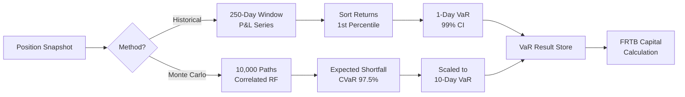

# C4 Level 3 — Risk Service Components

Internal architecture of the **Risk Service** (`packages/risk-service`).
Covers VaR, FRTB SA/IMA, XVA, and counterparty limit management.

## Diagram

```mermaid
C4Component
  title Risk Service — Component Diagram

  Container_Boundary(riskSvc, "Risk Service  :4003") {

    Component(routes,       "Risk Routes",           "Fastify / OpenAPI 3",
      "GET /risk/var, GET /risk/limits, GET /risk/xva, POST /risk/limits, GET /risk/frtb")
    Component(varCalc,      "VaR Calculator",        "Domain Service",
      "Historical simulation (250-day window) and Monte Carlo (10,000 paths) at 99% confidence.")
    Component(frtbEngine,   "FRTB SA/IMA Engine",   "Regulatory Domain Service",
      "Basel IV FRTB Standardised Approach + Internal Models Approach capital calculation.")
    Component(xvaEngine,    "XVA Engine",            "Domain Service",
      "CVA (Credit Valuation Adjustment), DVA, FVA, MVA calculations per counterparty.")
    Component(limitMgr,     "LimitManager",          "Domain Service",
      "Pre-deal limit check orchestrator. Checks FX, MM, credit, DV01, and FRTB bucket limits.")
    Component(limitAgg,     "Limit Aggregate",       "DDD Aggregate Root",
      "Limit entity: type, counterparty/book, amount, currency, utilised, status.")
    Component(limitRepo,    "LimitRepository",       "Repository (Prisma)",
      "Persists limit state. Optimistic locking. Tenant-scoped reads.")
    Component(posConsumer,  "PositionEventConsumer", "Kafka Consumer",
      "Consumes nexus.positions.updated. Triggers VaR recalculation and limit re-check.")
    Component(rateConsumer, "RateEventConsumer",     "Kafka Consumer",
      "Consumes nexus.marketdata.rates. Updates market risk factor cache.")
    Component(limitPub,     "LimitBreachPublisher",  "Kafka Producer",
      "Publishes LimitBreachEvent to nexus.risk.limit-breach when utilisation > 100%.")
    Component(varPub,       "VaRResultPublisher",    "Kafka Producer",
      "Publishes VaRResultEvent to nexus.risk.var-calculated after each calculation.")
    Component(otelTrace,    "OTel Tracer",           "Observability",
      "Traces VaR calculation duration, limit check latency, FRTB run time.")
  }

  Container(kafka,      "Apache Kafka",     "", "Event bus")
  ContainerDb(pg,       "PostgreSQL",       "", "limits, var_results tables")
  Container(notifSvc,   "Notification Svc", "", "Consumes LimitBreachEvent")
  Container(webApp,     "Next.js Web App",  "", "Risk dashboard")

  Rel(kafka,        posConsumer,   "nexus.positions.updated",        "SASL")
  Rel(kafka,        rateConsumer,  "nexus.marketdata.rates",         "SASL")
  Rel(posConsumer,  limitMgr,      "checkLimits(position)",          "in-process")
  Rel(posConsumer,  varCalc,       "recalculate(bookId)",            "in-process")
  Rel(rateConsumer, varCalc,       "updateRiskFactors(rates)",       "in-process")
  Rel(limitMgr,     limitAgg,      "evaluate(utilisation)",          "in-process")
  Rel(limitMgr,     limitPub,      "publish(LimitBreachEvent)",       "in-process")
  Rel(varCalc,      frtbEngine,    "computeCapital(positions)",      "in-process")
  Rel(varCalc,      varPub,        "publish(VaRResultEvent)",         "in-process")
  Rel(limitAgg,     limitRepo,     "save(limit)",                    "in-process")
  Rel(limitRepo,    pg,            "SELECT/UPDATE limits",           "pg-wire")
  Rel(limitPub,     kafka,         "nexus.risk.limit-breach",        "SASL")
  Rel(varPub,       kafka,         "nexus.risk.var-calculated",      "SASL")
  Rel(kafka,        notifSvc,      "nexus.risk.limit-breach",        "SASL")
  Rel(routes,       varCalc,       "GET /risk/var",                  "in-process")
  Rel(routes,       limitMgr,      "GET/POST /risk/limits",          "in-process")
  Rel(routes,       xvaEngine,     "GET /risk/xva",                  "in-process")
  Rel(routes,       frtbEngine,    "GET /risk/frtb",                 "in-process")
```

## Limit Types Supported

| Limit Type           | Scope               | Unit             | Basel Reference         |
| -------------------- | ------------------- | ---------------- | ----------------------- |
| FX Net Open Position | Book                | Notional (CCY)   | Basel II Pillar 1       |
| Counterparty Credit  | Counterparty        | Notional (CCY)   | EMIR/CRR2               |
| DV01 (Interest Rate) | Book                | USD per bp       | FRTB SB-DRC             |
| VaR                  | Book / Portfolio    | USD (99%, 1-day) | Basel III / FRTB IMA    |
| CVA                  | Counterparty        | USD              | Basel III CVA framework |
| FRTB SA Capital      | Desk / Legal Entity | USD              | Basel IV FRTB SA        |

## VaR Calculation Methods


