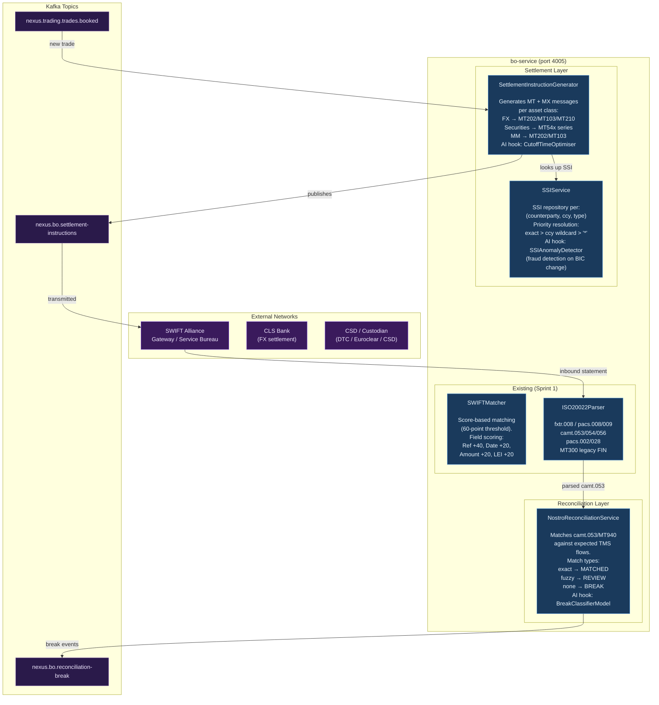
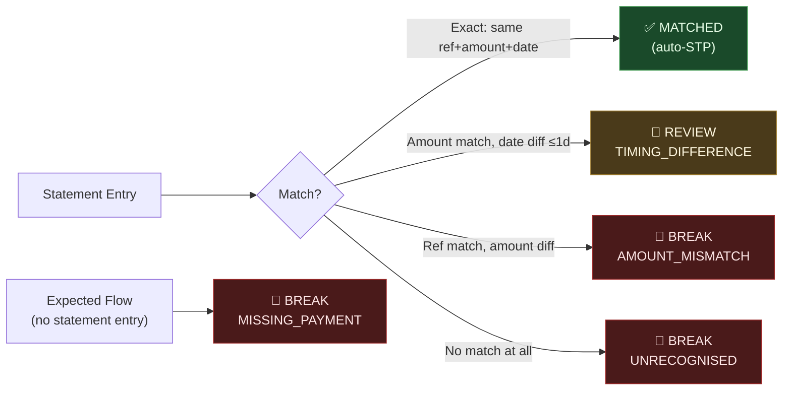

# C4 Level 3 — Settlement & Back Office Components

> **Sprint**: Sprint 3 (P1 — Settlement, SSI, Nostro Reconciliation)
> **Last Updated**: 2026-04-09

---

## Component Overview



---

## Settlement Message Matrix

| Asset Class    | Buy              | Sell             | Notice           | Network         |
| -------------- | ---------------- | ---------------- | ---------------- | --------------- |
| FX (interbank) | MT202 / pacs.009 | MT202 / pacs.009 | MT210 / camt.057 | CLS / bilateral |
| FX (corporate) | MT103 / pacs.008 | MT103 / pacs.008 | MT210            | SWIFT           |
| Fixed Income   | MT541 / sese.023 | MT543 / sese.023 | —                | CSD / custodian |
| Repo           | MT541 / sese.023 | MT543 / sese.023 | —                | CSD             |
| Money Market   | MT202 / pacs.009 | MT202 / pacs.009 | —                | SWIFT           |

---

## Reconciliation Break Categories



---

## SSI Priority Resolution

```
findBestMatch(counterpartyId, currency, instrumentType):
  1. exact:   currency='USD' AND instrumentType='FX'      → highest priority
  2. partial: currency='USD' AND instrumentType='*'       → medium
  3. wildcard: currency='*'  AND instrumentType='*'       → fallback
  4. null:    no SSI found → settlement instruction uses 'UNKNOWN' BIC
```

---

## AI/ML Hook Points — Sprint 3

| Hook                   | Interface                         | Purpose                           | Default Behaviour        |
| ---------------------- | --------------------------------- | --------------------------------- | ------------------------ |
| `CutoffTimeOptimiser`  | predict send time per MsgType+CCY | Maximise same-day settlement rate | None (no recommendation) |
| `SSIAnomalyDetector`   | score BIC/account changes 0–1     | Detect payment redirection fraud  | None (all SSIs active)   |
| `BreakClassifierModel` | classify break cause + action     | Auto-triage reconciliation breaks | None (no AI insight)     |
