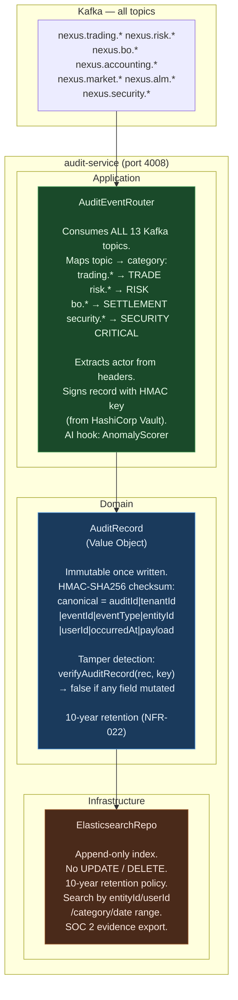
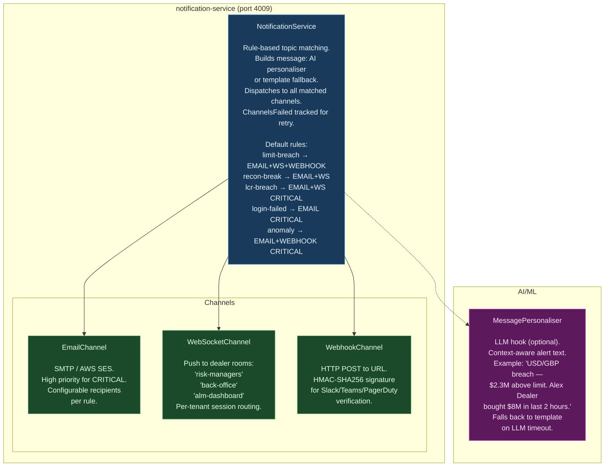
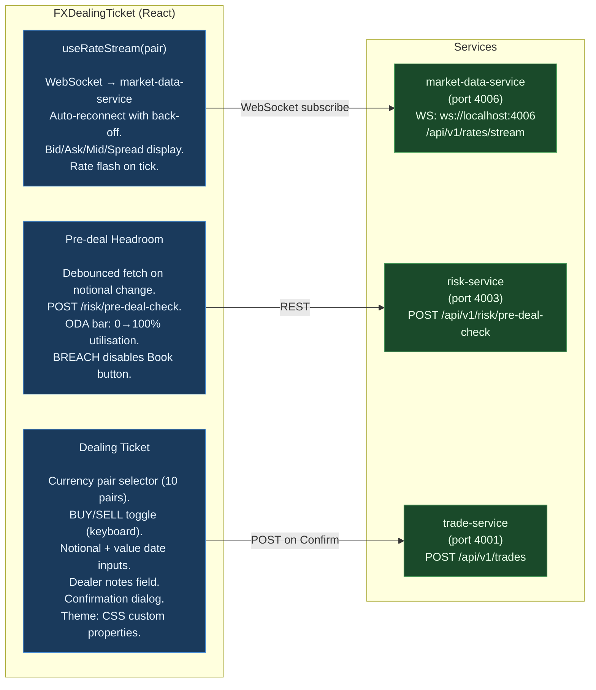
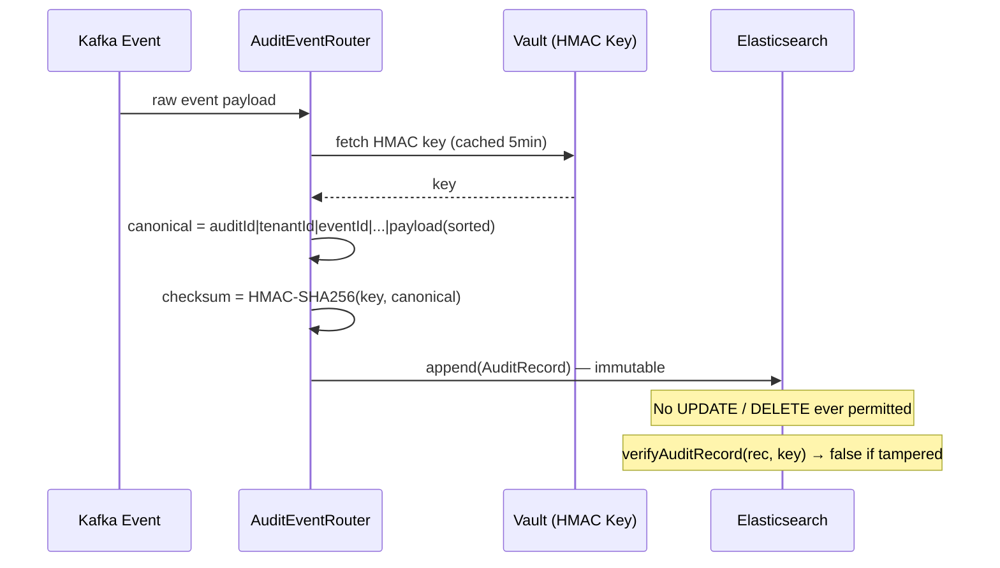

# C4 Level 3 — Sprint 5: Audit, Notification, FX eDealing & Corporate Actions

> **Sprint**: Sprint 5 | **Last Updated**: 2026-04-09

---

## Audit Service Component Diagram

---

## Notification Service Component Diagram

---

## FX eDealing Portal — Component & Data Flow

---

## Corporate Actions — Lifecycle Event Matrix

| Event                 | Asset Class | Cash Flow                       | SWIFT? | New Status  |
| --------------------- | ----------- | ------------------------------- | ------ | ----------- |
| `COUPON_PAYMENT`      | FI          | notional × rate / freq          | ✅     | —           |
| `PRINCIPAL_REPAYMENT` | FI          | notional + final coupon         | ✅     | `MATURED`   |
| `SWAP_RESET`          | IRS         | (float−fixed) × notional / freq | if >1K | —           |
| `FRA_SETTLEMENT`      | IRS         | net settlement amount           | ✅     | —           |
| `OPTION_EXERCISE`     | FX/IRD      | exercise value                  | ✅     | `EXERCISED` |
| `FX_OPTION_EXPIRY`    | FX          | none                            | ❌     | `EXPIRED`   |
| `NDF_FIXING`          | FX          | TBD at fixing                   | ❌     | —           |
| `REPO_MATURITY`       | Repo        | principal repayment             | ✅     | `MATURED`   |
| `DEPOSIT_MATURITY`    | MM          | principal + accrued interest    | ✅     | `MATURED`   |

---

## HMAC Tamper Evidence — How It Works

---

## Sprint 5 AI/ML Hook Points

| Hook                  | Service              | Interface                            | Use Case                                         |
| --------------------- | -------------------- | ------------------------------------ | ------------------------------------------------ |
| `AnomalyScorer`       | audit-service        | score(record) → 0–1                  | Off-hours access, large trade override detection |
| `MessagePersonaliser` | notification-service | personalise(event) → {subject, body} | Context-aware LLM alert narrative                |
| `MaturityPredictor`   | bo-service           | predictEarlyExercise(...)            | Predict callable bond / option early exercise    |

---

## Test Coverage — Sprint 5

| Module                              | Tests   | Key Scenarios                                                           |
| ----------------------------------- | ------- | ----------------------------------------------------------------------- |
| `AuditRecord` factory               | 4       | unique ID, timing, checksum format                                      |
| `verifyAuditRecord`                 | 5       | untampered ✓, payload mutated ✗, entityId ✗, wrong key ✗, actor ✗       |
| `AuditEventRouter`                  | 7       | routing by topic, CRITICAL severity, actor extraction, repo write, HMAC |
| `InMemoryAuditRepository`           | 2       | search by category, pagination                                          |
| `NotificationService` channels      | 4       | email, ws, both, failure tracking                                       |
| `NotificationService` rules         | 3       | topic match, unknown topic, custom rules                                |
| `NotificationService` template      | 3       | subject content, CRITICAL=high priority                                 |
| `NotificationService` AI/ML         | 2       | personaliser used, fallback on timeout                                  |
| `CorporateActionsService` coupon    | 5       | amount formula, BUY+/SELL-, requiresSwift                               |
| `CorporateActionsService` principal | 4       | 2 flows, notional, MATURED, Kafka                                       |
| `CorporateActionsService` IRS       | 3       | net CF, receiver+, payer-                                               |
| `CorporateActionsService` other     | 5       | expiry, exercise, deposit, Kafka shape                                  |
| **Sprint 5 Total**                  | **47**  |                                                                         |
| **Cumulative**                      | **364** | All 27 test files, 0 failures                                           |
