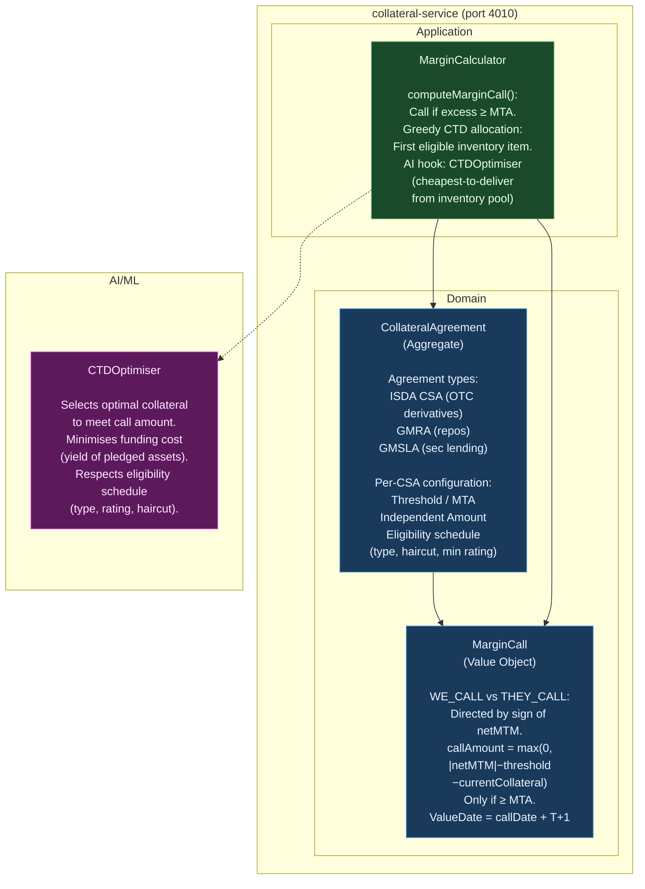
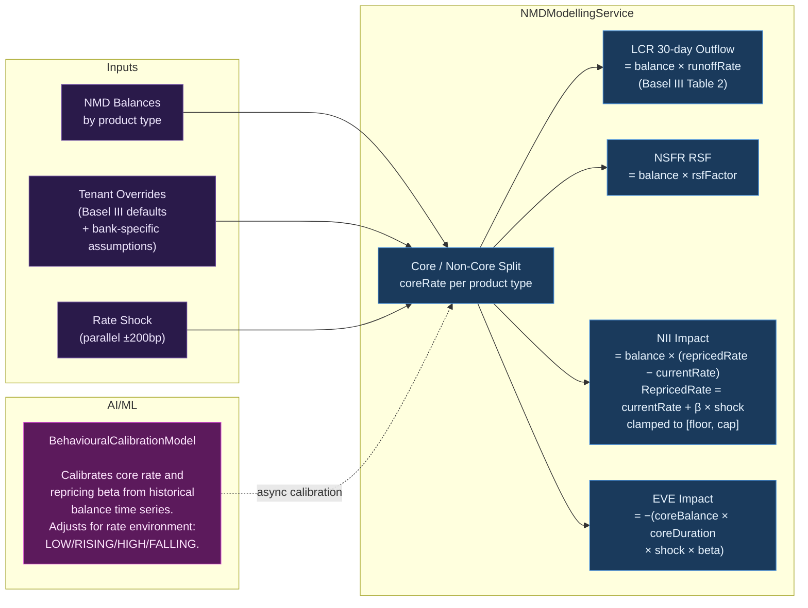
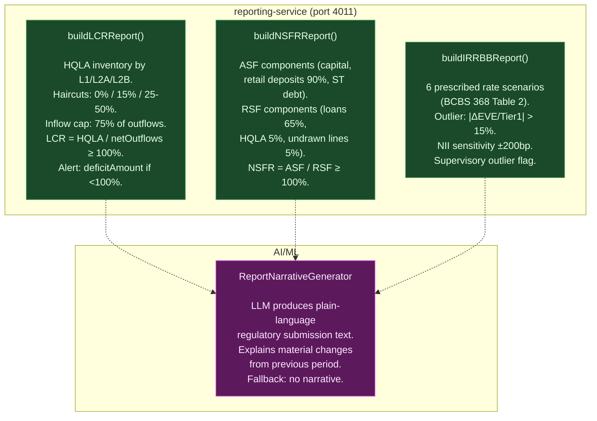

# C4 Level 3 — Sprint 6: Collateral, NMD Modelling & Regulatory Reporting

> **Sprint**: Sprint 6 (P1 completion + P2 regulatory) | **Last Updated**: 2026-04-09

---

## Collateral Service Component Diagram

---

## NMD Behavioural Modelling — Data Flow

---

## Regulatory Reporting Service

---

## Basel III NMD Runoff Rates by Product (LCR Table 2)

| Product Type              | Core Rate | Repricing β | LCR Runoff            | NSFR RSF |
| ------------------------- | --------- | ----------- | --------------------- | -------- |
| Retail Current Account    | 70%       | 10%         | **3%** (stable)       | 90%      |
| Retail Savings            | 60%       | 30%         | **10%** (less stable) | 90%      |
| SME Current               | 55%       | 20%         | **5%** (operational)  | 50%      |
| SME Savings               | 40%       | 40%         | **10%**               | 50%      |
| Corporate Operational     | 30%       | 50%         | **25%**               | 50%      |
| Corporate Non-Operational | 10%       | 70%         | **40%**               | 0%       |
| Private Banking           | 65%       | 25%         | **10%**               | 50%      |

---

## IRRBB Prescribed Scenarios (BCBS 368 Table 2)

| Scenario        | Short Rate | Long Rate | Outlier Threshold |
| --------------- | ---------- | --------- | ----------------- |
| PARALLEL_UP     | +200bp     | +200bp    | > 15% of Tier 1   |
| PARALLEL_DOWN   | −200bp     | −200bp    | > 15% of Tier 1   |
| STEEPENER       | −100bp     | +150bp    | > 15% of Tier 1   |
| FLATTENER       | +150bp     | −100bp    | > 15% of Tier 1   |
| SHORT_RATE_UP   | +300bp     | flat      | > 15% of Tier 1   |
| SHORT_RATE_DOWN | −300bp     | flat      | > 15% of Tier 1   |

---

## Sprint 6 Test Coverage

| Module                              | Tests   | Key Scenarios                                                      |
| ----------------------------------- | ------- | ------------------------------------------------------------------ |
| `MarginCalculator` computation      | 7       | WE_CALL, THEY_CALL, threshold, MTA, currentCollateral, T+1         |
| `MarginCalculator` allocation       | 3       | cash 0% haircut, bond 2% haircut, no eligible inventory            |
| `CTDOptimiser` ML hook              | 1       | uses optimiser output                                              |
| `InMemoryCollateralRepository`      | 2       | save/retrieve, status update                                       |
| `NMDModellingService` core/non-core | 3       | 70% retail, sum check, 10% corporate                               |
| `NMDModellingService` LCR           | 2       | 3% retail, 40% corporate                                           |
| `NMDModellingService` NSFR          | 2       | 90% retail, 0% corporate                                           |
| `NMDModellingService` NII           | 4       | zero shock, +200bp, floor clamp, cap clamp                         |
| `NMDModellingService` EVE           | 2       | zero shock, +200bp formula                                         |
| `NMDModellingService` aggregate     | 2       | sum outflow, array length                                          |
| `NMDModellingService` overrides     | 1       | tenant override 80% > default 70%                                  |
| `RegulatoryReportingService` LCR    | 7       | HQLA sum, outflows, 75% inflow cap, ratio, compliant/non-compliant |
| `RegulatoryReportingService` NSFR   | 2       | ratio formula, non-compliant                                       |
| `RegulatoryReportingService` IRRBB  | 5       | 6 scenarios, outlier flag, non-outlier, hasOutlier, NII            |
| **Sprint 6 Total**                  | **47**  |                                                                    |
| **CUMULATIVE**                      | **411** | **34 test files, 13 services, 0 failures**                         |
