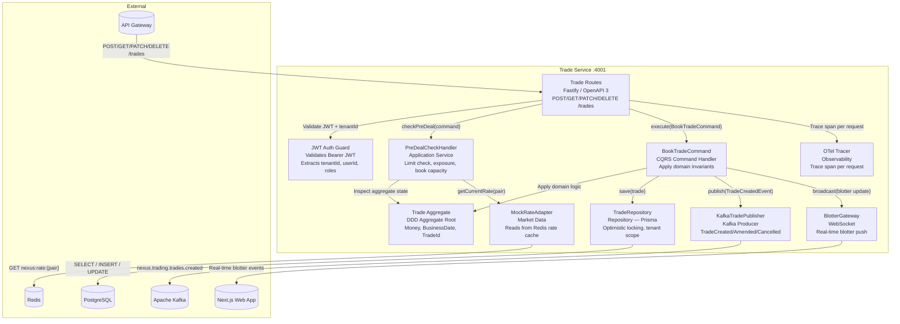

# C4 Level 3 — Trade Service Components

Internal architecture of the **Trade Service** (`packages/trade-service`).

## Diagram

## Component Responsibilities

| Component             | Pattern            | Key Invariants                                                  |
| --------------------- | ------------------ | --------------------------------------------------------------- |
| `BookTradeCommand`    | CQRS Command       | Trade must pass pre-deal check; notional > 0; valid value date  |
| `PreDealCheckHandler` | Domain Service     | Limit utilisation ≤ 100%; counterparty not blocked; book active |
| `Trade Aggregate`     | DDD Aggregate Root | Immutable after CONFIRMED; cancel only before settlement        |
| `TradeRepository`     | Repository         | Optimistic locking via `updatedAt`; tenant isolation enforced   |
| `KafkaTradePublisher` | Event Publisher    | Idempotent via `tradeRef`; exactly-once via Kafka transactions  |
| `BlotterGateway`      | WebSocket          | Per-tenant room isolation; JWT-scoped subscriptions             |

## SLA Targets

| Metric                       | Target    |
| ---------------------------- | --------- |
| Trade booking P99 latency    | < 100ms   |
| Pre-deal check P99 latency   | < 5ms     |
| WebSocket blotter update lag | < 50ms    |
| Throughput                   | ≥ 500 TPS |
| Error rate                   | < 0.01%   |
