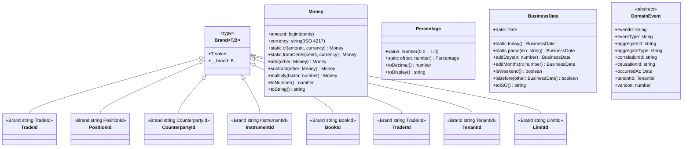
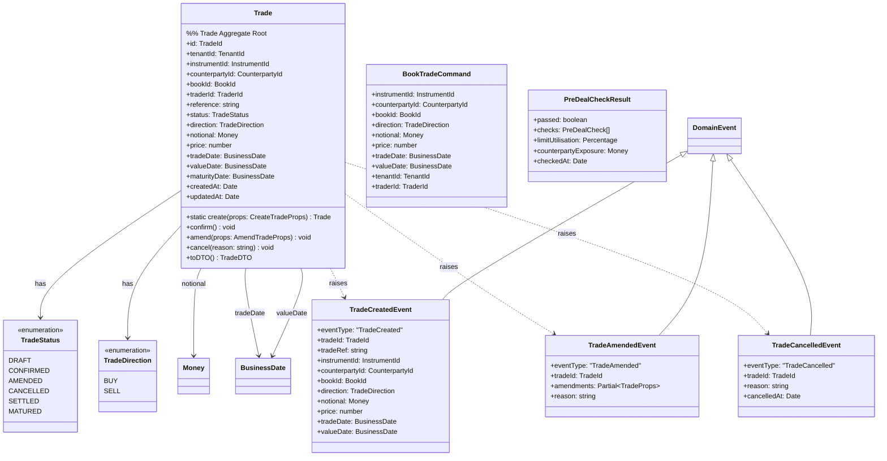
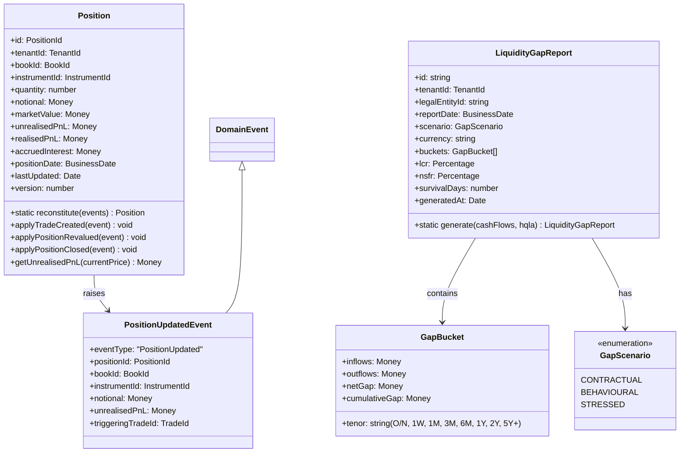
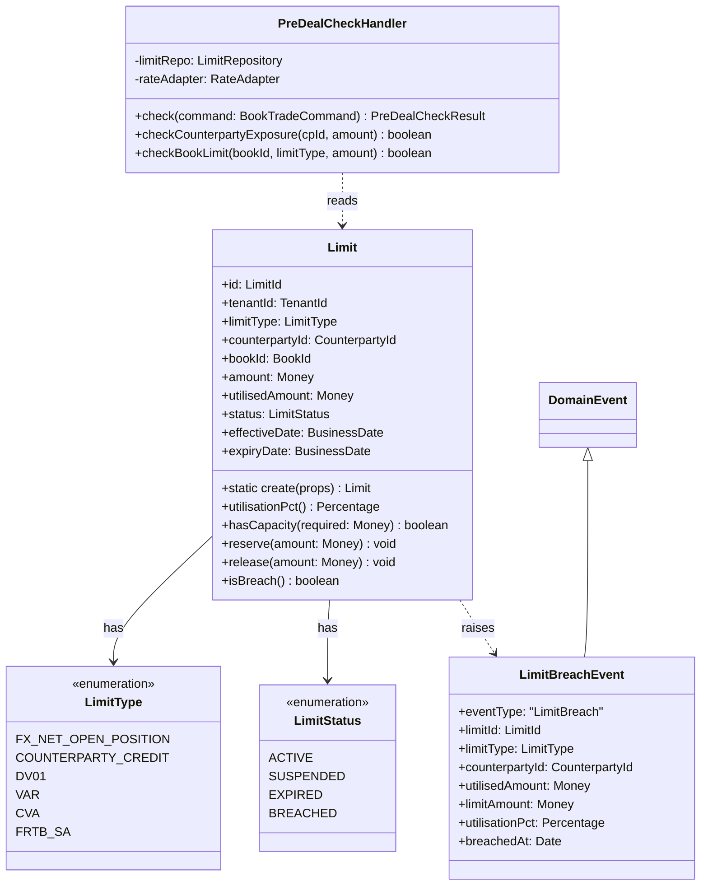

# C4 Level 4 — Domain Model Class Diagrams

DDD value objects, aggregates, domain events, and bounded-context relationships
from `packages/domain/src/`.

## Shared Kernel — Value Objects

## Trading Bounded Context

## Position Bounded Context

## Risk Bounded Context

