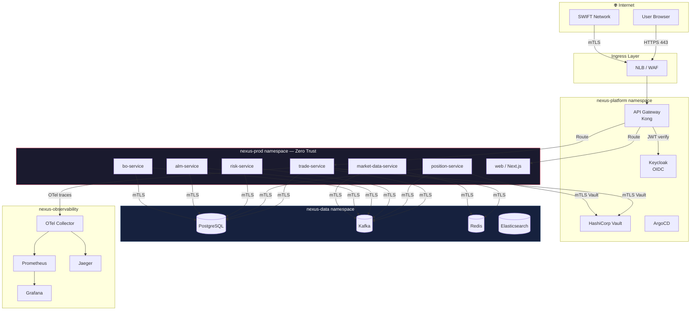
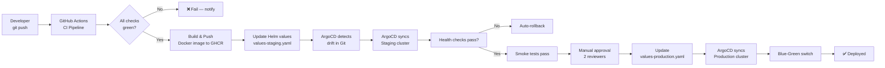

# Deployment Architecture

Kubernetes topology, namespace layout, and GitOps pipeline for NexusTreasury.

## Kubernetes Cluster Topology

```mermaid
flowchart TB
  subgraph cloud["☁️ Cloud Provider — Managed Kubernetes"]
    subgraph cluster["Kubernetes Cluster (EKS / AKS / GKE)"]

      subgraph nsApp["nexus-prod namespace — Application Workloads"]
        tradeDeploy["trade-service
Deployment · 3 replicas
node:24-alpine3.21 · Port 4001
HPA: 3–20 pods"]
        posDeploy["position-service
Deployment · 3 replicas
Port 4002 · HPA: 3–10"]
        riskDeploy["risk-service
Deployment · 2 replicas
Port 4003 · HPA: 2–8"]
        almDeploy["alm-service
Deployment · 2 replicas
Port 4004 · HPA: 2–6"]
        boDeploy["bo-service
Deployment · 2 replicas
Port 4005 · HPA: 2–6"]
        mdDeploy["market-data-service
Deployment · 2 replicas
Port 4006 · HPA: 2–6"]
        webDeploy["web (Next.js)
Deployment · 2 replicas
Standalone output · Port 3000"]
      end

      subgraph nsPlatform["nexus-platform namespace — Platform Services"]
        keycloakDeploy["keycloak
StatefulSet · 2 replicas
OIDC/OAuth2 · Port 8080"]
        kongDeploy["api-gateway
Deployment · 2 replicas
Kong / Nginx · Port 443"]
        argoCD["argocd
GitOps controller
Port 8080"]
        vaultDeploy["vault
StatefulSet · 3 replicas
HA Raft · Port 8200"]
      end

      subgraph nsData["nexus-data namespace — Data Stores"]
        pgCluster[("postgresql-patroni
StatefulSet · 3 nodes
1 primary + 2 standby")]
        kafkaCluster[("kafka
StatefulSet · 3 brokers
KRaft mode · Port 9092")]
        redisCluster[("redis
StatefulSet · 6 nodes
3 primary + 3 replica")]
        elasticDeploy[("elasticsearch
StatefulSet · 3 nodes
Port 9200")]
      end

      subgraph nsObs["nexus-observability namespace"]
        promDeploy["prometheus
Deployment · 30d retention"]
        grafanaDeploy["grafana
Deployment · Port 3000"]
        jaegerDeploy["jaeger
Deployment · Port 16686"]
        otelDeploy["otel-collector
DaemonSet · 1 per node"]
      end

      subgraph nsSec["nexus-security namespace"]
        opaDeploy["opa-gatekeeper
DaemonSet · Policy enforcement"]
        trivyDeploy["trivy-operator
DaemonSet · Runtime CVE scan"]
        ciliumDeploy["cilium
DaemonSet · 1 per node
eBPF L7 networking"]
      end
    end

    subgraph ingress["Ingress Layer"]
      nlb["NLB / ALB
TLS 1.3 + WAF
Port 443"]
    end
  end

  subgraph github["GitHub"]
    ghActions["GitHub Actions
CI Pipeline"]
    ghcr["GHCR
ghcr.io/manassehkafoh/nexustreasury/*"]
  end

  nlb         -->|"HTTPS"| kongDeploy
  kongDeploy  -->|"HTTP/2 mTLS"| tradeDeploy
  kongDeploy  -->|"HTTP/2"| webDeploy
  argoCD      -->|"Pull images"| ghcr
  ghActions   -->|"Push images"| ghcr
  argoCD      -->|"Watch main branch"| github
  tradeDeploy -->|"pg-wire/TLS"| pgCluster
  tradeDeploy -->|"SASL"| kafkaCluster
  tradeDeploy -->|"AUTH+TLS"| redisCluster
  posDeploy   -->|"pg-wire/TLS"| pgCluster
  posDeploy   -->|"SASL"| kafkaCluster
  otelDeploy  -->|"gRPC"| promDeploy
  otelDeploy  -->|"gRPC"| jaegerDeploy
  promDeploy  -->|"Query"| grafanaDeploy
  tradeDeploy -->|"mTLS Vault"| vaultDeploy
```



## Namespace Isolation (Cilium Zero Trust)



## GitOps Pipeline



## Resource Profiles

| Service              | CPU Request | CPU Limit | Memory Request | Memory Limit | HPA Min/Max |
| -------------------- | ----------- | --------- | -------------- | ------------ | ----------- |
| trade-service        | 250m        | 1000m     | 256Mi          | 1Gi          | 3 / 20      |
| position-service     | 250m        | 1000m     | 256Mi          | 1Gi          | 3 / 10      |
| risk-service         | 500m        | 2000m     | 512Mi          | 2Gi          | 2 / 8       |
| alm-service          | 250m        | 1000m     | 256Mi          | 1Gi          | 2 / 6       |
| bo-service           | 250m        | 1000m     | 256Mi          | 1Gi          | 2 / 6       |
| market-data-service  | 250m        | 500m      | 128Mi          | 512Mi        | 2 / 6       |
| web                  | 100m        | 500m      | 128Mi          | 512Mi        | 2 / 10      |
| postgresql (primary) | 2000m       | 4000m     | 4Gi            | 8Gi          | Fixed: 1    |
| kafka broker         | 1000m       | 2000m     | 2Gi            | 4Gi          | Fixed: 3    |
| redis                | 250m        | 500m      | 256Mi          | 1Gi          | Fixed: 6    |

---

## Multi-Region Active-Active Deployment (Sprint 7)

NexusTreasury runs in two AWS regions simultaneously. Traffic is routed by Route53
latency-based routing with health checks. If a region fails, Route53 removes it
from rotation within 5 minutes (3 failed health checks × 30s interval).

```
                    ┌─────────────────────────────┐
                    │  Route53 Latency Routing    │
                    │  Health checks every 30s    │
                    │  Failover: RTO < 5 minutes  │
                    └──────────┬──────────────────┘
                               │
              ┌────────────────┴─────────────────┐
              │                                  │
   ┌──────────▼───────────┐         ┌───────────▼────────────┐
   │  PRIMARY             │         │  SECONDARY             │
   │  eu-west-1 (London)  │         │  us-east-1 (N. Virginia)│
   │  EMEA trading hours  │         │  Americas trading hours │
   │  trade-service: 3    │◄───────►│  trade-service: 2      │
   │  risk-service: 3     │  Kafka  │  risk-service: 2       │
   │  All others: 2       │  MM2    │  All others: 2         │
   └──────────────────────┘         └────────────────────────┘
              │                                  │
   ┌──────────▼──────────┐           ┌──────────▼──────────┐
   │  Kafka Cluster      │◄──────────│  Kafka Cluster      │
   │  eu-west-1          │ MirrorMkr │  us-east-1          │
   │  Lag: < 30s RPO     │    2      │  Consumer failover  │
   └─────────────────────┘           └─────────────────────┘
```

### ArgoCD ApplicationSet

`infra/argocd/nexustreasury-multiregion.yaml` deploys to both clusters via a list
generator. Progressive delivery (10% canary → 100%) via Argo Rollouts on each deploy.

### Kafka MirrorMaker 2

All `nexus.*` topics are replicated eu-west-1 → us-east-1 with:
- Lag target: < 30 seconds (RPO)
- Consumer group offset sync: every 60 seconds
- 3 MirrorMaker replicas for HA

### SLAs

| Metric | Target |
|---|---|
| RPO (data loss on failure) | < 1 minute |
| RTO (traffic failover time) | < 5 minutes |
| Health check interval | 30 seconds |
| Failover threshold | 3 consecutive failures |


---

## Multi-Region Active-Active Deployment (Production)

> Added: Sprint 7 — see `infra/argocd/nexustreasury-multiregion.yaml`

NexusTreasury runs in two AWS regions simultaneously using active-active architecture.

### Region topology

```
┌─────────────────────────────────────────────────────────────┐
│                   Global Traffic Layer                      │
│          Route53 Latency-Based Routing + Health Checks      │
│          (30s check interval, 3-failure failover threshold)  │
└──────────────────┬──────────────────────┬───────────────────┘
                   │                      │
    ┌──────────────▼──────────────┐  ┌────▼──────────────────────┐
    │  PRIMARY: eu-west-1 (London) │  │ SECONDARY: us-east-1 (N.Va)│
    │  EMEA trading hours          │  │ Americas trading hours      │
    │  08:00–18:00 BST             │  │ 08:00–17:00 EST             │
    │                              │  │                             │
    │  EKS cluster                 │  │  EKS cluster                │
    │  trade-service  ×3           │  │  trade-service  ×2          │
    │  risk-service   ×3           │  │  risk-service   ×2          │
    │  All services   ×2+          │  │  All services   ×2          │
    │                              │  │                             │
    │  PostgreSQL 16 (primary)     │  │  PostgreSQL 16 (read replica│
    │  Kafka brokers ×3            │  │  Kafka brokers ×3           │
    └──────────────────────────────┘  └─────────────────────────────┘
                   │                                │
                   └──────────────┬─────────────────┘
                                  │
                    ┌─────────────▼────────────┐
                    │   Kafka MirrorMaker 2    │
                    │   All nexus.* topics     │
                    │   Lag target: < 30s      │
                    │   Offset sync: 60s       │
                    └──────────────────────────┘
```

### RPO / RTO targets

| Metric | Target | Mechanism |
|---|---|---|
| RPO (Recovery Point Objective) | < 1 minute | Kafka MirrorMaker 2 lag |
| RTO (Recovery Time Objective) | < 5 minutes | Route53 health-check failover |

### Deployment mechanism

ArgoCD `ApplicationSet` (list generator) deploys to both clusters from the same Git commit. Region-specific replica counts are applied via Kustomize overlay patches:

```
infra/kubernetes/
  base/                    ← Shared manifests (all 13 services)
  overlays/
    production-eu-west-1/  ← Primary: replicas=3 for critical services
    production-us-east-1/  ← Secondary: replicas=2 (scales on failover)
```

### Failover sequence

1. Route53 health check detects `/api/v1/ready` returning 503 (3 consecutive failures)
2. Route53 removes the failing region from latency routing within 90 seconds
3. All traffic routes to the healthy region automatically
4. PagerDuty alert fires → on-call engineer notified
5. KEDA autoscaler in the surviving region detects increased Kafka lag and scales up
6. Root cause fixed, region restored → Route53 re-adds it after 3 consecutive 200 OKs

### Kafka MirrorMaker 2 details

See `infra/argocd/nexustreasury-multiregion.yaml` — `KafkaMirrorMaker2` Strimzi CRD:
- Replicates: all `nexus.*` topics (trades, positions, risk, settlement, audit)
- `nexus.security.*` topics replicated with higher-priority connector
- Consumer group offsets synced every 60 seconds — minimal re-processing on failover
- 3 MirrorMaker replicas for HA
