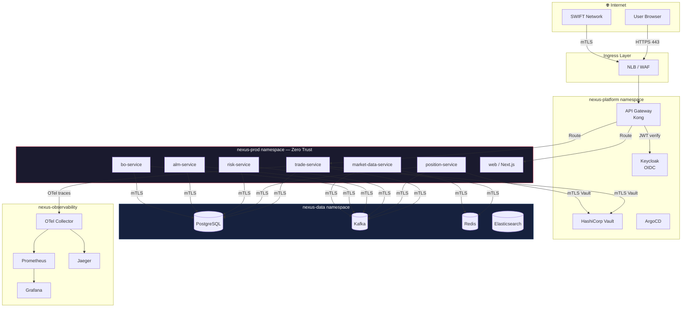
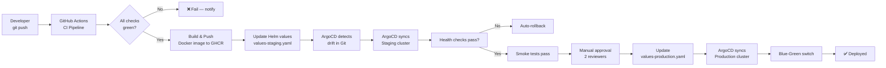

# Deployment Architecture

Kubernetes topology, namespace layout, and GitOps pipeline for NexusTreasury.

## Kubernetes Cluster Topology

```mermaid
flowchart TB
  subgraph cloud["☁️ Cloud Provider — Managed Kubernetes"]
    subgraph cluster["Kubernetes Cluster (EKS / AKS / GKE)"]

      subgraph nsApp["nexus-prod namespace — Application Workloads"]
        tradeDeploy["trade-service
Deployment · 3 replicas
node:24-alpine3.21 · Port 4001
HPA: 3–20 pods"]
        posDeploy["position-service
Deployment · 3 replicas
Port 4002 · HPA: 3–10"]
        riskDeploy["risk-service
Deployment · 2 replicas
Port 4003 · HPA: 2–8"]
        almDeploy["alm-service
Deployment · 2 replicas
Port 4004 · HPA: 2–6"]
        boDeploy["bo-service
Deployment · 2 replicas
Port 4005 · HPA: 2–6"]
        mdDeploy["market-data-service
Deployment · 2 replicas
Port 4006 · HPA: 2–6"]
        webDeploy["web (Next.js)
Deployment · 2 replicas
Standalone output · Port 3000"]
      end

      subgraph nsPlatform["nexus-platform namespace — Platform Services"]
        keycloakDeploy["keycloak
StatefulSet · 2 replicas
OIDC/OAuth2 · Port 8080"]
        kongDeploy["api-gateway
Deployment · 2 replicas
Kong / Nginx · Port 443"]
        argoCD["argocd
GitOps controller
Port 8080"]
        vaultDeploy["vault
StatefulSet · 3 replicas
HA Raft · Port 8200"]
      end

      subgraph nsData["nexus-data namespace — Data Stores"]
        pgCluster[("postgresql-patroni
StatefulSet · 3 nodes
1 primary + 2 standby")]
        kafkaCluster[("kafka
StatefulSet · 3 brokers
KRaft mode · Port 9092")]
        redisCluster[("redis
StatefulSet · 6 nodes
3 primary + 3 replica")]
        elasticDeploy[("elasticsearch
StatefulSet · 3 nodes
Port 9200")]
      end

      subgraph nsObs["nexus-observability namespace"]
        promDeploy["prometheus
Deployment · 30d retention"]
        grafanaDeploy["grafana
Deployment · Port 3000"]
        jaegerDeploy["jaeger
Deployment · Port 16686"]
        otelDeploy["otel-collector
DaemonSet · 1 per node"]
      end

      subgraph nsSec["nexus-security namespace"]
        opaDeploy["opa-gatekeeper
DaemonSet · Policy enforcement"]
        trivyDeploy["trivy-operator
DaemonSet · Runtime CVE scan"]
        ciliumDeploy["cilium
DaemonSet · 1 per node
eBPF L7 networking"]
      end
    end

    subgraph ingress["Ingress Layer"]
      nlb["NLB / ALB
TLS 1.3 + WAF
Port 443"]
    end
  end

  subgraph github["GitHub"]
    ghActions["GitHub Actions
CI Pipeline"]
    ghcr["GHCR
ghcr.io/manassehkafoh/nexustreasury/*"]
  end

  nlb         -->|"HTTPS"| kongDeploy
  kongDeploy  -->|"HTTP/2 mTLS"| tradeDeploy
  kongDeploy  -->|"HTTP/2"| webDeploy
  argoCD      -->|"Pull images"| ghcr
  ghActions   -->|"Push images"| ghcr
  argoCD      -->|"Watch main branch"| github
  tradeDeploy -->|"pg-wire/TLS"| pgCluster
  tradeDeploy -->|"SASL"| kafkaCluster
  tradeDeploy -->|"AUTH+TLS"| redisCluster
  posDeploy   -->|"pg-wire/TLS"| pgCluster
  posDeploy   -->|"SASL"| kafkaCluster
  otelDeploy  -->|"gRPC"| promDeploy
  otelDeploy  -->|"gRPC"| jaegerDeploy
  promDeploy  -->|"Query"| grafanaDeploy
  tradeDeploy -->|"mTLS Vault"| vaultDeploy
```

## Namespace Isolation (Cilium Zero Trust)

## GitOps Pipeline

## Resource Profiles

| Service              | CPU Request | CPU Limit | Memory Request | Memory Limit | HPA Min/Max |
| -------------------- | ----------- | --------- | -------------- | ------------ | ----------- |
| trade-service        | 250m        | 1000m     | 256Mi          | 1Gi          | 3 / 20      |
| position-service     | 250m        | 1000m     | 256Mi          | 1Gi          | 3 / 10      |
| risk-service         | 500m        | 2000m     | 512Mi          | 2Gi          | 2 / 8       |
| alm-service          | 250m        | 1000m     | 256Mi          | 1Gi          | 2 / 6       |
| bo-service           | 250m        | 1000m     | 256Mi          | 1Gi          | 2 / 6       |
| market-data-service  | 250m        | 500m      | 128Mi          | 512Mi        | 2 / 6       |
| web                  | 100m        | 500m      | 128Mi          | 512Mi        | 2 / 10      |
| postgresql (primary) | 2000m       | 4000m     | 4Gi            | 8Gi          | Fixed: 1    |
| kafka broker         | 1000m       | 2000m     | 2Gi            | 4Gi          | Fixed: 3    |
| redis                | 250m        | 500m      | 256Mi          | 1Gi          | Fixed: 6    |
