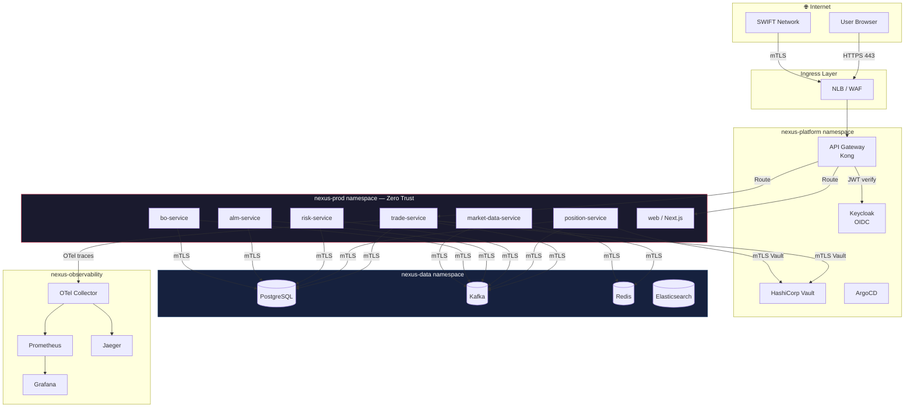
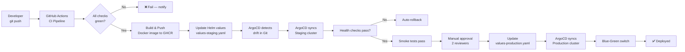

# Deployment Architecture

Kubernetes topology, namespace layout, and GitOps pipeline for NexusTreasury.

## Kubernetes Cluster Topology

```mermaid
C4Deployment
  title NexusTreasury — Kubernetes Deployment Architecture

  Deployment_Node(cloud, "Cloud Provider (AWS/Azure/GCP)", "Managed Kubernetes") {

    Deployment_Node(cluster, "Kubernetes Cluster", "EKS/AKS/GKE") {

      Deployment_Node(nsApp, "nexus-prod namespace", "Application workloads") {
        Container(tradeDeploy,    "trade-service",         "Deployment: 3 replicas\nnode:24-alpine3.21\nHPA: 3-20 pods\nPort: 4001")
        Container(posDeploy,      "position-service",      "Deployment: 3 replicas\nHPA: 3-10 pods\nPort: 4002")
        Container(riskDeploy,     "risk-service",          "Deployment: 2 replicas\nHPA: 2-8 pods\nPort: 4003")
        Container(almDeploy,      "alm-service",           "Deployment: 2 replicas\nHPA: 2-6 pods\nPort: 4004")
        Container(boDeploy,       "bo-service",            "Deployment: 2 replicas\nHPA: 2-6 pods\nPort: 4005")
        Container(mdDeploy,       "market-data-service",   "Deployment: 2 replicas\nHPA: 2-6 pods\nPort: 4006")
        Container(webDeploy,      "web",                   "Deployment: 2 replicas\nNext.js standalone\nPort: 3000")
      }

      Deployment_Node(nsPlatform, "nexus-platform namespace", "Platform services") {
        Container(keycloakDeploy, "keycloak",               "StatefulSet: 2 replicas\nOIDC/OAuth2\nPort: 8080")
        Container(kongDeploy,     "api-gateway",            "Deployment: 2 replicas\nKong / Nginx Ingress\nPort: 443/80")
        Container(argoCD,         "argocd",                 "ArgoCD\nGitOps controller\nPort: 8080")
        Container(vaultDeploy,    "vault",                  "StatefulSet: 3 replicas\nHA Raft\nPort: 8200")
      }

      Deployment_Node(nsData, "nexus-data namespace", "Data stores") {
        ContainerDb(pgCluster,    "postgresql-patroni",     "StatefulSet: 3 nodes\nPatroni HA\n1 primary, 2 standby")
        ContainerDb(kafkaCluster, "kafka",                  "StatefulSet: 3 brokers\nKRaft mode\nPort: 9092")
        ContainerDb(redisCluster, "redis",                  "StatefulSet: 6 nodes\n3 primary, 3 replica\nPort: 6379")
        ContainerDb(elasticDeploy,"elasticsearch",          "StatefulSet: 3 nodes\nPort: 9200")
      }

      Deployment_Node(nsObs, "nexus-observability namespace", "Observability") {
        Container(promDeploy,     "prometheus",             "Deployment: 1 replica\n30-day retention")
        Container(grafanaDeploy,  "grafana",                "Deployment: 1 replica\nPort: 3000")
        Container(jaegerDeploy,   "jaeger",                 "Deployment: 1 replica\nPort: 16686")
        Container(otelDeploy,     "otel-collector",         "DaemonSet: 1 per node")
      }

      Deployment_Node(nsSec, "nexus-security namespace", "Security") {
        Container(opaDeploy,      "opa-gatekeeper",         "DaemonSet\nPolicy enforcement")
        Container(trivyDeploy,    "trivy-operator",         "DaemonSet\nRuntime CVE scan")
        Container(ciliumDeploy,   "cilium",                 "DaemonSet: 1 per node\neBPF networking")
      }
    }

    Deployment_Node(ingress, "Ingress Layer", "Cloud Load Balancer") {
      Container(nlb, "Network Load Balancer", "AWS ALB / Azure AppGW", "TLS termination. WAF. Port 443.")
    }
  }

  Deployment_Node(github, "GitHub", "Source Control + CI") {
    Container(ghActions, "GitHub Actions", "CI Pipeline", "lint, test, build, scan, push")
    Container(ghcr,      "GHCR",           "Container Registry", "ghcr.io/manassehkafoh/nexustreasury/*")
  }

  Rel(nlb,       kongDeploy,   "HTTPS",         "443")
  Rel(kongDeploy,tradeDeploy,  "HTTP/2 mTLS",   "4001")
  Rel(kongDeploy,webDeploy,    "HTTP/2",        "3000")
  Rel(argoCD,    ghcr,         "Pull images",   "HTTPS")
  Rel(ghActions, ghcr,         "Push images",   "HTTPS")
  Rel(argoCD,    github,       "Watch main branch", "HTTPS")
```

## Namespace Isolation (Cilium Zero Trust)



## GitOps Pipeline



## Resource Profiles

| Service              | CPU Request | CPU Limit | Memory Request | Memory Limit | HPA Min/Max |
| -------------------- | ----------- | --------- | -------------- | ------------ | ----------- |
| trade-service        | 250m        | 1000m     | 256Mi          | 1Gi          | 3 / 20      |
| position-service     | 250m        | 1000m     | 256Mi          | 1Gi          | 3 / 10      |
| risk-service         | 500m        | 2000m     | 512Mi          | 2Gi          | 2 / 8       |
| alm-service          | 250m        | 1000m     | 256Mi          | 1Gi          | 2 / 6       |
| bo-service           | 250m        | 1000m     | 256Mi          | 1Gi          | 2 / 6       |
| market-data-service  | 250m        | 500m      | 128Mi          | 512Mi        | 2 / 6       |
| web                  | 100m        | 500m      | 128Mi          | 512Mi        | 2 / 10      |
| postgresql (primary) | 2000m       | 4000m     | 4Gi            | 8Gi          | Fixed: 1    |
| kafka broker         | 1000m       | 2000m     | 2Gi            | 4Gi          | Fixed: 3    |
| redis                | 250m        | 500m      | 256Mi          | 1Gi          | Fixed: 6    |
