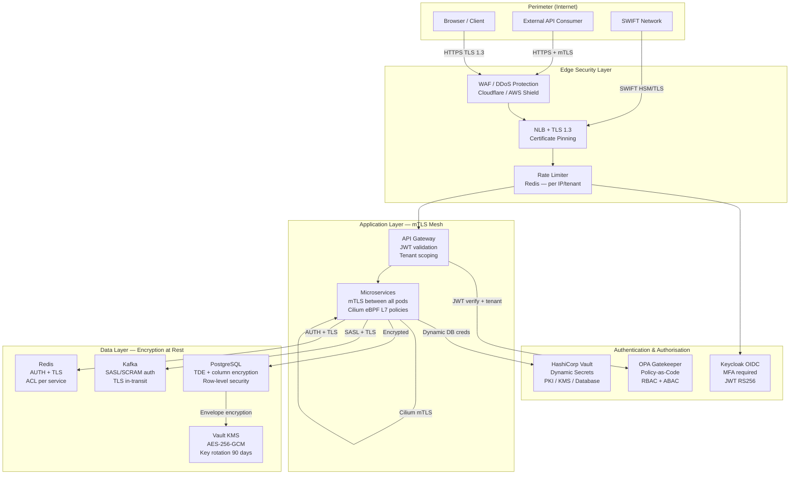
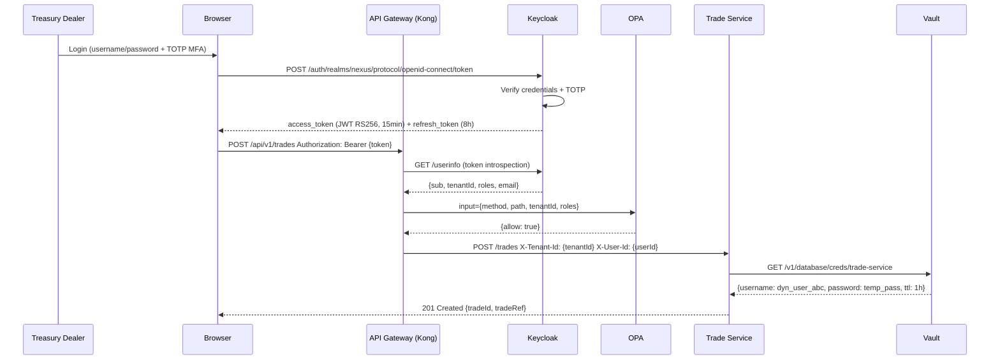

# Security Architecture

Zero Trust, mTLS, RBAC, secrets management, and compliance controls.

## Zero Trust Network Architecture



## Authentication Flow



## RBAC Role Matrix

| Role                    | Trade:W | Trade:R | Position:R | Risk:R | Limit:W | ALM:R | BO:W | Audit:R | Platform:A |
| ----------------------- | ------- | ------- | ---------- | ------ | ------- | ----- | ---- | ------- | ---------- |
| `treasury.dealer`       | ✅      | ✅      | ✅         | ✅     | ❌      | ❌    | ❌   | ❌      | ❌         |
| `treasury.alm.manager`  | ❌      | ✅      | ✅         | ✅     | ❌      | ✅    | ❌   | ❌      | ❌         |
| `treasury.risk.manager` | ❌      | ✅      | ✅         | ✅     | ✅      | ✅    | ❌   | ❌      | ❌         |
| `treasury.bo.ops`       | ❌      | ✅      | ✅         | ❌     | ❌      | ❌    | ✅   | ❌      | ❌         |
| `platform.engineer`     | ❌      | ✅      | ✅         | ✅     | ❌      | ✅    | ❌   | ✅      | ✅         |
| `compliance.ciso`       | ❌      | ✅      | ✅         | ✅     | ❌      | ✅    | ❌   | ✅      | ❌         |
| `system.admin`          | ✅      | ✅      | ✅         | ✅     | ✅      | ✅    | ✅   | ✅      | ✅         |

## Secrets Management (HashiCorp Vault)

```mermaid
flowchart LR
  subgraph vault_paths["Vault Secret Paths"]
    db_creds[database/creds/{service}<br/>Dynamic — TTL 1h]
    kafka_creds[secret/kafka/credentials<br/>Static — rotation 30d]
    jwt_keys[pki/issue/nexus<br/>TLS certs — rotation 90d]
    api_keys[secret/external/{service}<br/>Bloomberg / LSEG keys]
    encryption_key[transit/encrypt/nexus-data<br/>AES-256-GCM key]
  end

  subgraph services["Services (Vault Agent Injector)"]
    trade[trade-service]
    pos[position-service]
    bo[bo-service]
  end

  trade -->|Lease 1h| db_creds
  pos -->|Lease 1h| db_creds
  bo -->|Lease 1h| db_creds
  bo -->|Read| api_keys
  trade -->|Read| kafka_creds
  pos -->|Read| kafka_creds
  trade -->|Encrypt PII| encryption_key
```

## Cilium Network Policies (Zero Trust)

All inter-service communication is **deny-by-default**. The following is what is explicitly permitted:

| From             | To               | Port | Protocol       | L7 Rule                   |
| ---------------- | ---------------- | ---- | -------------- | ------------------------- |
| API Gateway      | trade-service    | 4001 | HTTPS/HTTP2    | POST /trades, GET /trades |
| API Gateway      | position-service | 4002 | HTTPS          | GET /positions            |
| API Gateway      | risk-service     | 4003 | HTTPS          | GET /risk/\*              |
| API Gateway      | alm-service      | 4004 | HTTPS          | GET /alm/\*               |
| API Gateway      | bo-service       | 4005 | HTTPS          | POST /bo/swift/inbound    |
| trade-service    | kafka            | 9092 | PLAINTEXT/SASL | Produce only              |
| position-service | kafka            | 9092 | PLAINTEXT/SASL | Consume + Produce         |
| risk-service     | kafka            | 9092 | PLAINTEXT/SASL | Consume only              |
| All services     | PostgreSQL       | 5432 | pg-wire/TLS    | Own schema only           |
| All services     | vault            | 8200 | HTTPS          | Own path prefix           |
| OTel Collector   | All services     | 4317 | gRPC           | Receive traces            |

## Audit Log Schema

Every state change produces an immutable audit record:

```json
{
  "auditId": "uuid",
  "tenantId": "uuid",
  "userId": "uuid",
  "entityType": "Trade",
  "entityId": "uuid",
  "action": "TRADE_BOOKED",
  "beforeState": { ... },
  "afterState": { ... },
  "ipAddress": "10.0.1.42",
  "userAgent": "NexusTreasury-Web/1.0",
  "occurredAt": "2026-04-09T10:30:00Z",
  "checksum": "sha256:a1b2c3..."
}
```

Audit records are written to Kafka topic `nexus.platform.audit-log` (partition 48, replication 3,
retention **3650 days / 10 years** for SOC 2 and EMIR requirements), then indexed in Elasticsearch
for full-text search and compliance reporting.
