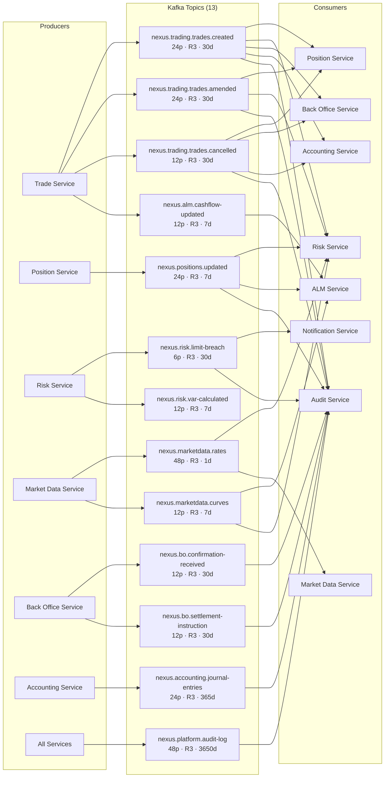
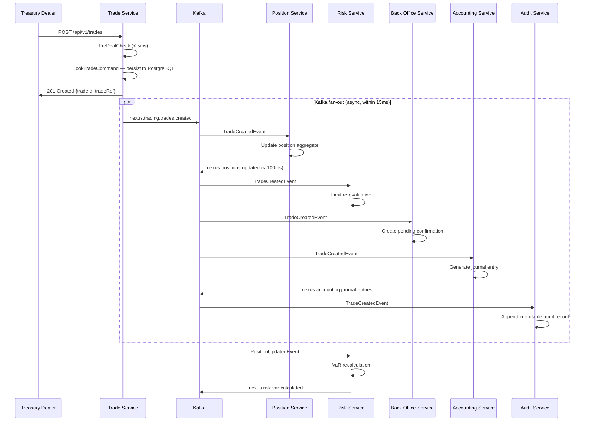

# Kafka Event Topology

Apache Kafka is the central nervous system of NexusTreasury. All inter-service
communication for state changes flows through Kafka topics with Avro-serialised
payloads governed by the Confluent Schema Registry.

## Topic Topology Overview



## Topic Reference Table

| Topic                              | Partitions | Replication | Retention     | Key Schema      | Value Schema           |
| ---------------------------------- | ---------- | ----------- | ------------- | --------------- | ---------------------- |
| `nexus.trading.trades.created`     | 24         | 3           | 30 days       | `tradeId`       | `TradeCreatedEvent`    |
| `nexus.trading.trades.amended`     | 24         | 3           | 30 days       | `tradeId`       | `TradeAmendedEvent`    |
| `nexus.trading.trades.cancelled`   | 12         | 3           | 30 days       | `tradeId`       | `TradeCancelledEvent`  |
| `nexus.positions.updated`          | 24         | 3           | 7 days        | `positionId`    | `PositionUpdatedEvent` |
| `nexus.risk.limit-breach`          | 6          | 3           | 30 days       | `limitId`       | `LimitBreachEvent`     |
| `nexus.risk.var-calculated`        | 12         | 3           | 7 days        | `bookId`        | `VaRResultEvent`       |
| `nexus.marketdata.rates`           | 48         | 3           | 1 day         | `currencyPair`  | `RateTickEvent`        |
| `nexus.marketdata.curves`          | 12         | 3           | 7 days        | `curveId`       | `YieldCurveEvent`      |
| `nexus.bo.confirmation-received`   | 12         | 3           | 30 days       | `tradeId`       | `ConfirmationEvent`    |
| `nexus.bo.settlement-instruction`  | 12         | 3           | 30 days       | `tradeId`       | `SettlementEvent`      |
| `nexus.accounting.journal-entries` | 24         | 3           | 365 days      | `tradeId`       | `JournalEntryEvent`    |
| `nexus.alm.cashflow-updated`       | 12         | 3           | 7 days        | `legalEntityId` | `CashFlowEvent`        |
| `nexus.platform.audit-log`         | 48         | 3           | **3650 days** | `entityId`      | `AuditLogEvent`        |

> **Partition key strategy:** All topics use domain entity IDs as partition keys.
> This guarantees that all events for the same trade/position are processed in-order
> by the same consumer partition — essential for the event-sourced position engine.

## Consumer Groups

| Consumer Group               | Topics Subscribed                                          | Offset Strategy   | Parallelism  |
| ---------------------------- | ---------------------------------------------------------- | ----------------- | ------------ |
| `nexus-position-service`     | trades.created, trades.amended, trades.cancelled           | Earliest (replay) | 24 consumers |
| `nexus-risk-service`         | positions.updated, marketdata.rates, marketdata.curves     | Latest            | 12 consumers |
| `nexus-alm-service`          | positions.updated, marketdata.curves, alm.cashflow-updated | Latest            | 12 consumers |
| `nexus-bo-service`           | trades.created, trades.cancelled                           | Latest            | 12 consumers |
| `nexus-accounting-service`   | trades.created, trades.amended, trades.cancelled           | Earliest          | 24 consumers |
| `nexus-notification-service` | risk.limit-breach                                          | Latest            | 6 consumers  |
| `nexus-audit-service`        | ALL topics                                                 | Earliest (replay) | 48 consumers |

## End-to-End Event Flow: Trade Booking



## Exactly-Once Semantics

NexusTreasury uses Kafka's **exactly-once semantics (EOS)** for financial transactions
to prevent duplicate or lost events:

```mermaid
flowchart LR
  A[Trade Service<br/>Producer] -->|transactional.id<br/>= nexus-trade-{pod}| B[Kafka Broker]
  B -->|isolation.level<br/>= read_committed| C[Position Service<br/>Consumer]
  C -->|consume-process-produce<br/>in single transaction| B
  B --> D[Position Event<br/>Committed atomically]

  note1[enable.idempotence=true\nacks=all\nmin.insync.replicas=2] -.-> A
  note2[Transactional producer\nbeginTransaction()\ncommitTransaction()\nabortTransaction()] -.-> A
```

| Producer Setting           | Value                     | Purpose                                       |
| -------------------------- | ------------------------- | --------------------------------------------- |
| `enable.idempotence`       | `true`                    | Prevents duplicate messages on retries        |
| `acks`                     | `all`                     | All in-sync replicas must ack before success  |
| `transactional.id`         | `nexus-{service}-{podId}` | Unique per producer instance                  |
| `min.insync.replicas`      | `2`                       | At least 2 replicas must be in sync           |
| Consumer `isolation.level` | `read_committed`          | Only reads committed (non-duplicate) messages |

## Market Data Rate Topic: High-Throughput Design

The `nexus.marketdata.rates` topic is the highest-throughput topic in the platform.
Bloomberg B-PIPE delivers up to 10,000 ticks/second during peak market hours.

```mermaid
flowchart LR
  A[Bloomberg B-PIPE\n~10k ticks/sec] --> B[Market Data Service\nBloombergAdapter]
  B -->|batch.size=65536\nlinger.ms=5\ncompression=snappy| C[Kafka\n48 partitions]
  C --> D[Risk Service\n12 consumers\nVaR risk factors]
  C --> E[Redis Cache\nSET nexus:rate:{pair}\nTTL 5s]
  E --> F[Trade Service\nPre-deal rate lookup\n< 1ms]
  C --> G[ALM Service\n4 consumers\nIRRBB curves]
```

| Tuning Parameter   | Value       | Reason                                             |
| ------------------ | ----------- | -------------------------------------------------- |
| Partitions         | 48          | Parallelise 10k ticks/sec across consumers         |
| Retention          | 1 day       | Only current rates matter; history in TimescaleDB  |
| `batch.size`       | 65536 bytes | Amortise network overhead for high-frequency ticks |
| `linger.ms`        | 5ms         | Batch ticks within 5ms window before sending       |
| `compression.type` | snappy      | 60% compression for numeric rate data              |
