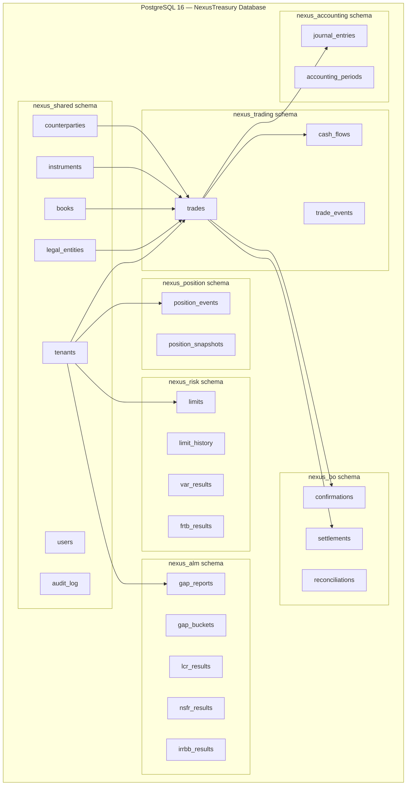
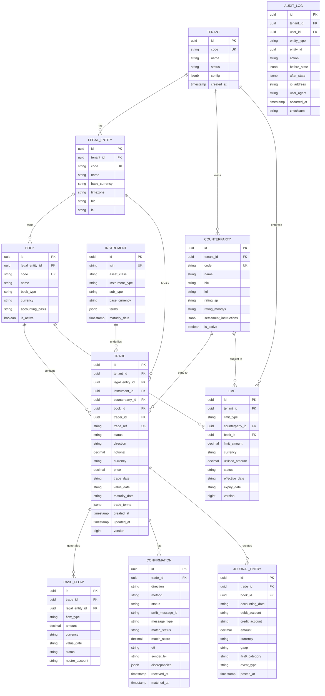
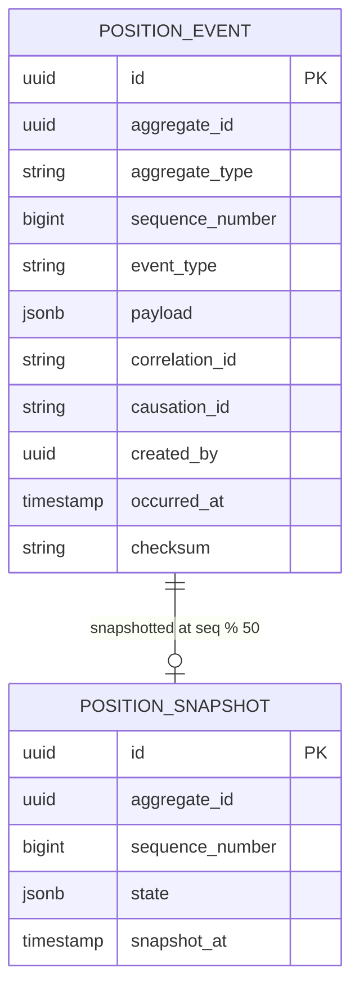
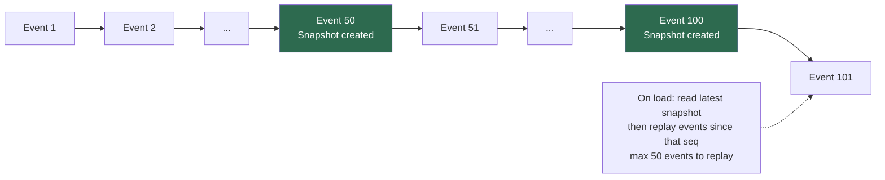
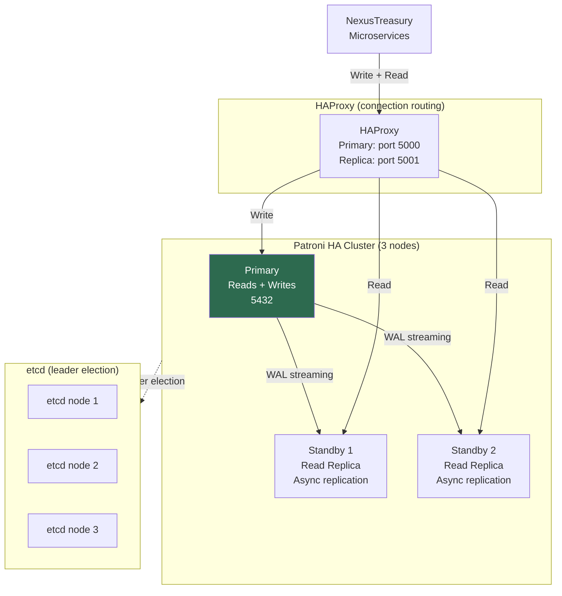

# Data Architecture

PostgreSQL schemas, ERD, event sourcing store, multi-tenancy, and data classification.

## Multi-Tenancy Schema Layout

NexusTreasury uses **PostgreSQL schema-per-bounded-context** with a shared `nexus_shared`
schema for cross-cutting tables (tenants, users, audit).



## Core Entity Relationship Diagram



## Event Store Schema (Position Service)

The position service uses **event sourcing**: position state is never updated directly.
Instead, an ordered sequence of domain events is appended. The current state is derived
by replaying events from the last snapshot.



### Snapshot Strategy



## TimescaleDB: Time-Series Tables

Market data history and P&L time series are stored in TimescaleDB hypertables:

| Table                       | Hypertable Dimension | Chunk Size | Retention | Use                             |
| --------------------------- | -------------------- | ---------- | --------- | ------------------------------- |
| `market_data.rate_history`  | `timestamp`          | 1 day      | 5 years   | Historical VaR (250-day window) |
| `market_data.curve_history` | `timestamp`          | 1 week     | 5 years   | IRRBB historical scenarios      |
| `trading.pnl_history`       | `position_date`      | 1 month    | 7 years   | P&L time series, SOC 2 evidence |
| `risk.var_history`          | `calculated_at`      | 1 day      | 3 years   | FRTB back-testing               |

## Data Classification

| Classification   | Examples                                 | Controls                                      |
| ---------------- | ---------------------------------------- | --------------------------------------------- |
| **CONFIDENTIAL** | Trade terms, counterparty names, LEI/BIC | Vault encryption, RLS, audit log              |
| **RESTRICTED**   | PnL, VaR, limit utilisations             | Role-based access, no export without approval |
| **INTERNAL**     | Market rates, instrument terms           | Internal only, no external sharing            |
| **PUBLIC**       | Instrument ISIN, currency codes          | No special controls                           |

### Column-Level Encryption (Vault Transit)

Sensitive fields encrypted before storage using Vault Transit (AES-256-GCM):

| Table            | Column                     | Classification | Key                      |
| ---------------- | -------------------------- | -------------- | ------------------------ |
| `trades`         | `notional`, `price`        | CONFIDENTIAL   | `nexus-trade-financials` |
| `counterparties` | `settlement_instructions`  | CONFIDENTIAL   | `nexus-counterparty-pii` |
| `users`          | `email`, `phone`           | CONFIDENTIAL   | `nexus-user-pii`         |
| `audit_log`      | `ip_address`, `user_agent` | RESTRICTED     | `nexus-audit-meta`       |

## Row-Level Security (PostgreSQL RLS)

Every table in `nexus_trading`, `nexus_position`, `nexus_risk`, `nexus_alm`, and
`nexus_bo` enforces tenant isolation via PostgreSQL Row-Level Security policies:

```sql
-- Example: Trade table RLS policy
CREATE POLICY nexus_tenant_isolation ON nexus_trading.trades
  USING (tenant_id = current_setting('nexus.tenant_id')::uuid);

-- Set per-connection before queries
SET nexus.tenant_id = '{tenantId}';
```

This guarantees that even if application-level tenant filtering is bypassed, the
database layer prevents cross-tenant data access.

## Database HA Architecture



| Parameter                         | Value         | Purpose                        |
| --------------------------------- | ------------- | ------------------------------ |
| `max_connections`                 | 500           | Per-node connection limit      |
| `shared_buffers`                  | 4GB           | 25% of RAM for caching         |
| `wal_level`                       | `replica`     | Enable streaming replication   |
| `synchronous_commit`              | `local`       | Performance — async to standby |
| `checkpoint_completion_target`    | `0.9`         | Spread checkpoint I/O          |
| `TimescaleDB chunk_time_interval` | 1 day (rates) | Optimal for daily queries      |
