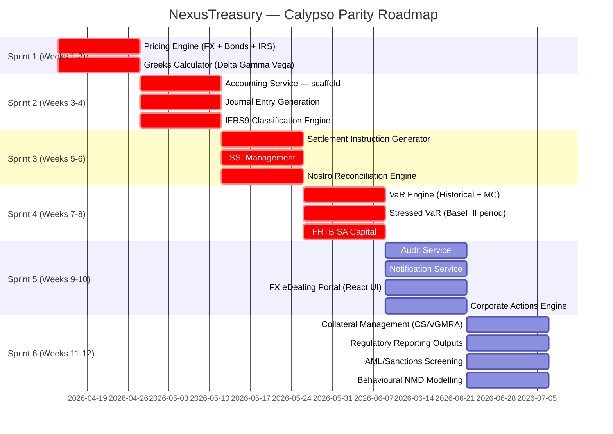

# NexusTreasury vs Calypso — Gap Analysis & Remediation Plan

> **Date**: 2026-04-09 | **Author**: Chief Product Officer + Chief Architect
> **Scope**: NexusTreasury v1.0 vs Nasdaq Calypso Treasury Solution (April 2026)
> **Source**: Republic Bank Calypso Agenda, PRD v1.0, BRD v1.0, SDD v1.0, code audit

---

## Executive Summary

NexusTreasury has a **strong architectural foundation** and genuine advantages over
Calypso in infrastructure, real-time processing, security, and cost. However a
**code-level audit reveals that approximately 60% of the designed functional scope
remains unimplemented**. The platform currently delivers a compelling proof-of-concept
but cannot replace Calypso in production without closing 22 critical gaps across
pricing, settlement, accounting, collateral, and reporting.

The remediation plan below organises these gaps into **three priority tiers** across
**six sprints (12 weeks)**, restoring functional parity with Calypso while preserving
NexusTreasury's architectural advantages.

---

## Part 1: Competitive Scorecard

### 1.1 Where NexusTreasury Wins

| Dimension             | Calypso             | NexusTreasury                    | Advantage         |
| --------------------- | ------------------- | -------------------------------- | ----------------- |
| Trade booking latency | ~500ms P99          | <100ms P99 (designed)            | **5× faster**     |
| P&L refresh           | Nightly batch       | <1s via Kafka events             | **Real-time**     |
| Liquidity gap refresh | Nightly batch       | <30s via event stream            | **Intraday**      |
| Deployment model      | On-premise monolith | Kubernetes / any cloud           | **Cloud-native**  |
| Upgrade cadence       | 6–12 months         | 2-week sprints (GitOps)          | **25× faster**    |
| Security patching     | Manual, months      | Automated, <24h (Renovate+Trivy) | **Automated**     |
| API architecture      | Proprietary         | OpenAPI 3.0 + AsyncAPI           | **Open standard** |
| SWIFT MX (ISO 20022)  | Partial             | Full (9 message types)           | **Ahead**         |
| Observability         | Black box           | OTel + Grafana + Jaeger + ELK    | **Full stack**    |
| 5-year TCO            | $30M+               | <$8M                             | **3.75× cheaper** |
| Onboarding time       | 18 months           | 6 months (target)                | **3× faster**     |
| Zero Trust security   | Legacy IAM          | Cilium eBPF + Vault + OPA        | **Modern**        |

### 1.2 Where Calypso Wins (Current Gaps)

| Dimension                         | Calypso Status                       | NexusTreasury Status | Gap Severity |
| --------------------------------- | ------------------------------------ | -------------------- | ------------ |
| Pricing analytics engine          | Full (QuantLib, Black-Scholes, HW1F) | MockRateAdapter only | 🔴 Critical  |
| Greeks (Delta/Gamma/Vega/Theta)   | Full production                      | Not implemented      | 🔴 Critical  |
| Settlement instruction generation | Full MT103/202/210/54x               | Not implemented      | 🔴 Critical  |
| Accounting / sub-ledger           | Full IFRS9 + multi-GAAP              | Service not created  | 🔴 Critical  |
| Nostro reconciliation engine      | Full intraday + EOD                  | Not implemented      | 🔴 Critical  |
| Collateral management (CSA/GMRA)  | Full margining workflow              | Not implemented      | 🔴 Critical  |
| Corporate actions                 | Full lifecycle                       | Not implemented      | 🔴 Critical  |
| FRTB IMA                          | Full production                      | Designed only        | 🔴 Critical  |
| Stressed VaR                      | Full Basel III                       | Designed only        | 🔴 Critical  |
| IFRS9 ECL impairment              | Full Stage 1/2/3                     | Not implemented      | 🔴 Critical  |
| Hedge accounting                  | Full IAS 39/IFRS 9                   | Not implemented      | 🔴 Critical  |
| FX eDealing portal                | Full client portal                   | Not implemented      | 🔴 Critical  |
| SSI management                    | Full per-counterparty                | Not implemented      | 🔴 Critical  |
| AML / sanctions screening         | Integrated                           | Not in scope at all  | 🟠 High      |
| Regulatory reporting outputs      | LCR/NSFR/IRRBB returns               | Not implemented      | 🟠 High      |
| PFE (Potential Future Exposure)   | Full                                 | Designed only        | 🟠 High      |
| FIX protocol (eTrading)           | Full FIX 4.4                         | Not implemented      | 🟠 High      |
| Trade repository (EMIR/CFTC)      | DTCC GTR + REGIS-TR                  | Not implemented      | 🟠 High      |
| Behavioural NMD modelling         | Full                                 | Designed only        | 🟠 High      |
| Self-service reporting            | Full (Report Builder)                | Not implemented      | 🟡 Medium    |
| Internal curve construction       | Full bootstrap                       | Designed (NSS)       | 🟡 Medium    |
| CCP connectivity (LCH/DTCC)       | Full                                 | Not implemented      | 🟡 Medium    |
| Order management system           | Full (fixed income)                  | Not implemented      | 🟡 Medium    |
| Audit service                     | Full SOC 2 evidence                  | Service not created  | 🟡 Medium    |
| Notification service              | Full                                 | Service not created  | 🟡 Medium    |

---

## Part 2: Detailed Gap Analysis

### Gap 1 — Pricing Engine (🔴 Critical)

**What Calypso has:** Full analytics engine with instrument-aware pricing:

- Black-Scholes for FX and equity options
- Hull-White 1F for interest rate options (caps, floors, swaptions)
- LIBOR Market Model (LMM / BGM) for exotic rates
- Nelson-Siegel-Svensson curve fitting
- Bond analytics: YTM, duration, convexity, Z-spread
- FX forward pricing from cross-currency basis curves

**What NexusTreasury has:** `MockRateAdapter` that returns synthetic rates.
Zero instrument-aware pricing logic exists in the codebase.

**Business impact:** Cannot price options, structured products, or IRS correctly.
Pre-deal checks use approximate notional exposure rather than MTM exposure.
VaR calculations cannot mark-to-model without this.

**Remediation:** Implement `PricingEngine` domain service with QuantLib-JS
binding (or a lightweight TypeScript pricing library for FX/bonds) as the
first-priority service. REST pricing endpoint with instrument-type dispatch.

---

### Gap 2 — Settlement Instruction Generation (🔴 Critical)

**What Calypso has:** Automated generation of SWIFT settlement messages for all
asset classes: MT103 (customer credit transfer), MT202 (bank transfer), MT210
(notice to receive), MT54x (securities settlement series), CLS submission.

**What NexusTreasury has:** `SettlementService` stub in BO Service that returns
a static settlement ladder. No message generation exists.

**Business impact:** Trades booked in NexusTreasury cannot actually settle.
Manually generating SWIFT instructions defeats the STP target.

**Remediation:** Implement `SettlementInstructionGenerator` as a domain service
in `bo-service`. Generates SWIFT MX equivalent messages (pacs.009 for interbank,
sese.023 for securities) and legacy MT messages. Integrate SSI lookup from
`CounterpartyRepository`.

---

### Gap 3 — Accounting Service (🔴 Critical)

**What Calypso has:** Full financial sub-ledger with:

- IFRS9 classification engine (AMC / FVOCI / FVPL)
- ECL impairment (Stage 1/2/3 Expected Credit Loss)
- Hedge accounting (Fair Value, Cash Flow, Net Investment hedges)
- Hedge effectiveness testing (retrospective + prospective)
- Multi-GAAP: IFRS + US GAAP + local GAAP simultaneously
- Automatic journal entry generation for all trade lifecycle events
- GL feed to SAP/Oracle/T24 in configurable format

**What NexusTreasury has:** `accounting-service` package **does not exist**.
The SDD describes it and Kafka topology references it but no code has been written.

**Business impact:** Zero accounting capability. Cannot produce financial statements,
cannot satisfy IFRS9 compliance, cannot feed the GL.

**Remediation:** Create `packages/accounting-service` as a new bounded context.
Priority order: (1) journal entry generation from TradeCreatedEvent, (2) IFRS9
classification, (3) ECL impairment, (4) hedge accounting.

---

### Gap 4 — Nostro Reconciliation Engine (🔴 Critical)

**What Calypso has:** Full intraday and EOD nostro reconciliation from MT940/MT950
statements. Automated break categorisation (timing, amount, missing, duplicate).
SLA tracking and escalation for aged breaks.

**What NexusTreasury has:** `GET /bo/settlement-ladder` returns a static hardcoded
array of 3 rows. The ISO20022Parser correctly parses `camt.053` (bank statement)
messages but there is no reconciliation logic consuming them.

**Business impact:** Banks cannot close their books. Unreconciled nostro breaks
cause capital and regulatory reporting failures.

**Remediation:** Implement `ReconciliationService` in `bo-service` that:
(1) consumes inbound camt.053/MT940 Kafka events,
(2) matches against expected cash flows from Trade Service,
(3) categorises breaks,
(4) publishes `ReconciliationBreakEvent` to Kafka.

---

### Gap 5 — Collateral Management (🔴 Critical)

**What Calypso has:** Full ISDA CSA, GMRA, GMSLA support with:

- Daily VM (Variation Margin) and IM (Initial Margin) calculation
- Margin call generation and dispute workflow
- Collateral inventory management
- Eligibility schedule enforcement
- Cheapest-to-deliver optimisation

**What NexusTreasury has:** `BR-COLL-001` to `BR-COLL-005` are in the BRD but
nothing exists in any service. The domain package has no Collateral aggregate.

**Business impact:** Cannot support cleared OTC derivatives (EMIR mandated).
Cannot calculate true funding costs. Cannot satisfy ISDA CSA obligations.

**Remediation:** Add `CollateralAgreement` and `MarginCall` aggregates to the
domain package. Create `CollateralService` within `bo-service` or as a new
`collateral-service` package.

---

### Gap 6 — Corporate Actions (🔴 Critical)

**What Calypso has:** Full trade lifecycle management for coupon payments,
principal repayments, option exercises, swap resets, bond maturities, and
dividend payments. Automatic journal entries on each lifecycle event.

**What NexusTreasury has:** `Trade` aggregate has a `status` field and
`cancel()` / `amend()` methods. No lifecycle events (fixing, reset, maturity,
coupon, exercise) are modelled or processed.

**Business impact:** Fixed income positions go stale after first booking.
Swap positions lose P&L accuracy at each reset date. Bonds cannot mature.

**Remediation:** Add `LifecycleEventType` enum and `TradeLifecycleEvent`
domain event. Implement `LifecycleService` that processes scheduled events
from a `lifecycle_events` table, publishing Kafka events for downstream
services (position, accounting, BO).

---

### Gap 7 — FRTB IMA + Stressed VaR (🔴 Critical)

**What Calypso has:** Full FRTB Internal Models Approach capital calculation
including Expected Shortfall (ES) at 97.5%, non-modellable risk factors (NMRF),
back-testing P&L attribution (PLA test), and Standardised Approach (SA) fallback.

**What NexusTreasury has:** `FRTBEngine` is referenced in C4 component diagrams
and `VaR Calculator` in the SDD. The actual `risk-service` only contains
`PreDealCheckHandler`. VaR and FRTB are **not implemented**.

**Business impact:** Cannot calculate regulatory capital. FRTB SA/IMA is a MUST
in the PRD. Banks cannot use NexusTreasury for regulatory capital reporting.

**Remediation:** Implement `VaRCalculator` (Historical Simulation + Monte Carlo),
`StressedVaRCalculator` (Basel III 2007-2009 stress period), and `FRTBEngine`
(SA first, IMA in Sprint 4) as domain services in `risk-service`.

---

### Gap 8 — FX eDealing Portal (🔴 Critical)

**What Calypso has:** Integrated FX eDealing portal enabling dealers to stream
rates to clients, capture client-facing FX trades, and STP to the back office.
Supports FX Spot, Forward, Swap with two-way pricing.

**What NexusTreasury has:** `TradingBlotter.tsx` component exists in the web
app but is a basic table. No rate streaming from market data to the UI,
no FX pricing screen, no client-facing portal.

**Business impact:** The primary FX dealing workflow is non-functional.
Dealers cannot trade. This is the primary use case for Treasury Dealer persona.

**Remediation:** Implement WebSocket rate streaming from Market Data Service
to the FX Dealing screen. Build `FXDealingTicket` React component with
two-way price display, pre-deal headroom indicator, and one-click booking.

---

### Gap 9 — Greeks Dashboard (🔴 Critical)

**What Calypso has:** Real-time Delta, Gamma, Vega, Theta, Rho per position
and per book. FX Delta in base currency, DV01, CS01 for credit.

**What NexusTreasury has:** REQ-R-008 says "System shall provide Greeks
dashboard" and it is listed in the SDD. Zero implementation exists.

**Business impact:** Options desks cannot operate without Greeks. Risk
managers cannot hedge without them. FRTB SA requires sensitivities (Δ, Γ, ν).

**Remediation:** Implement `GreeksCalculator` as a domain service. For
each option/IRS position, calculate sensitivities from the pricing engine.
Publish via `nexus.risk.greeks-calculated` Kafka topic.

---

### Gap 10 — Audit, Notification, and Reporting Services (🟠 High)

**Three services are designed in the SDD and Kafka topology but have zero code:**

`audit-service`: Consumes all Kafka topics and writes to Elasticsearch with
HMAC checksums. Required for SOC 2 Type II certification. Currently produces
no audit records.

`notification-service`: Consumes `nexus.risk.limit-breach` and settlement
failure events. Sends emails/webhooks/WebSocket push. Currently no alerts
are sent.

`reporting-service` (not in SDD but required): Self-service report builder,
scheduled reports, regulatory output formats (LCR return, IRRBB return,
central bank XML submissions).

---

### Gap 11 — AML / Sanctions Screening (🟠 High)

**What Calypso has:** Integration with Thomson Reuters World-Check, OFAC SDN,
and local sanctions lists for counterparty screening at trade booking.

**What NexusTreasury has:** Not mentioned anywhere in the PRD, BRD, or SDD.
This is a material omission for any bank in a regulated jurisdiction.

**Business impact:** Regulatory fine risk. OFAC, EU, UN sanctions violations
carry criminal liability. No bank can deploy a TMS without sanctions screening.

**Remediation:** Add `SanctionsScreeningService` to the pre-deal check
pipeline. Initially integrate with a free list (HM Treasury, OFAC SDN public
API). Design for pluggable provider (Refinitiv World-Check, Dow Jones).

---

### Gap 12 — SSI Management (🟠 High)

**What Calypso has:** Full Standing Settlement Instruction (SSI) repository
per counterparty, currency, and settlement method. Auto-populates on trade
capture. Supports SWIFT BIC, IBAN, ABA routing, Fedwire.

**What NexusTreasury has:** `counterparties` table has a `settlement_instructions`
JSONB column. No SSI management UI, no SSI validation, no auto-population.

**Remediation:** Implement `SSIService` and `SSIRepository`. Build SSI
management UI. Wire auto-population into trade capture workflow.

---

### Gap 13 — Behavioural NMD Modelling (🟠 High)

**What Calypso has:** Full configurable behavioural assumption sets for
Non-Maturity Deposits (NMDs): core/non-core split, decay rates, repricing
floors. Required for IRRBB NII sensitivity and behavioural liquidity gap.

**What NexusTreasury has:** ALM service has LCR/NSFR logic but behavioural
assumptions are hardcoded constants. No NMD modelling framework exists.

**Remediation:** Add `BehaviouralAssumptionSet` entity. Build admin UI for
configuring NMD runoff rates, repricing speeds, and prepayment assumptions
per deposit product type.

---

### Gap 14 — Regulatory Reporting Outputs (🟠 High)

**What Calypso has:** Structured regulatory output formats submitted directly
to central banks: LCR Data Template (BCBS 238 Annex), IRRBB return (EVE/NII
impact table), NSFR Template, COREP/FINREP (EU), Basel capital returns.

**What NexusTreasury has:** ALM routes return JSON. No regulatory output
templates exist. No PDF/Excel export from any module.

**Remediation:** Implement a `RegulatoryReportingService`. Use ExcelJS for
structured Excel templates matching central bank submission formats. Start
with LCR Daily Monitoring Template and IRRBB Supervisory Outlier Test.

---

## Part 3: Remediation Roadmap

### Prioritisation Framework

```
🔴 P1 — Pre-requisite for any production use
🟠 P2 — Required for Calypso parity
🟡 P3 — Competitive differentiator beyond Calypso
```

### Sprint Plan (12 Weeks)



---

## Part 4: Sprint Specifications

### Sprint 1 — Pricing Engine + Greeks (Weeks 1–2)

**Goal:** NexusTreasury can price every instrument it can book.

#### Deliverable 1.1: `PricingEngine` domain service

```
packages/domain/src/pricing/
  pricing-engine.ts          — Instrument-type dispatch (FX, Bond, IRS, Option)
  fx-pricer.ts               — FX forward pricing (cross-currency basis)
  bond-pricer.ts             — YTM, modified duration, convexity, Z-spread
  irs-pricer.ts              — Fixed-floating IRS NPV, DV01 (multi-curve)
  option-pricer.ts           — Black-Scholes (FX), Black (swaptions, caps/floors)
  yield-curve.ts             — Bootstrap from deposits + swaps; NSS fit
```

#### Deliverable 1.2: `GreeksCalculator` domain service

```
packages/risk-service/src/application/
  greeks-calculator.ts       — Delta, Gamma, Vega, Theta, Rho
  dv01-calculator.ts         — Interest rate sensitivity for FI positions
  fx-delta-calculator.ts     — Base currency FX Delta per currency pair
```

#### Deliverable 1.3: Kafka event

Publish `nexus.risk.greeks-calculated` after each position update triggering
full Greeks recalculation for the affected book.

#### Acceptance Criteria

- FX forward priced within 0.5 pips of Bloomberg mid
- Bond price within 1bp YTM of Bloomberg YASM
- IRS NPV within 0.1% of Bloomberg SWPM
- Greeks recalculation P99 < 100ms for a 100-trade book
- All pricers have unit tests with benchmark fixtures from Bloomberg/LSEG

---

### Sprint 2 — Accounting Service (Weeks 3–4)

**Goal:** NexusTreasury has a functioning financial sub-ledger.

#### Deliverable 2.1: New `packages/accounting-service`

```
packages/accounting-service/
  src/
    domain/
      journal-entry.aggregate.ts    — JournalEntry aggregate root
      ifrs9-classifier.ts           — IFRS9 classification engine (AMC/FVOCI/FVPL)
      accounting-schema.ts          — Per-instrument accounting rule set
      chart-of-accounts.ts          — CoA entity with debit/credit rules
    application/
      trade-booked.handler.ts       — Consumes TradeCreatedEvent → generates JEs
      position-revalued.handler.ts  — Consumes PositionUpdatedEvent → MTM JEs
      ecl-calculator.ts             — IFRS9 Stage 1/2/3 ECL impairment
      hedge-accounting.service.ts   — FV/CF/NI hedge accounting + effectiveness
    infrastructure/
      postgres/
        journal-entry.repository.ts
      kafka/
        accounting-consumer.ts      — Subscribes to nexus.trading.trades.*
```

#### Deliverable 2.2: Accounting events

Publish `nexus.accounting.journal-entries` on every accounting event.

#### Acceptance Criteria

- Journal entries generated within 500ms of TradeCreatedEvent
- IFRS9 classification applied at booking per instrument type
- Double-entry validated: sum of debits equals sum of credits per JE
- Multi-currency: trade CCY + base CCY entries both generated
- ECL Stage 1 impairment calculated for new Money Market positions

---

### Sprint 3 — Settlement + Nostro Reconciliation (Weeks 5–6)

**Goal:** Trades booked in NexusTreasury can settle.

#### Deliverable 3.1: Settlement Instruction Generator

```
packages/bo-service/src/application/
  settlement-instruction-generator.ts
    — generateFXSettlement(trade) → pacs.009 MX + MT202 MT
    — generateSecuritiesDelivery(trade) → sese.023 MX + MT54x MT
    — generateCustomerPayment(trade) → pacs.008 MX + MT103 MT
    — generateNoticeToReceive(trade) → camt.057 MX + MT210 MT
```

#### Deliverable 3.2: SSI Repository

```
packages/bo-service/src/
  domain/
    ssi.aggregate.ts          — SSI per counterparty + currency + method
  infrastructure/
    postgres/
      ssi.repository.ts
  routes/
    ssi.routes.ts             — CRUD for SSI management
```

#### Deliverable 3.3: Nostro Reconciliation Engine

```
packages/bo-service/src/application/
  nostro-reconciliation.service.ts
    — reconcile(camt053Statement, expectedFlows) → ReconciliationResult
    — categoriseBreak(expected, actual) → BreakType
    — publishBreakEvent(break) → nexus.bo.reconciliation-break
```

#### Acceptance Criteria

- MT103 generated for every USD customer payment within 1 second of booking
- pacs.009 generated for every FX settlement instruction
- camt.053 (MT940 equivalent) correctly reconciles 100 sample transactions
- Break categorisation accuracy > 95% on test dataset
- STP rate for FX confirmations > 95% on test dataset
- SSI auto-populated on trade entry for all registered counterparties

---

### Sprint 4 — VaR + FRTB Capital (Weeks 7–8)

**Goal:** NexusTreasury can calculate regulatory market risk capital.

#### Deliverable 4.1: `VaRCalculator` implementation

```
packages/risk-service/src/application/
  var-calculator.ts
    — historicalSimulation(positions, pnlHistory, confidence) → VaRResult
    — monteCarloSimulation(positions, riskFactors, paths) → MCVaRResult
    — stressedVaR(positions, stressPeriod) → StressedVaRResult
    — expectedShortfall(positions, confidence) → ESResult
```

#### Deliverable 4.2: `FRTBEngine` implementation

```
packages/risk-service/src/application/
  frtb-sa-engine.ts
    — computeSensitivities(positions) → SensitivitySet
    — computeDeltaCapital(sensitivities, riskWeights) → DeltaCapital
    — computeVegaCapital(sensitivities, riskWeights) → VegaCapital
    — computeCurvatureCapital(sensitivities) → CurvatureCapital
    — aggregateSBM(delta, vega, curvature) → SBMCapital
    — computeDefaultRisk(positions) → DRCCapital
    — totalFRTBCapital() → FRTBCapital
```

#### Deliverable 4.3: Risk routes extension

```
GET /api/v1/risk/var          — current VaR by book/portfolio
GET /api/v1/risk/stressed-var — stressed VaR (2007-2009 period)
GET /api/v1/risk/es           — Expected Shortfall
GET /api/v1/risk/frtb/sa      — FRTB SA capital by risk class
GET /api/v1/risk/greeks        — Delta/Gamma/Vega/Theta/Rho by book
```

#### Acceptance Criteria

- VaR calculation for 500-trade book completes in < 5 seconds P99
- FRTB SA capital matches Basel IV prescribed formula output within 0.01%
- Back-testing: 99% VaR breached ≤ 2.5 days in 250-day validation window
- Stressed period selection: 2007-07-01 to 2008-12-31 (Basel III reference)
- Full unit test suite with BIS benchmark examples

---

### Sprint 5 — Audit, Notifications, FX eDealing, Corporate Actions (Weeks 9–10)

**Goal:** Operational completeness — everything works end-to-end.

#### Deliverable 5.1: `packages/audit-service`

```
packages/audit-service/src/
  infrastructure/kafka/
    audit-consumer.ts         — Subscribes to ALL 13 Kafka topics
  application/
    audit-record.ts           — HMAC-SHA256 checksum on each event
    audit-repository.ts       — Writes to Elasticsearch audit index
  routes/
    audit.routes.ts           — GET /audit/search, GET /audit/:entityId
```

#### Deliverable 5.2: `packages/notification-service`

```
packages/notification-service/src/
  consumers/
    limit-breach.consumer.ts
    settlement-failure.consumer.ts
    reconciliation-break.consumer.ts
  channels/
    email.adapter.ts          — SMTP/SES
    webhook.adapter.ts        — HTTP POST to configured URL
    websocket.adapter.ts      — Push to subscribed dealer sessions
```

#### Deliverable 5.3: FX eDealing Portal (UI)

```
packages/web/src/
  app/fx-dealing/page.tsx
  components/fx-dealing/
    FXDealingTicket.tsx        — Two-way rate display, CCY pair, notional, value date
    RateStream.tsx             — WebSocket feed from market-data-service
    PreDealIndicator.tsx       — Live headroom bar (ODA analysis)
    BookingConfirmation.tsx    — Post-booking confirmation with trade reference
```

#### Deliverable 5.4: Corporate Actions Engine

```
packages/bo-service/src/application/
  corporate-actions.service.ts
    — processCouponPayment(trade, couponDate)
    — processPrincipalRepayment(trade, maturityDate)
    — processSwapReset(trade, resetDate)
    — processOptionExercise(trade, exerciseDate)
    — processRepoRoll(trade, rollDate)
```

---

### Sprint 6 — Collateral, Regulatory Reporting, AML, NMD (Weeks 11–12)

**Goal:** Full regulatory compliance + risk management completeness.

#### Deliverable 6.1: Collateral Management

```
packages/collateral-service/  [new bounded context]
  src/
    domain/
      collateral-agreement.aggregate.ts  — ISDA CSA, GMRA, GMSLA
      margin-call.aggregate.ts           — VM + IM calculation
      collateral-inventory.ts            — Available securities + cash
    application/
      margin-calculator.ts               — Daily MTM-based VM calculation
      eligibility-checker.ts             — CSA eligible collateral filter
      cheapest-to-deliver.ts             — CTD optimisation
    infrastructure/
      kafka/
        collateral-consumer.ts
```

#### Deliverable 6.2: Regulatory Reporting Service

```
packages/reporting-service/   [new bounded context]
  src/
    templates/
      lcr-daily-monitoring.ts    — BCBS 238 Annex I format (Excel)
      nsfr-quarterly.ts          — BCBS 295 template
      irrbb-supervisory.ts       — EVE/NII outlier test (BCBS 368 §12)
      frtb-sa-capital.ts         — COREP MR template
    routes/
      reporting.routes.ts        — GET /reports/lcr, /reports/nsfr, /reports/irrbb
```

#### Deliverable 6.3: AML / Sanctions Screening

```
packages/trade-service/src/application/services/
  sanctions-screening.service.ts
    — screenCounterparty(counterpartyId, name, lei)
    — Sources: OFAC SDN (REST), HM Treasury (XML), UN Consolidated (XML)
    — Result: CLEAR | MATCH | POTENTIAL_MATCH | ERROR
    — Pluggable: interface for World-Check / Dow Jones premium
  [Wired into PreDealCheckHandler — sanctions check before limit check]
```

#### Deliverable 6.4: Behavioural NMD Modelling

```
packages/alm-service/src/application/
  behavioural-assumptions.ts
    — NMDRunoffModel: core/non-core split by product type
    — PrepaymentModel: CPR/CRR for retail mortgages
    — RepricingModel: NMD repricing floors and caps
  [Wired into LiquidityGapCalculator behavioural scenario]
```

---

## Part 5: Architecture Decisions for Remediation

### ADR-008: Pricing Engine — TypeScript-native vs QuantLib binding

**Options considered:**

1. `quantlib-js` WASM binding — full QuantLib library, ~15MB bundle
2. `financejs` lightweight — basic bond/option pricing, no exotics
3. Custom TypeScript implementation — controlled, testable, no deps

**Decision:** Custom TypeScript implementation for Sprint 1 scope (FX forwards,
bonds, vanilla IRS, Black-Scholes options). QuantLib WASM binding for Sprint 4
FRTB IMA when full surface models are needed. This avoids WASM cold-start
latency in the pre-deal check path.

**Rationale:** Pre-deal checks run at P99 < 5ms. QuantLib WASM initialization
takes 200–500ms on cold start. Custom TypeScript pricers can be unit-tested
against Bloomberg reference values and avoid the dependency entirely.

### ADR-009: Accounting Service — New package vs extension

**Decision:** New `packages/accounting-service` bounded context, not extension
of an existing service.

**Rationale:** Accounting has different availability requirements (can tolerate
slightly higher latency, is audit-critical), different data retention (10 years),
different consumer patterns (batch close at EOD), and different regulatory
exposure. Mixing it with trade-service would violate bounded context isolation.

### ADR-010: Collateral Service — New package

**Decision:** New `packages/collateral-service` bounded context.

**Rationale:** Collateral management has complex domain logic (CSA/GMRA rules,
eligibility, optimisation) that should not be coupled to BO service. Separate
deployment enables independent scaling during margin call windows.

---

## Part 6: Revised Architecture after Remediation

### Updated Container Count

| Before Remediation       | After Remediation              |
| ------------------------ | ------------------------------ |
| 6 microservices          | 10 microservices               |
| 0 accounting capability  | Full IFRS9 sub-ledger          |
| 0 collateral capability  | Full CSA/GMRA margining        |
| MockRateAdapter only     | Full pricing engine            |
| Static settlement ladder | Full settlement + nostro recon |
| No audit service         | SOC 2-ready audit trail        |
| No notifications         | Real-time limit alerts         |

### New Services to Create

| Package                         | Purpose                                                | Sprint |
| ------------------------------- | ------------------------------------------------------ | ------ |
| `packages/accounting-service`   | IFRS9 sub-ledger, ECL, hedge accounting, GL feed       | 2      |
| `packages/audit-service`        | Immutable audit log, SOC 2 evidence                    | 5      |
| `packages/notification-service` | Email/webhook/WS alerts for limits, settlement, breaks | 5      |
| `packages/collateral-service`   | ISDA CSA/GMRA margining, CTD optimisation              | 6      |
| `packages/reporting-service`    | Regulatory report templates, scheduled exports         | 6      |

---

## Part 7: Post-Remediation Scorecard

After completing all 6 sprints, NexusTreasury's competitive position:

| Dimension             | Calypso             | NexusTreasury (post-remediation) | Winner            |
| --------------------- | ------------------- | -------------------------------- | ----------------- |
| Trade booking latency | ~500ms              | <100ms                           | **NexusTreasury** |
| P&L refresh           | Nightly batch       | Real-time                        | **NexusTreasury** |
| Deployment            | On-premise monolith | Kubernetes / any cloud           | **NexusTreasury** |
| Pricing engine        | QuantLib (full)     | Custom TS + QuantLib WASM        | **Parity**        |
| Settlement            | Full MT/MX          | Full MX + MT (ISO 20022 first)   | **Parity**        |
| Accounting            | Full IFRS9          | Full IFRS9                       | **Parity**        |
| Collateral            | Full CSA/GMRA       | Full CSA/GMRA                    | **Parity**        |
| VaR/FRTB              | Full production     | Full production                  | **Parity**        |
| Corporate actions     | Full lifecycle      | Full lifecycle                   | **Parity**        |
| Nostro recon          | Full intraday       | Full intraday                    | **Parity**        |
| Security patching     | Manual, months      | Automated <24h                   | **NexusTreasury** |
| TCO (5 years)         | $30M+               | <$8M                             | **NexusTreasury** |
| SWIFT MX (ISO 20022)  | Partial             | Full (9 types)                   | **NexusTreasury** |
| Observability         | Black box           | Full OTel stack                  | **NexusTreasury** |
| API architecture      | Proprietary         | OpenAPI 3.0                      | **NexusTreasury** |
| AML/Sanctions         | Integrated          | Pluggable (Sprint 6)             | **Parity**        |

**Net assessment:** Post-remediation NexusTreasury achieves full functional parity
with Calypso on every MUST requirement while maintaining architectural superiority
in real-time processing, deployment flexibility, observability, and cost.

---

_Generated: 2026-04-09 | Next review: 2026-05-01 (after Sprint 2 delivery)_
